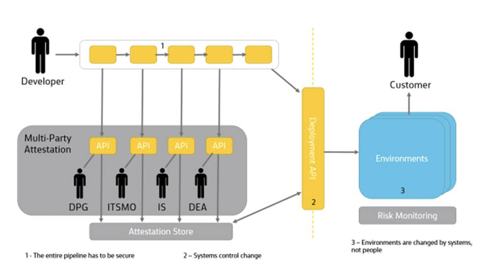
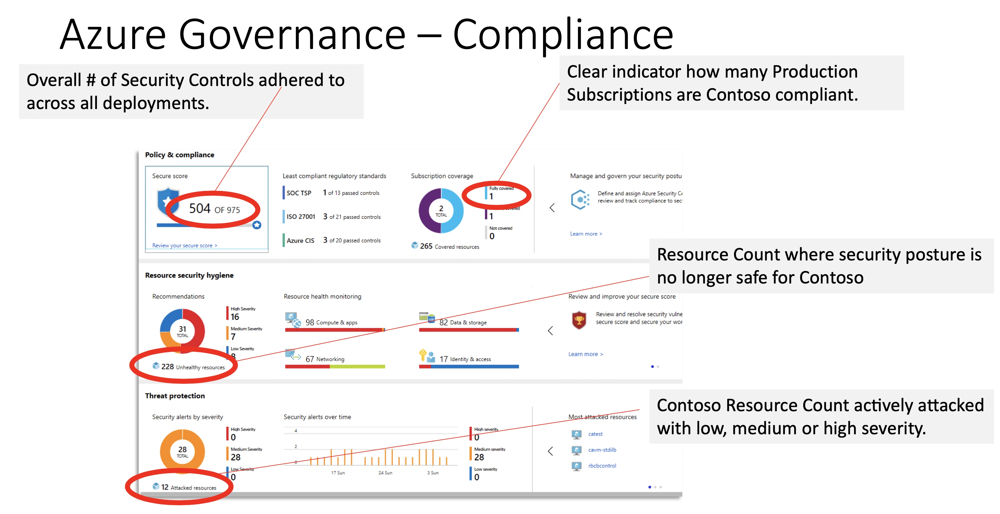
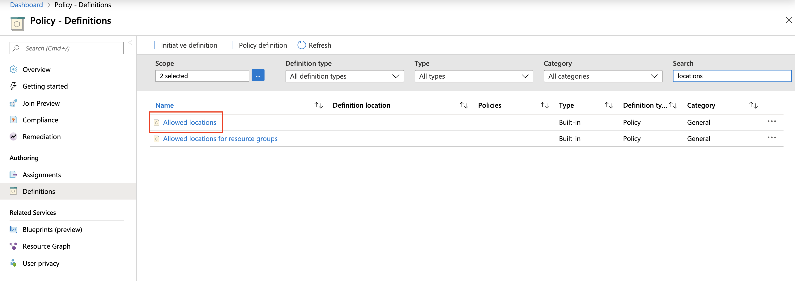
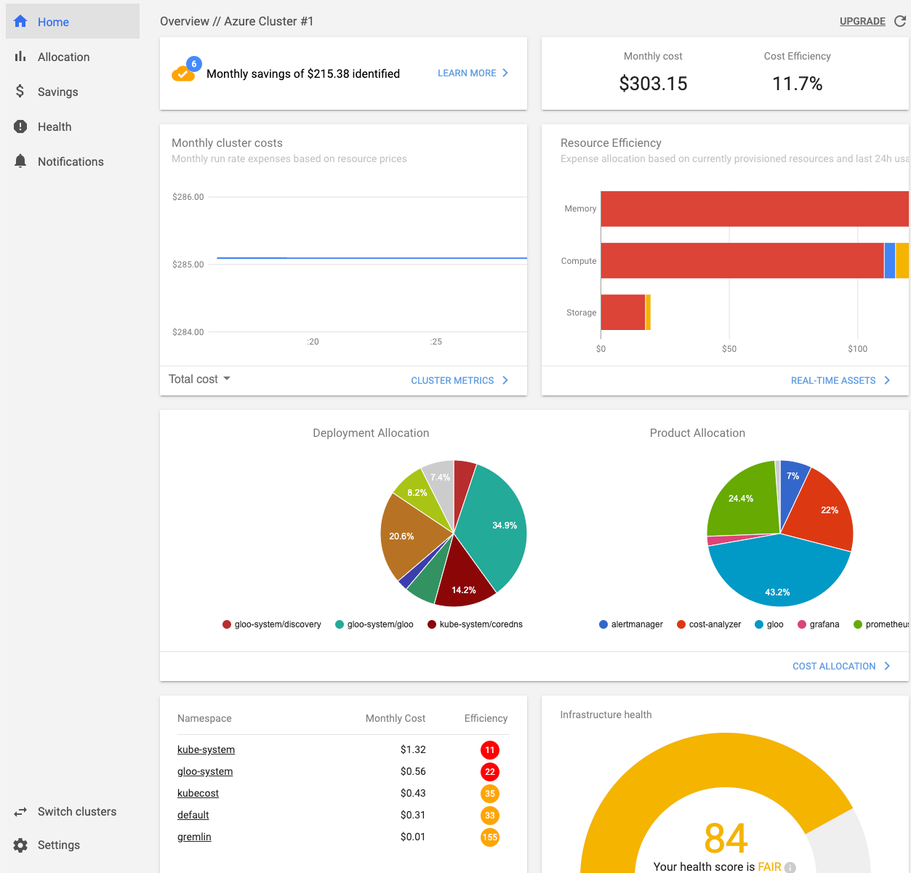
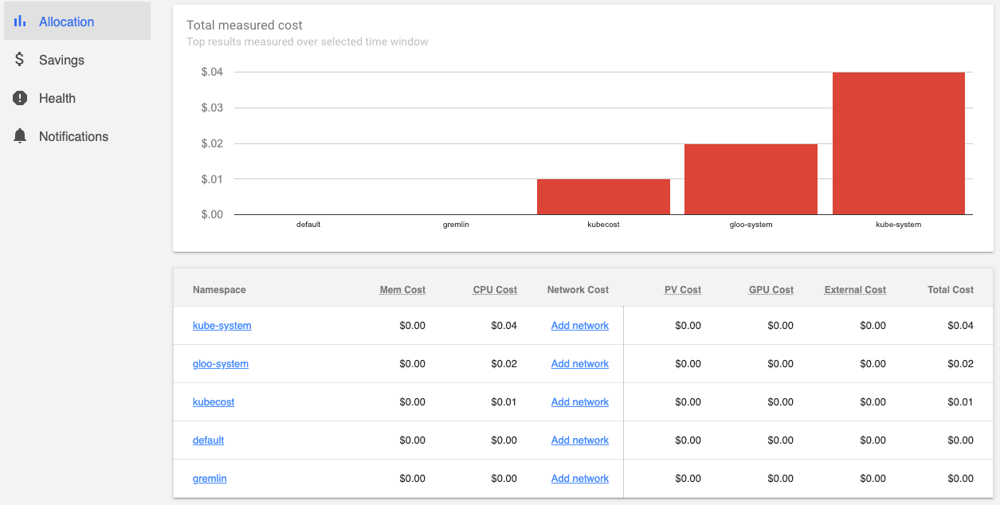
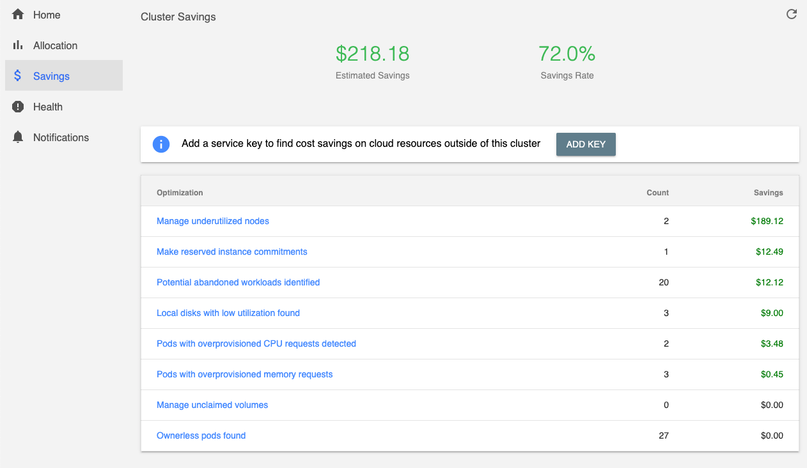

# Security, governance, and compliance for AKS Enterprise-Scale scenario

This section walks us through the different aspects of governance and security that need to be thought about prior to implementing any solution. To help guide the way, we will be leveraging the [customer scenario](/customer-scenario/README.md) based on Contoso Financials. The scenario describes the customer, along with some background, and wraps up with a list of the requirements that need to be met.

Now that we know the customer scenario and understand what needs to be implemented, let's get started. The majority of this section's content is technology agnostic, as implementation varies from customer to customer. For the purposes of this workshop, we will be focusing on how to implement the solution using Microsoft Azure along with some Open Source Software (OSS) solutions.

## Security Control Lifecycle in the Cloud

One of the first things to understand when talking about Cloud Native Security and Governance is that the cloud can be very dynamic where as most enterprises are used to having relatively stable environments that include both technical preventative and detective controls in place as well as a structured organizational model that aligns with traditional IT functions such as Identity, Networking, machine and VM OS management. The security and compliance team had to work with relatively infrequent changes to the overall structure and infrastructure and the controls and monitoring required to achieve the enterprises security and risk objectives.  With the adopting the cloud and also in adopting dev/ops models, security ends up having to adapt to operate as part of those changes in order to not become an impediment to the business and progress. Much of that includes how to create the right roles and responsibilities (people processes) as well as automation and technical tools such as scanning/testing and infrastructure as code as part of a DevOps pipeline to enable innovation and time to delivery while still ensuring security requirements can be met.

**The temptation and typical path most enterprises take is starting off by doing what they do today. In some aspects, you can but in others, no. The key take-a-way is that if you simply try and do exactly what you are doing today on-prem in the Cloud, you will fail.** Adopting the cloud is an opportunity to update skills, learn, increase the organization's security posture and position security to be an enabler rather than a blocker by streamlining security as part of the development to production process. If you use 10-20-years-old tools and processes, you are simply going to inherit/introduce the same 10-20-years-old security challenges, problems and frustrations to the business. This is your chance to start fresh.

So how is that done? It starts with an understanding of the cloud, what services are available, what controls are available, what visibility is available, how do I operate it, what security tools and governance tools are available and how can I leverage them as part of a process/system so lines of business can be more agile, a modern dev-ops model, and I can ensure that security and compliance requirements can be met.

It's often easiest to start with a framework/lifecycle from a process perspective in both establishing security controls as well as how to manage/operationalize the controls themselves.  For the former, many customers use common security control frameworks and standards such as NIST 800-53, ISO, CIS benchmarks, HIPAA/HITRUST, etc.  These can help establish a comprehensive framework and often guidance to help establish, document, and/or audit security controls and processes.  When it comes to managing/operationalizing security controls, in particular when it comes to things like the Cloud and DevOps, it can be useful to look at a variety of models including SDL processes that include cloud and dev/ops, approaches and models like treating security controls like assets like any others in an organization including lifecycle management (see below).



## Azure Security Controls Setup

In this section, we will walk through setting up the overarching security control framework specific to Azure. This section assumes organizational security controls have already been established; defining those security controls is out-of-scope for this workshop.

## Azure Security Control Architecture

All security controls in Microsoft Azure start with, and build on top of, the Azure Resource Manager (ARM) API. As you can see from the diagram below, there is a service in Azure called **Azure Policy** that helps enforce policies regardless of the origin of said policies.


**Note: This is important because it means organizations do not have to define policies in multiple places.**

## Security Control Governance

One of the key benefits of leveraging a security control framework is its incorporation of governance and controls auditing. For Azure, in addition to Azure Policy, this includes [Azure Security Center](https://docs.microsoft.com/azure/security-center/security-center-intro) and its [Secure Score & Compliance](https://docs.microsoft.com/azure/security-center/security-center-secure-score) Dashboard features. Compliance, at its core, is all about governance observability. See the image below for a sample compliance dashboard: 



## Implementing Security Controls using Security Controls Lifecycle

Within this workshop, we will implement just a subset of the security controls and Azure policies that would be included in a full Azure deployment. Once the process is understood, it is just a matter of rinsing and repeating to implement the additional security controls an organization might require. 

Based on the Contoso Financials scenario, we will be implement the following to meet requirements from security:
* Log All Cloud API requests for Audit Reporting purposes
* Enable AKS Cluster IP Whitelisting 
* AKS Clusters can only be created in certain regions

In the next sections, we will talk through implementing each of these controls.

## Capture Azure Audit Logs (Log all Cloud API requests for Audit Reporting purposes)

Azure Audit Logs are captured in something called [Azure Activity Logs](https://docs.microsoft.com/azure/azure-monitor/platform/activity-logs-overview). These Activity Logs capture all Azure Resource Manager (ARM) interactions. The challenge is the activity logs only have a certain retention lifecycle. To combat this challenge, we need to export the data out of the Activity Logs into a more persistent storage location. For the purpose of this workshop, we will leverage Azure Monitor Logs.

Click [here](https://docs.microsoft.com/azure/azure-monitor/platform/activity-log-collect) for a tutorial on how to get this setup for an Azure Subscription.

This is a sample screenshot of what it looks like when completed:


## Enable Azure Security Monitoring (AKS Cluster IP Whitelisting Enabled)

Before we create anything, we should look to the Cloud Provider for security monitoring best practices and recommendations. Within Azure specifically, we can enable Azure Security Center (ASC) to gain visibility into such recommendations. By leveraging ASC, we can determine whether or not an AKS Cluster has IP Whitelisting (Authorized IP Ranges) enabled.

Note: not all security controls that an organization wants or requires will be implemented by the Cloud Provider. The key is to leverage what is provided to avoid reinventing the wheel, while creating custom controls only when they are unavilable. 

Click [here](https://docs.microsoft.com/azure/security-center/security-center-get-started) for an article on how to enable Security Center Standard for an Azure Subscription.

This is a sample screenshot of what it looks like when completed:


## Security Enforcement through Azure Policy (AKS Clusters can only be created in certain regions)

Similar to the point above around security, we should be looking to the Cloud Provider to see what they provide for policy enforcement.  Within Azure, this would mean evaluating Azure Policy; it is a key part of the Enterprise Control Plane (ECP) that we talked about on the previous page.

The ability to restrict resource creation to a specific region is just one of many Azure Policies that are available. The two links below contain more thorough samples of what can be done with Azure Policy:

* [Azure Policy Samples](https://docs.microsoft.com/azure/governance/policy/samples/)
* [Azure Policy Security Samples](https://docs.microsoft.com/azure/security-center/security-center-policy-definitions)

Reminder: not everything can be done with Azure Policy. The key is to leverage what is provided to avoid reinventing the wheel, while creating custom controls only when they are unavilable. 

Click [here](https://docs.microsoft.com/azure/governance/policy/samples/allowed-locations) for guidance on how to implement allowed region locations via Azure Policy.

These are sample screenshots of the flow you will go through:




## Cost Governance

Cost Governance is the continuous process of implementing policies to control costs. In the context of Kubernetes, there are a number of ways organizations can control and optimize their costs. These include native Kubernetes tooling to manage and govern resource usage and consumption as well as proactive monitoring and optimize the underlying infrastructure.

In this section, we will use [KubeCost monitor](https://kubecost.com/) and govern our AKS cluster cost. Cost allocation can be scoped to a deployment, service, label, pod, and namespace, which will give you flexibility in how you chargeback/showback users of the cluster.

## Setup

We will first need to get KubeCost deployed to our cluster. We have the choice to install directly or using the Helm charts as documented [here](https://kubecost.com/install?ref=home).

### Install directly

```bash
# Create Kubecost Namespace
kubectl create namespace kubecost
# Install KubeCost into AKS Cluster
kubectl apply -f https://raw.githubusercontent.com/kubecost/cost-analyzer-helm-chart/master/kubecost.yaml --namespace kubecost
```

### Install with Helm

```bash
## Helm 2
helm repo add kubecost https://kubecost.github.io/cost-analyzer/
helm install kubecost/cost-analyzer --namespace kubecost --name kubecost --set kubecostToken="YWxnaWJib25AbWljcm9zb2Z0LmNvbQ==xm343yadf98"
```

```bash
## Helm 3
kubectl create namespace kubecost
helm repo add kubecost https://kubecost.github.io/cost-analyzer/
helm install kubecost kubecost/cost-analyzer --namespace kubecost --set kubecostToken="YWxnaWJib25AbWljcm9zb2Z0LmNvbQ==xm343yadf98"
```

### Check your deployment

```bash
# After a few minutes check to see that everything is up and running
kubectl get pods -n kubecost
# Connect to the KubeCost Dashboard (UI)
kubectl port-forward -n kubecost svc/kubecost-cost-analyzer 9090:9090
```

You now can open your browser and point to <http://127.0.0.1:9090> to open the Kubecost UI. In the Kubecost UI you should see a screen like below, so go ahead and select your cluster to view cost allocation information.

## Navigating KubeCost

KubeCost will break down resources into the following categories:

* Monthly Cluster Cost
* Namespace Cost
* Deployment Resource Cost
* Cost Efficiency

You'll see a dashboard like the one below when selecting your cluster



If you select __Allocation__ on the left side you can dig down into the namespace cost of your resources. It will show the cost for CPU, Memory, Persistent Volumes, and Network. It gets the data from Azure pricing, but you can also set a custom cost of the resources.



Now if you select  __Savings__ on the left side you can dig down into cost-saving for underutilized resources. It will give you info back on underutilized nodes, pods, and abandoned resources. It will also identify resource requests that have been overprovisioned within the cluster. You can see a sample below of the overview:



Take some time to navigate around the different views and features KubeCost provides.
=======
AKS has several interfaces to other Azure services like Azure AD, Azure Storage, Azure Networking etc. that require special attention during the planning phase. And it also adds additional complexity that requires you to consider applying the same security, governance and compliance mechanisms and controls that are in place for the rest of your infrastructure landscape.

## Design considerations

- Decide whether the cluster's control plane is accessible via the internet (default) or within a specific VNet only (private cluster).
- Monitor and enforce configuration using [Azure Policy for Kubernetes](https://docs.microsoft.com/azure/aks/use-pod-security-on-azure-policy)

## Design recommendations

- Limit access to [Kubernetes cluster configuration](https://docs.microsoft.com/azure/aks/control-kubeconfig-access) file with Azure role-based access control.
- Limit access to [actions that containers can perform](https://docs.microsoft.com/azure/aks/developer-best-practices-pod-security#secure-pod-access-to-resources). Provide the least number of permissions, and avoid the use of root / privileged escalation.
- Evaluate the use of the built-in [AppArmor security module](https://docs.microsoft.com/azure/aks/operator-best-practices-cluster-security#app-armor) to limit actions that containers can perform such as read, write, or execute, or system functions such as mounting filesystems.
- Evaluate the use of the [seccomp (secure computing)](https://docs.microsoft.com/azure/aks/operator-best-practices-cluster-security#secure-computing). seccomp works at the process level and allows you to limit the process calls that containers can perform.
- Use [Pod Identities](https://docs.microsoft.com/azure/aks/operator-best-practices-identity#use-pod-identities) and [Secrets Store CSI Driver](https://github.com/Azure/secrets-store-csi-driver-provider-azure#usage) with Azure Key Vault to protect secrets, certificates, and connection strings.
- Ensure certificates are [rotated](https://docs.microsoft.com/azure/aks/certificate-rotation) on a regular basis (e.g. every 90 days).
- Use [AKS node image upgrade](https://docs.microsoft.com/azure/aks/node-image-upgrade) to update AKS cluster node images (preferred) or [Kured](https://docs.microsoft.com/azure/aks/node-updates-kured) to automate node reboots after updates are applied.
- Use [Azure Security Center](https://docs.microsoft.com/azure/security-center/defender-for-kubernetes-introduction) to provide AKS recommendations and consider using [Azure Defender for Kubernetes](https://docs.microsoft.com/azure/security-center/defender-for-kubernetes-introduction) for threat detection.
