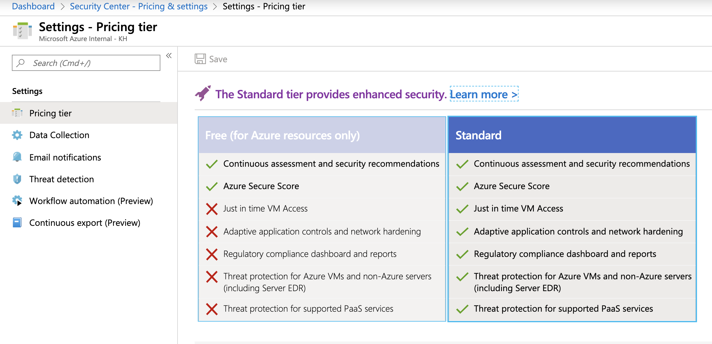
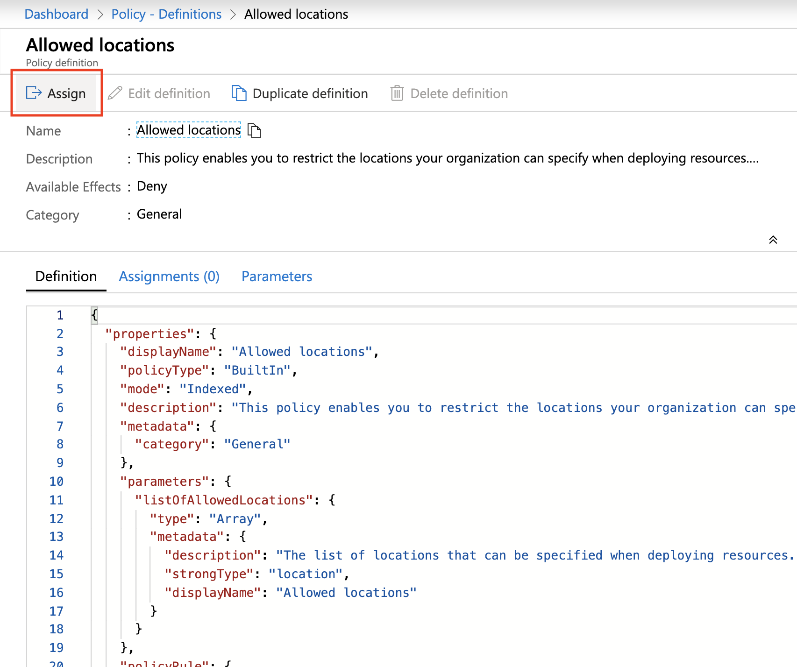
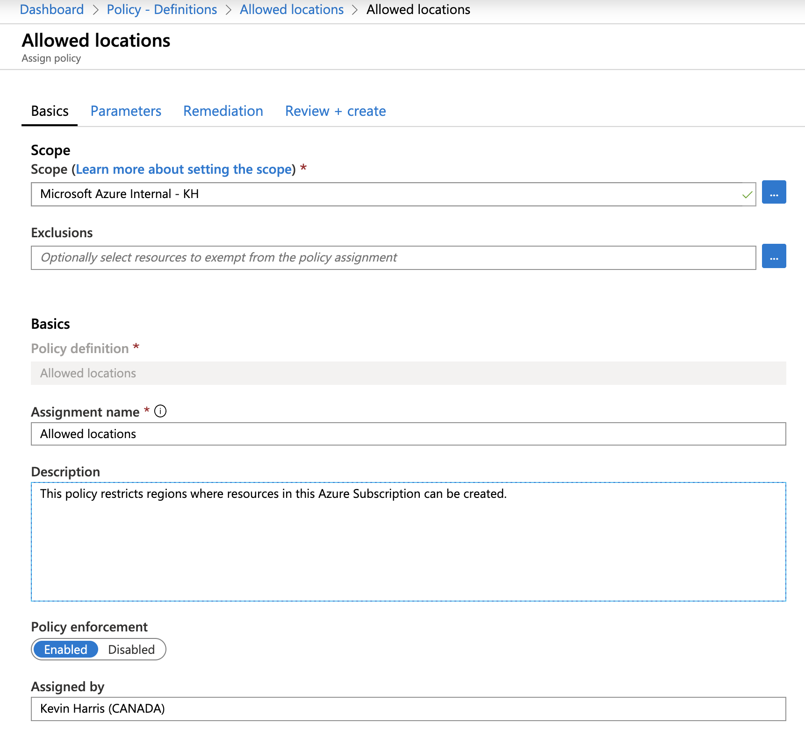
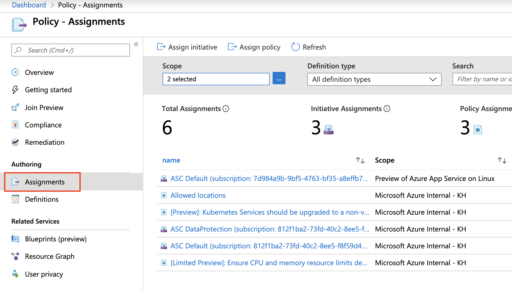

# AKS enterprise-scale platform security governance and compliance

This article walks through aspects of AKS security governance to think about before implementing any solution. 
<!-- this scenario doesn't exist
 To help guide the way, we will be leveraging the [customer scenario](/customer-scenario/README.md) based on Contoso Financials. The scenario describes the customer, along with some background, and wraps up with a list of the requirements that need to be met.

Now that we know the customer scenario and understand what needs to be implemented, let's get started. -->
Most of the article's content is technology agnostic, because implementation varies among customers. The article focuses on how to implement the solution using Azure and some open source software (OSS) solutions.

## Cloud security control lifecycle

In cloud-native security and governance, the cloud can be very dynamic, whereas most enterprises are used to having relatively stable environments. Traditional environments include detection and prevention controls in a structured organizational model that aligns with traditional IT functions like identity, networking, and machine and virtual machine (VM) OS management. Security and compliance teams face relatively infrequent changes to overall structure and infrastructure, or to required controls and monitoring to achieve security and risk objectives.

With the adoption of cloud and DevOps models, security must adapt to changes, so it doesn't become an impediment to business and progress. Security adaptations include people processes like creating the right roles and responsibilities, and automation and technical tools like scanning, testing, and Infrastructure as Code. These tools are part of a DevOps pipeline that enables innovation and fast delivery times, while still meeting security requirements.

The temptation is to begin by doing what you do today, but the key takeaway is that if you try to do in the cloud exactly what you do today on premises, you will fail. Cloud adoption is an opportunity to learn, update skills, and increase the organization's security posture. You can position security to be an enabler rather than a blocker, by streamlining security as part of the development to production process. If you use 10-20 year-old tools and processes, you inherit or introduce 10-20 year-old security challenges, problems, and frustrations to the business. Cloud adoption is your chance to start fresh.

Starting fresh begins with an understanding of the cloud:

- What are the available cloud services, controls, and visibility?
- How do you operate the cloud services and controls?
- What are the available security tools and governance tools?
- How can you use security and governance tools in processes and systems, so lines of business can be more agile with a modern DevOps model?
- How can you ensure that security and compliance requirements are met?

It's often easiest to start a lifecycle framework from a process perspective, both in establishing security controls, and managing and operationalizing the controls themselves. For establishing security controls, many customers use common frameworks and standards like NIST 800-53, ISO, CIS benchmarks, and HIPAA/HITRUST. These standards can help establish a comprehensive framework, and offer guidance to help establish, document, and audit security controls and processes.

For managing and operationalizing security controls, you can look at a variety of models, including Security Development Lifecycle (SDL) processes that include cloud and DevOps. These approaches and models treat security controls like any other assets in an organization, and include lifecycle management. The following diagram shows an example of an organization's security control lifecycle management:

:::image type="content" source="./media/security-control-lifecycle.png" alt-text="Diagram showing Azure security control lifecycle management setup." border="false":::

### Azure security control architecture

All Azure security controls start with, and build on top of, the Azure Resource Manager API. The following diagram shows how the Azure Policy engine helps enforce policies regardless of their origin. This ability is important because it means organizations don't have to define policies in multiple places.

:::image type="content" source="./media/enterprise-control-plane-architecture.png" alt-text="Diagram showing Azure security control architecture." border="false":::

### Security control governance

One of the key benefits of a security control framework is its incorporation of governance and controls auditing. In addition to Azure Policy, this includes [Azure Security Center](/azure/security-center/security-center-intro) and its [secure score](/azure/security-center/security-center-secure-score) and compliance dashboard features. Compliance, at its core, is all about governance observability. The following image shows a sample compliance dashboard:

:::image type="content" source="./media/enterprise-control-plane-governance.png" alt-text="Diagram showing Azure security control governance." border="false":::

## Azure security controls setup

This section walks through setting up the overarching Azure-specific security control framework. This section assumes organizational security controls are already established. Defining these security controls is out of scope for this article.

The following sections walk through implementing controls to meet security requirements for a fictitious Contoso Financials scenario:

- Log all Cloud API requests for audit reporting purposes.
- Enable Azure Kubernetes Service (AKS) cluster IP Approved Listing.
- Create AKS clusters only in certain regions.

These controls are just a subset of the security controls and Azure policies that a full Azure deployment includes. Once you understand the process, you can repeat it to implement any additional security controls your organization requires.

### Log all Cloud API requests for audit reporting purposes

[Azure Activity Logs](/azure/azure-monitor/platform/activity-logs-overview) capture all Azure Resource Manager interactions, including audit logs. The challenge is that activity logs only have a certain retention lifecycle. You need to export the data out of the Activity Logs into a more persistent storage location, such as Azure Monitor Logs.

For a tutorial on how to set up activity log collection for an Azure subscription, see [Send to Log Analytics workspace](/azure/azure-monitor/essentials/activity-log#send-to-log-analytics-workspace).

The following example screenshot shows an Azure Activity Log capture:

:::image type="content" source="./media/activity-log-capture.png" alt-text="Screenshot showing Activity Log capture.":::

### Enable Azure security monitoring to check for AKS cluster IP Approved Listing

Before you create anything, look to the cloud provider for security monitoring best practices and recommendations. Not all security controls that an organization requires are implemented by the cloud provider, but the key is to leverage what is provided to avoid reinventing the wheel, and create custom controls only when necessary.

In Azure, you can enable Azure Security Center to see security monitoring recommendations, and determine whether an AKS cluster has IP Approved Listing (Authorized IP Ranges) enabled.

For an article on how to enable Azure Security Center Standard for an Azure subscription, see [here](/azure/security-center/security-center-get-started).

The following screenshot shows what Azure Security Center Standard monitoring looks like:



### Enforce an Azure Policy to create AKS clusters only in certain regions

Also look to the cloud provider for policy enforcement. In Azure, evaluate Azure Policy, which is a key part of the Enterprise Control Plane (ECP). You can't do everything with Azure Policy, but the key is to leverage what is provided to avoid reinventing the wheel, and create custom controls only when necessary.

The ability to restrict resource creation to a specific region is just one of many available Azure Policies. For samples of what you can do with Azure Policy, see:

- [Azure Policy Samples](/azure/governance/policy/samples/)
- [Azure Policy Security Samples](/azure/security-center/security-center-policy-definitions)

For guidance on how to implement allowed region locations via Azure Policy, see [here](/azure/governance/policy/samples/allowed-locations).

The following example screenshots show how to use Azure Policy to implement allowed region locations:









## Cost governance

Cost governance is the continuous process of implementing policies to control costs. In the Kubernetes context, there are several ways organizations can control and optimize their costs. These include native Kubernetes tooling to manage and govern resource usage and consumption, and proactively monitor and optimize the underlying infrastructure.

In this section, you use [KubeCost monitor](https://kubecost.com/) to govern your AKS cluster cost. You can scope cost allocation to a deployment, service, label, pod, or namespace, which gives you flexibility in how you charge back or show cluster users.

### Install KubeCost

First, deploy KubeCost to your cluster. You can install directly, or use Helm charts according to the instructions at [here](https://kubecost.com/install?ref=home).

#### Install KubeCost directly

```kubectl
# Create Kubecost Namespace
kubectl create namespace kubecost
# Install KubeCost into AKS Cluster
kubectl apply -f https://raw.githubusercontent.com/kubecost/cost-analyzer-helm-chart/master/kubecost.yaml --namespace kubecost
```

#### Install KubeCost by using Helm

Helm 2:

```bash
helm repo add kubecost https://kubecost.github.io/cost-analyzer/
helm install kubecost/cost-analyzer --namespace kubecost --name kubecost --set kubecostToken="YWxnaWJib25AbWljcm9zb2Z0LmNvbQ==xm343yadf98"
```

Helm 3:

```bash
kubectl create namespace kubecost
helm repo add kubecost https://kubecost.github.io/cost-analyzer/
helm install kubecost kubecost/cost-analyzer --namespace kubecost --set kubecostToken="YWxnaWJib25AbWljcm9zb2Z0LmNvbQ==xm343yadf98"
```

#### Check your deployment

After a few minutes, check to see that KubeCost is up and running:

```kubectl
kubectl get pods -n kubecost
# Connect to the KubeCost Dashboard (UI)
kubectl port-forward -n kubecost svc/kubecost-cost-analyzer 9090:9090
```

You can now open your browser and point to `http://127.0.0.1:9090` to open the Kubecost UI. In the Kubecost UI, select your cluster to view cost allocation information.

### Navigate KubeCost

KubeCost breaks down resources into the following categories:

- Monthly Cluster Cost
- Namespace Cost
- Deployment Resource Cost
- Cost Efficiency

When you select your cluster, you see a dashboard like the following:


Select **Allocation** on the left side to dig down into the namespace cost of your resources. **Allocation** shows the cost for CPU, Memory, Persistent Volumes, and Network. KubeCost gets the data from Azure pricing, but you can also set custom costs for the resources.


To dig down into cost saving for underutilized resources, select **Savings** on the left side. **Savings** gives you information about underutilized nodes and pods and abandoned resources. **Savings** also identifies resource requests that are overprovisioned within the cluster. The following screenshot shows an example **Savings** overview:


Take some time to navigate around the different views and features that KubeCost provides.

AKS has several interfaces to other Azure services like Azure Active Directory, Azure Storage, and Azure Networking that require special attention during the planning phase. AKS also adds additional complexity that requires you to consider applying the same security, governance, and compliance mechanisms and controls as in the rest of your infrastructure landscape.

## Design recommendations

- Limit access to the [Kubernetes cluster configuration](/azure/aks/control-kubeconfig-access) file by using Azure role-based access control.

- Limit access to [actions that containers can perform](/azure/aks/developer-best-practices-pod-security#secure-pod-access-to-resources). Provide the least number of permissions, and avoid using root or privileged escalation.

- Evaluate using the built-in [AppArmor security module](/azure/aks/operator-best-practices-cluster-security#app-armor) to limit actions that containers can perform, like read, write, execute, or system functions like mounting filesystems.

- Evaluate using [secure computing (seccomp)](/azure/aks/operator-best-practices-cluster-security#secure-computing). You can use seccomp at the process level to limit the process calls that containers can perform.

- Use [Pod Identities](/azure/aks/operator-best-practices-identity#use-pod-identities) and [Secrets Store CSI Driver](https://github.com/Azure/secrets-store-csi-driver-provider-azure#usage) with Azure Key Vault to protect secrets, certificates, and connection strings.

- Make sure to [rotate certificates](/azure/aks/certificate-rotation) regularly, like every 90 days.

- Use [AKS node image upgrade](/azure/aks/node-image-upgrade) to update AKS cluster node images if possible, or [Kured](/azure/aks/node-updates-kured) to automate node reboots after applying updates.

- Use [Azure Security Center](/azure/security-center/defender-for-kubernetes-introduction) to provide AKS recommendations.

- Monitor and enforce configuration using [Azure Policy for Kubernetes](/azure/aks/use-pod-security-on-azure-policy).

## Design considerations

- Decide whether the cluster's control plane is accessible via the internet, which is the default, or only within a specific virtual network as a private cluster.

- Consider using [Azure Defender for Kubernetes](https://docs.microsoft.com/azure/security-center/defender-for-kubernetes-introduction) for threat detection.

