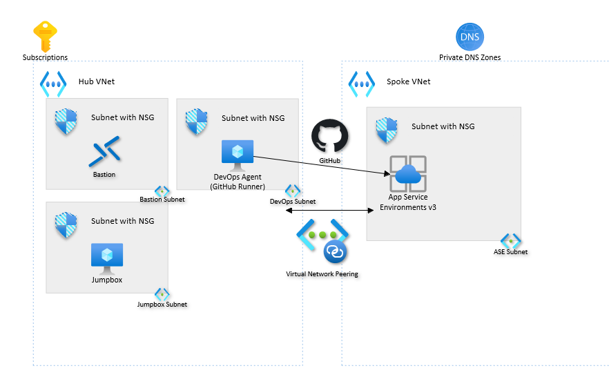

# Landing zone accelerator for App Service

The Landing zone accelerator for Azure App Service set is an open-source collection of Terraform templates that you can use to automate the deployment of an environment capable of hosting Azure App Service. It can provide a specific architectural approach and reference implementation to prepare your enterprise-scale landing zones. The landing zones adhere to the architecture and best practices of the Cloud Adoption Framework.

Customers adopt Azure App Service in various ways. The construction set can be adapted to produce an architecture that fits **your** way and puts your organization on a path to sustainable scale.

## Implement a platform foundation

Landing zone accelerator for Azure App Service assumes that a platform foundation that takes care of the shared services (network, security, identity, and governance) required to effectively construct and operationalize a landing zone has been successfully implemented. This isn't mandatory when implementing Landing zone accelerator for Azure App Service, but it does handle much of the security and management required to safely manage your cloud environment. If you already have one, you can skip this step. For more information on this, review these articles:

- [Start with Cloud Adoption Framework enterprise-scale landing zones](../../ready/enterprise-scale/index.md)
- [Implement Cloud Adoption Framework enterprise-scale landing zones in Azure](../../ready/enterprise-scale/implementation.md)

## What Landing zone accelerator for Azure App Service provides

The Landing zone accelerator approach to landing zones provides these assets to support your project:

- A modular approach, so that you can customize environment variables
- Design guidelines to aid in evaluating critical decisions
- The landing zone architecture
- An implementation that includes:
  - A deployable reference capable of creating the environment for your Azure App Service deployment
  - A Microsoft-approved Azure App Service reference implementation to test the deployed environment

## Design guidelines

These articles provide guidelines for creating your landing zone:

- [Identity and access management](./identity-and-access-management.md)
- [Network topology and connectivity](./network-topology-and-connectivity.md)
- [Security](./security.md)
- [Management](./management.md)
- [Governance](./governance.md)
- [Platform automation and DevOps](./platform-automation-and-devops.md)

## Example conceptual reference architecture

The following conceptual reference architecture is an example that shows design areas and best practices.

## Deploy Landing zone accelerator for Azure App Service

The enterprise-scale App Service reference implementation with infrastructure-as-code templates is available on [GitHub](https://github.com/Azure/appservice-landing-zone-accelerator).

## Next steps

- Review the Azure App Service construction set critical design areas to make complete considerations and recommendations for your Azure App Service construction set architecture. See [Azure App Service enterprise-scale scenario](./identity-and-access-management.md).