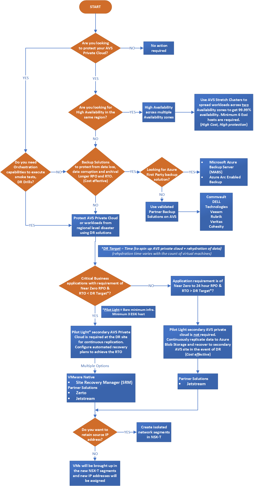
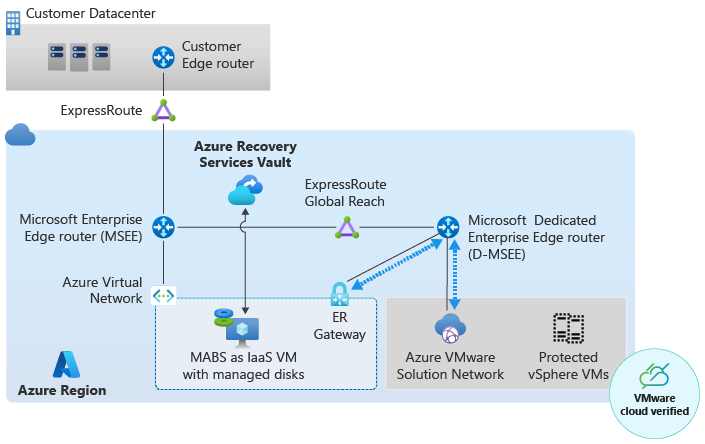

# Business continuity and disaster recovery for Azure VMware Solution enterprise-scale scenario

[Azure VMware Solution](https://docs.microsoft.com/azure/azure-vmware/) provides one or more [private clouds](https://docs.microsoft.com/azure/azure-vmware/concepts-private-clouds-clusters) that contain vSphere clusters which are built from dedicated bare-metal Azure infrastructure. The solution provides a minimum of three ESXi hosts, up to a maximum of 16 hosts per cluster. Up to 96 hosts can be run in one private cloud. vCenter Server, vSAN, vSphere and NSX-T are all provided as part of the private cloud solution. Although Azure VMware Solution has an SLA of 99.9%, it is always wise to consider additional BCDR factors.

## Business Continuity (BC) Design considerations

- A validated backup solution should be chosen for the VMware Virtual Machines, such as [Microsoft Azure Backup Server (MABS)](https://docs.microsoft.com/azure/backup/backup-azure-backup-server-vmware?context=/azure/azure-vmware/context/context) or from our [backup partners](https://docs.microsoft.com/azure/azure-vmware/ecosystem-back-up-vms).
- **NOTE:** Private cloud vCenter and NSX-T configurations are on an hourly backup schedule. Backups are kept for three days. 
- VMware vSAN storage policies on Azure VMware Solution are implemented with storage availability in mind. When the cluster has between 3 and 5 hosts, the number of host failures to tolerate without loss of data equals 1; when the cluster has between 6 and 16 hosts, the number of host failures to tolerate before data loss can occur equals 2. VMware vSAN storage policies can be applied on a per-VM basis. Whilst these are the default policies, there is the ability to amend the policy used for VMware VMs to suit custom requirements. Further reading is found in [this article](https://docs.microsoft.com/azure/azure-vmware/concepts-storage).
- VMware High Availability (HA) is enabled by default on Azure VMWare Solution. The HA admittance policy ensures a reservation of the compute and memory capacity of a single node ensuring sufficient reserve capacity to restart workloads in another node in an Azure VMWare Solution cluster.
- Currently MABS does not support restoring backups to an alternative (secondary) Azure VMWare Solution private cloud. Refer to the [disaster recovery section](eslz-business-continuity-and-disaster-recovery.md#disaster-recovery-dr-design-considerations) of this guidance when cross Azure VMWare Solution recovery is required.

## Business Continuity (BC) Design recommendations

- Use MABS to back up the Azure VMWare Solution private cloud. See more at: [Back up VMware VMs with MABS](https://docs.microsoft.com/azure/backup/backup-azure-backup-server-vmware?context=/azure/azure-vmware/context/context).
- Deploy the Azure Backup Server in the same Azure region as the Azure VMWare Solution private cloud. This will reduce traffic costs, ease administration and keep the primary/secondary topology. Best practices for Azure region deployments can be found [in this document](https://docs.microsoft.com/azure/cloud-adoption-framework/migrate/azure-best-practices/multiple-regions).
- MABS can be deployed as an Azure IaaS VM or within the Azure VMWare Solution private cloud. It is highly recommended to deploy it outside of the Azure VMWare Solution private cloud in an Azure Virtual Network that is connected to the same ExpressRoute to reduce vSAN consumption as this is a ‘limited capacity’ resource within the Azure VMWare Solution private cloud. 

- If restoration from a backup is needed for Azure VMWare Solution platform components like vCenter, NSX manager or HCX manager, a support ticket should be opened from the [Azure Portal Help + Support section](https://docs.microsoft.com/azure/azure-portal/supportability/how-to-create-azure-support-request). 

## Disaster Recovery (DR) design considerations

- Business requirements need to align with RTCPOs (Recovery time, capacity, and point objectives) for Apps/VMs tiers. Plan and design accordingly to achieve them using the most appropriate replication technology; App Native (e.g., SQL Always On availability group), or non-native (for better orchestration) like VMware SRM (Site Recovery Manager) and [Azure Site Recovery](https://docs.microsoft.com/azure/site-recovery/).
- A decision should be made as to what the target DR site for the Azure VMWare Solution private cloud will be as this will influence which DR tooling is suitable to the environment.
- Migration from third party locations into Azure VMWare Solution will have support through Site Recovery Manager through scale.
- VMware Site Recovery Manager can be used to provide DR for Azure VMWare Solution private cloud to a secondary Azure VMWare Solution private cloud.
- Azure Site Recovery can be leveraged as a DR solution for Azure VMWare Solution private cloud to Azure IaaS. See more at: [Prepare Azure Site Recovery resources for disaster recovery of Azure VMware Solution VMs](https://docs.microsoft.com/azure/site-recovery/avs-tutorial-prepare-azure)

- [Azure Site Recovery Deployment Planner](https://docs.microsoft.com/azure/site-recovery/site-recovery-deployment-planner) can be used to begin planning DR to Azure Native.
- When planning the workloads to start after Azure Site Recovery failover, the recovery plan should include the correct start up order for workloads.
- Partner Solutions like JetStream Software and [HCX (testing purposes only)](https://docs.microsoft.com/azure/azure-vmware/deploy-disaster-recovery-using-vmware-hcx#:~:text=%20Deploy%20disaster%20recovery%20using%20VMware%20HCX%20,VMware%20Solution%20private%20cloud%2C%20and%20access...%20More%20) support disaster recovery scenarios for Azure VMWare Solution as well.
- An analysis and decision should be made which (sub-)set of Azure VMWare Solution workloads require protection in case of a DR event. Consider protecting only those workloads critical to business operations to control the costs associated with the DR implementation.
- Functional domain roles (e.g., Active Directory Domain Controllers, DNS) should be set up in the secondary environment
- To enable DR between Azure VMWare Solution private clouds in distinct Azure regions, ExpressRoute Global Reach needs to be enabled between both (back-end) ExpressRoute circuits to allow primary to secondary private cloud connectivity when required for solutions like VMware SRM and VMware HCX for DR.
- When working with disaster recovery there is the ability to leverage the same IP address space(s) from the primary Azure region in the secondary Azure region. Using the same address space(s) from the primary Azure region to the secondary Azure region requires further engineering overhead incorporation to the solution foundation compared to two separate address spaces for the primary and secondary Azure regions. 
  - **Retaining the same IP address(es)**: The same IP address(es) can be used on the recovered VM as the one allocated to the Azure VMWare Solution VMs. For this isolated VLANS/segments in the secondary site will need to be created and ensure none of these isolated VLANS/segments are connected to the environment. DR routes will need to be modified to reflect that the subnet has moved to the secondary site, and new IP address locations. Whilst this does work, this provides engineering overhead when aiming for minimal interaction.
  - **Using different IP address(es)**: A different IP address can be used for the recovered VMs. If the VM is moved to a secondary site, the recovery plan within the SRM will detail out the custom IP map that will need to be selected for the change of IP address and in case of ASR a defined VNET will be chosen for new IP allocation.
- Understanding partial and full disaster recovery (DR) solutions:
  - When working with Azure Site Recovery, preparing for full disaster recovery should be understood. This means failing over from Azure VMWare Solution into an Azure Native environment.
  - Utilising VMware SRM for partial and full DR is supported. This means that running Azure VMWare Solution in Region 1 and Region 2, the option to fail some or all the VMs from primary to secondary regions is supported. 
  - The requirement for VM recovery and the IP address retention requirements will define if Partial vs Full DR is possible or not. 
  - In order to maintain the IP address and achieve a partial disaster recovery in SRM, gateway of the subnet will need to move to the secondary Azure VMWare Solution.
  - Active-Standby DR does not require L2 stretching.

## Disaster Recovery (DR) design recommendations

- When working with Azure VMware Solution in both primary (protected) and secondary (recovery) sites, VMware Site Recovery Manager should be used.

- Using the above point as a high-level overview, a more detailed diagram can be found below:

- Azure Site Recovery should be used if Azure IaaS is the DR target for the Azure VMWare Solution private cloud
- When working with either VMware Site Recovery Manager or Azure Site Recovery to provide DR for the Azure VMWare Solution private cloud, manual input should be minimized as much as possible by leveraging automated Recovery plans within each of the respective solutions. A recovery plan gathers machines into recovery groups for the purpose of failover and helps to define a systematic recovery process by creating small independent units that can fail over.
- Utilizing the geopolitical region pair as the secondary DR environment is recommended for proximity of regions and cost reductions.
- Keep address spaces completely different (i.e., 192.168.0.0/16 for Region 1 and 10.0.0.0/16 for Region 2) to reduce risk of IP address overlap 
- Leverage ExpressRoute Global Reach connectivity between the primary and secondary Azure VMWare Solution private clouds. [Further networking considerations and recommendations in the relevant design area](eslz-network-topology-and-connectivity.md).