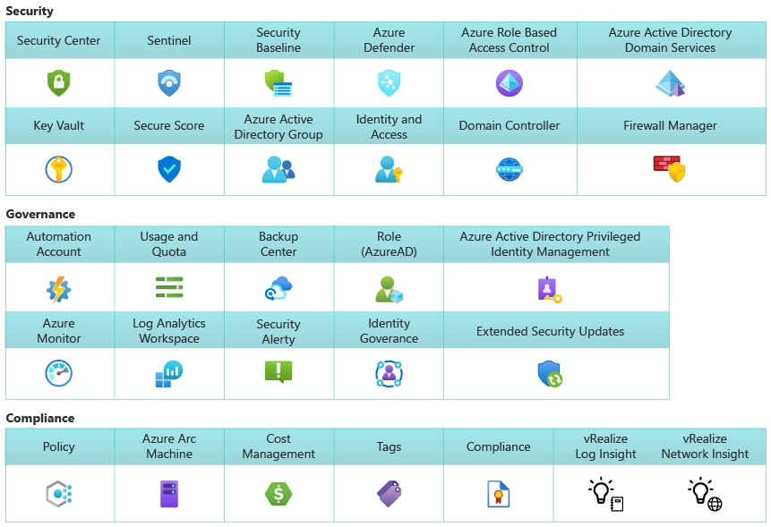
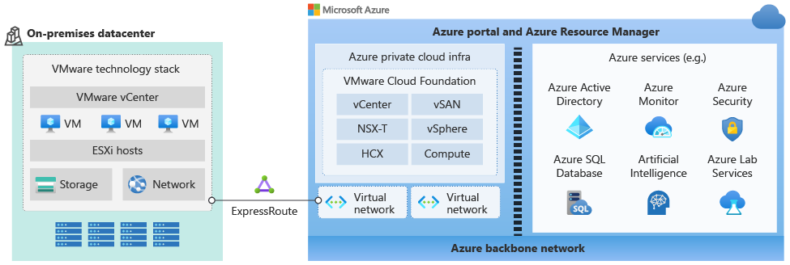

# Govern Azure VMware Solution

Azure VMware Solution combines its Software-Defined Data Center (SDDC) software with Azure's global cloud platform. Using the [Govern methodology](../../govern/index.md) to incrementally improve governance of your cloud portfolio. Microsoft manages Azure VMware Solution to meet performance, availability, security, and compliance requirements. Microsoft provides the following components to run Azure VMware Solution at scale in Azure—across management systems, networking services, operating platform, and back-end infrastructure operations.

To extend your governance approach across the Azure VMware solution, evaluate and manage risk tolerance by identifying high-risk areas for business—converting risk vectors into governing corporate policies—and extend governance policies across Cost, Security baseline, Identity baseline, Resource consistency, and Deployment acceleration disciplines.

*Figure 1*

## Azure VMware solution management

Azure VMware solution is an Azure service built with VMware that delivers vSphere clusters, single-tenant, private cloud environment—accessible for users and applications from on-premises and Azure-based environments or resources. The VMware technology stack on-premises runs with a highly secure set of compute, storage, and networking technologies.

A required ExpressRoute circuit can connect to Azure cloud services with a dedicated private and redundant layer-3 network fiber connection that supports bandwidth up to 100 Gbps. The Azure VMware Solution also requires an Azure Virtual Network (Vnet) to connect.

All provisioned private clouds have vCenter Server, vSAN, vSphere, and NSX-T, so you can migrate workloads from your on-premises environments, deploy new virtual machines (VMs), and consume Azure services from your private clouds.

 VMware vSphere clusters reside on top of "share nothing" hyper-converged, bare-metal infrastructure. Azure VMware cluster architecture is dedicated and isolated—meaning that networking, storage, or compute is not shared with any other tenant. VSphere clusters are managed by Microsoft to meet performance, availability, security, and compliance requirements, at scale in Azure, providing unified management, networking, and operational controls.

Because Azure VMware solutions run hybrid workloads across on-premises and private cloud, unified operations is the best approach to providing a single pane of glass for incrementally deploying required governance and operational management controls. Read [Introduction to unified operations](/azure/cloud-adoption-framework/scenarios/hybrid/unified-operations) to get started.

## Unified security and compliance

On Azure, you can run, manage, and secure applications across VMware environments with a common operating framework. Utilize your existing VMware tools, like VMware vSphere, vSAN, and vCenter, combined with the scale, performance and innovation of Azure. In terms of access and security, Azure VMware Solution private clouds use vSphere role-based access control for enhanced security. You can integrate vSphere SSO LDAP capabilities with Azure Active Directory. Read more about [Access and Identity concepts](/azure/azure-vmware/concepts-identity).

Using a unified operations approach that uses familiar Azure tools to manage and govern your VMware hybrid workloads across on-premises and private cloud. Monitor, manage, and protect virtual machines in a hybrid environment (Azure, Azure VMware Solution, and on-premises). Read more about how you can [Start small with basic VM management](https://docs.microsoft.com/azure/architecture/hybrid/azure-arc-hybrid-config?bc=/azure/cloud-adoption-framework/_bread/toc.json&toc=/azure/cloud-adoption-framework/scenarios/hybrid/toc.json).

### Integration with Azure-native services

Integrating with Azure-native services in your Azure VMware Solution private cloud will ensure that your Azure VMware workloads benefit from unified operations best practices for governance guardrails.

**Unified VM management**: single pane of glass to manage vSphere-based and Azure native VMs, with uniform identities, access control and monitoring.

 **Native Azure integration**: connect to Azure services endpoints. For example, leverage Azure Active Directory as VMware vCenter SSO identity source.

**Single point of support**: Azure VMware Solution is Microsoft-developed, operated, and supported. Microsoft is first and only contact and coordinates support with VMware as required.

**Unified licensing and consumption**: avoid unnecessary complexity and take confidence in managing a single vendor for licensing and resource consumption.

**Azure Hybrid Use Benefits**: maximize the value of existing Windows Server and SQL Server licenses. Save up to 80% with Azure Hybrid Use Benefits and Azure Reserved Instances.

*Figure 2*

### Unified operational management controls

We recommend a [unified operations](/azure/cloud-adoption-framework/scenarios/hybrid/unified-operations) approach, so you can extend consistent Azure governance and operational management controls across your Vsphere cluster, and seamlessly modernize your VMware workloads with native Azure services. 

Azure Resource Manager (ARM) is the operating system of Azure which, stretching across VMware resources, extends Azure-native governance and operational management controls across clusters, resource pools and  private clouds by:

- Monitoring, managing, and protecting VMs with Azure native services. [Learn more](/azure/azure-vmware/integrate-azure-native-services)
- Integrating Azure Security Center. [Learn more](/azure/azure-vmware/azure-security-integration)
- Integrating Azure NetApp Files. [Learn more](/azure/azure-vmware/netapp-files-with-azure-vmware-solution)
- Protecting web apps with Azure Application Gateway. [Learn more](/azure/azure-vmware/protect-azure-vmware-solution-with-application-gateway)
- Deploying Traffic Manager to balance workloads. [Learn more](/azure/azure-vmware/deploy-traffic-manager-balance-workloads)
- Configuring Azure alerts and work with metrics. [Learn more](/azure/azure-vmware/configure-alerts-for-azure-vmware-solution)
- Attaching disk pools to Azure VMware Solution hosts. [Learn more](/azure/azure-vmware/attach-disk-pools-to-azure-vmware-solution-hosts)
- Setting up Azure Backup Server. [Learn more](/azure/azure-vmware/attach-disk-pools-to-azure-vmware-solution-hosts)
- Preparing Azure Site Recovery resources for disaster recovery. [Learn more](https://docs.microsoft.com/azure/site-recovery/avs-tutorial-prepare-azure?context=/azure/azure-vmware/context/context)

Learn more about Azure VMware solution's [Integration with native Azure services](https://docs.microsoft.com/learn/modules/intro-azure-vmware-solution/2-what-is-azure-vmware-solution)

## Governance MVP for hybrid workloads

Governance of hybrid workloads in Azure VMware solution should align with  existing guidance for governing a consistent environment for a hybrid and multicloud deployment using the unified operations approach.

An initial governance foundation should consider:

- Hybrid and multicloud network connectivity
- Common identity management
- Integrated resource consistency, resource management, and security
- Unified operational process controls for management operations, governance, and compliance
- Unified, consistent development and DevOps
- Azure-Arc enabled resource management and governance policy enforcement

### Enterprise-scale security, governance, and compliance

These are the main focus areas of governance in an initial AVS implementation:

- Automation Account [Learn more](/azure/automation/)
- Usage and Quota [Learn more](/azure/azure-resource-manager/management/azure-subscription-service-limits)
- Backup Center [Learn more](/azure/backup/backup-center-overview)
- Role (AzureAD) [Learn more](/azure/active-directory/roles/concept-understand-roles)
- Azure Active Directory Privileged Identity Management [Learn more](/azure/active-directory/privileged-identity-management/pim-configure)
- Azure Monitor [Learn more](/azure/azure-monitor/overview)
- Log Analytics Workspace [Learn more](/azure/azure-monitor/logs/quick-create-workspace)
- Extended Security Updates [Learn more](https://docs.microsoft.com/lifecycle/faq/extended-security-updates)
- Security Alert [Learn more](/azure/security-center/security-center-alerts-overview)
- Azure AD Identity Governance [Learn more](/azure/active-directory/governance/identity-governance-overview)

We recommend implementing an AVS solution that is secure—implementing solid governance in your environment for the whole lifecycle. This will help your organization to meet compliance requirements, and explore specifically recommended design elements during your implementation.

For more recommendations regarding security, governance, and overall design, (including guidance on Enterprise-Scale Landing Zone (ESLZ) and Azure services) read [Security, governance and compliance disciplines for Azure VMware Solution](./eslz-security-governance-and-compliance.md)

## Expanding hybrid governance

- Cost optimization: Learn more about [using Azure Reservations to save costs with a reserved instance](/azure/azure-vmware/reserved-instance)
- Security baseline: Learn more about [how to secure your private cloud environment](https://docs.microsoft.com/azure/vmware-cloudsimple/private-cloud-secure?bc=/azure/cloud-adoption-framework/_bread/toc.json&toc=/azure/cloud-adoption-framework/toc.json)
- Identity baseline: Learn more about [using Azure AD as an identify provider for vCenter on CloudSimple private cloud](/azure/vmware-cloudsimple/azure-ad)
- Resource consistency: Learn more about using Azure Security Benchmark to [ensure security visibility and governance over Azure resources](https://docs.microsoft.com/security/benchmark/azure/security-controls-v2-asset-management)
- Deployment acceleration: Learn more about using an ARM Azure Security Benchmark Foundation blueprint providing [baseline infrastructure patterns to build a secure and compliant Azure environment](/azure/governance/blueprints/samples/azure-security-benchmark-foundation/)

### Azure VMware infrastructure hybridity

VMware HCX Enterprise can speed up your organization's hybrid cloud adoption with enhanced VMware-native features that operate seamlessly on Azure.

**Accelerate cloud adoption**—create app mobility across any vSphere 5.0+ version deployed on-premises and Azure VMware Solution

**Hybrid Cloud Extension**—deliver multisite, WAN optimized, Secured, Load Balanced, Traffic Engineered Network Extension

**Replicated Assisted vMotion**—execute large scale bulk migrations with Zero-downtime using the HCX Interconnect appliance along with replication and vMotion technologies

**Mobility Optimized Networking**—used to ensure traffic between the source data center and destination private cloud is optimally routed preventing asymmetric traffic flows. Scenarios include optimal VM to VM communication on extended segments as well as defining default gateway options.

## Azure VMware Solution governance references

**ARE THERE SPECIFIC EXAMPLES THE CUSTOMER CAN LOOK TO FOR BEST PRACTICES?**

## Next step: Manage Azure VMware Solution

These articles will take you to specific points of guidance along your cloud adoption journey—and help you succeed in the cloud adoption scenario:

- [Strategy for Azure VMware Solution](./strategy.md)
- [Plan for Azure VMware Solution](./plan.md)
- [Review your environment or Azure Landing Zone(s)](./ready.md)
- [Migrate Azure VMware Solution](./migrate.md)
- [Innovate with Azure VMware Solution](./innovate.md)
- [Govern Azure VMware Solution](./govern.md)
- [Manage Azure VMware Solution](./manage.md)