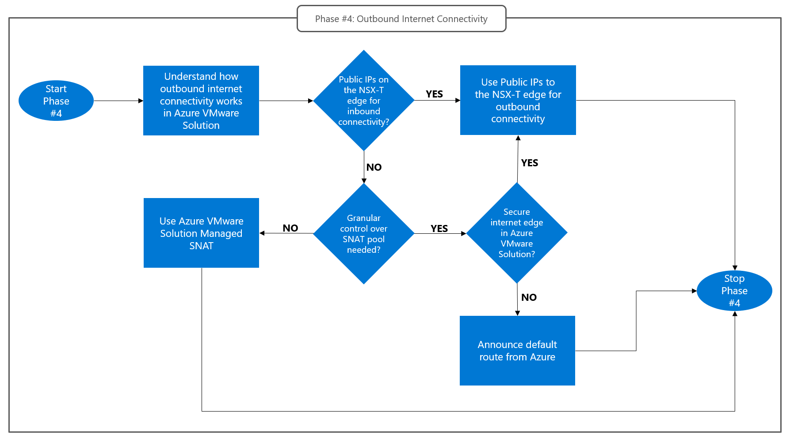
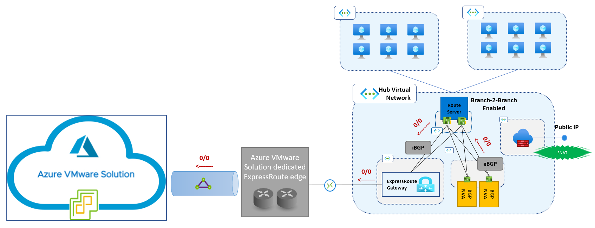

# Design phase #4: Internet outbound connectivity
Design Phase #4 is driven by the outbound Internet connectivity requirements of the applications running on Azure VMware Solution. Such requirements may range from basic Internet access (for example to allow virtual machines running in the private cloud to download software updates) to complex outbound scenarios that require granular control on the source-NAT address pool (for example in B2B collaboration scenarios where access to a third party API is allowed only from authorized IP addresses) or the number of supported source-NAT sessions (for example in VDI scenarios). 

Almost invariably, outbound Internet access must be secured, by routing connections through a firewall or proxy device. Azure VMware Solution supports deploying such devices in the private cloud itself, or in an Azure virtual network connected to the private cloud. Choosing between these two options is the main goal of Design Phase #4. The following considerations may help drive the decision:
- Azure VMware Solution customers may want to leverage pre-existing secure internet access NVAs (firewalls, forward proxies) deployed in Azure virtual networks for cost optimization and consistency.
- Azure VMware Solution customers may want to leverage PaaS solutions available on Azure, to reduce management overhead. Azure Firewall (especially when the Premium SKU features are enabled) can be used for secure Internet access. 
- Azure VMware Solution customers that prefer to host the network infrastructure that supports their Azure VMware Solution applications entirely on Azure VMware Solution may want to deploy firewalls and/or proxy devices as Azure VMware Solution virtual machines, if supported by the NVA vendor.

Design phase #4 has a dependency on Phase #3. If ["Public IPs to the NSX-T edge"](network-design-guide-internet-inbound-connectivity.md#nvas-for-application-publishing-hosted-in-azure-vmware-solution-public-ips-on-the-nsx-t-edge) has been selected as the inbound Internet connectivity option, then it must be used for outbound connectivity too. All outbound connections initiated by virtual machines running on Azure VMware Solution will be managed on the NSX-T edge and Source-NATted behind addresses in the Azure Public IP Prefix associated with the private cloud's NSX-T edge. The flow chart below describes how to approach Design Phase #4.
 
 
*Design Phase #4: Outbound Internet connectivity.*

## Default routes and outbound Internet connectivity in Azure VMware Solution
Default routes determine how outbound Internet connections initiated by virtual machines running in the private cloud are routed. Different default routes are used in different network segments of an Azure VMware Solution private cloud: 
- The private cloud's management network (which hosts vCenter Server and NSX-T Manager) always uses a default route that provides direct Internet access through a platform-managed Internet breakout. This default route cannot be overridden and users have no control over the source-NAT pool for connections initiated from the management network.
- All workload segments share the same default route configuration, which can be one of the following:
    - Default route that provides Internet access through a platform-managed breakout. Source-NAT can be managed by the platform or by the user. In the former case, users have no control over the public IP addresses in the source-NAT pool (see [this article](/azure/azure-vmware/concepts-design-public-internet-access#azure-vmware-solution-managed-snat) for more information). In the latter case, users are responsible for provisioning Azure Public IP Prefixes for the source-NAT pool and for defining NAT rules on the NSX-T edge (see [this article](/azure/azure-vmware/concepts-design-public-internet-access#azure-public-ipv4-address-to-nsx-t-data-center-edge) for more information). 
    - Default route announced over the private cloud's ExpressRoute circuit. This default route can be originated by a BGP-capable device in an Azure virtual network or in an on-premises site. Source-NAT is the user's responsibility and must be performed by network devices in Azure virtual networks or on-premises (see [this article](/azure/azure-vmware/concepts-design-public-internet-access#internet-service-hosted-in-azure) for more information).

Outbound internet connectivity for workload segments can be configured through the Azure portal, by selecting one of the following options: 
- "Connect using SNAT" provides a platform-managed Internet breakout with a managed NAT pool. 
- "Connect using Public IP down to the NSX-T edge" provides a platform-managed internet breakout with user-managed NAT pool.
- "Do not connect or connect using default route from Azure" disables the platform-managed Internet breakout. Use this option when a custom default route is announced over the Azure VMware Solution ExpressRoute circuit from Azure or on-premises sites. 

The three options are discussed next.

### Use Azure VMware Solution managed source-NAT
Managed source-NAT is the lowest complexity option for outbound Internet access in Azure VMware Solution. When enabled on a private cloud, a default route in installed on T0/T1 gateways that forwards Internet-bound traffic to a platform-managed edge. The platform managed edge performs source-NAT. Users have no control on the NAT pool. Managed source-NAT can be used to provide direct Internet access to Azure VMware Solution virtual machines. It is however possible to define NSX-T topologies whereby Internet-bound connections initiated by virtual machines are routed to secure Internet edge devices (firewall, forward proxies) deployed as virtual appliances running in the private cloud itself. Typical reasons for discarding Azure VMware Solution managed source-NAT for outbound connectivity are listed below:

- Granular control over the NAT pool is a requirement. For example, specific Azure Public IPs must be used to source-NAT connections initiated by specific virtual machines towards specific public endpoints. In this case, Public IPs on the NSX-T edge, [covered below](network-design-guide-internet-outbound-connectivity.md#deploy-pips-at-the-nsx-t-edge), should be considered.
- Public IPs on the NSX-T edge have been selected for Internet inbound connectivity in [Design Phase #3](network-design-guide-internet-inbound-connectivity.md). In this case, Public IPs on the NSX-T must also be used for outbound Internet connectivity. See [next section](network-design-guide-internet-outbound-connectivity.md#deploy-pips-at-the-nsx-t-edge).
- Outbound Internet connections should be routed via a secure Internet edge running in an Azure VNet (or in an on-premises site). In this case, a default route must be originated from the Internet edge running in Azure and advertised to the private cloud (covered in section [Originate default route from Azure](#originate-default-route-from-azure-customer-managed-vnet-or-virtual-wan)).

### Deploy PIPs at the NSX-T edge
When Public IPs to the NSX-T edge are configured, a default route that forwards traffic from T1/T0 gateways towards the Azure network's Internet edge exists in the private cloud. Outbound Internet connections must be source-NATted on T1 gateways using  one of the Public IPs associated to the private cloud. Detailed instructions on how to configure NAT rules on T1 gateways are provided in the [official documentation](/azure/azure-vmware/enable-public-ip-nsx-edge#outbound-internet-access-for-vms).This option can be used to provide direct Internet access to Azure VMware Solution virtual machines. It is however possible to define NSX-T topologies whereby Internet-bound connections initiated by Azure VMware Solution virtual machines are routed to secure Internet edge devices (firewall, forward proxies) deployed as virtual appliances in the private cloud. 

### Originate default route from Azure (customer-managed virtual network or Virtual WAN)
Internet-bound traffic emitted by Azure VMware Solution virtual machines can be routed to an Azure-native NVA by announcing a default route over the private cloud's managed ExpressRoute circuit. The private cloud's T0 gateways will honor the default route received from Azure and will send Internet-bound traffic to the next hop specified by the received default route. If the Internet edge NVAs in Azure support BGP, then they can be used as BGP speakers to originate the default route. If the NVAs do not support BGP (or cannot be used as BGP speakers due to security-related constraints), additional NVAs can be deployed to act as BGP speakers. A typical scenario that requires additional BGP-capable NVAs is when the Azure Internet edge is Azure Firewall (Azure Firewall does not support BGP). The resulting network topology is shown in the figure below.

  
*Default route origination from Azure virtual networks.*

## Next Steps
- Go back to [Design Phase #3: Inbound Internet Connectivity](network-design-guide-internet-inbound-connectivity.md)
- Go back to the Azure VMware Solution Network Design Guide [introduction](network-design-guide-intro.md)
