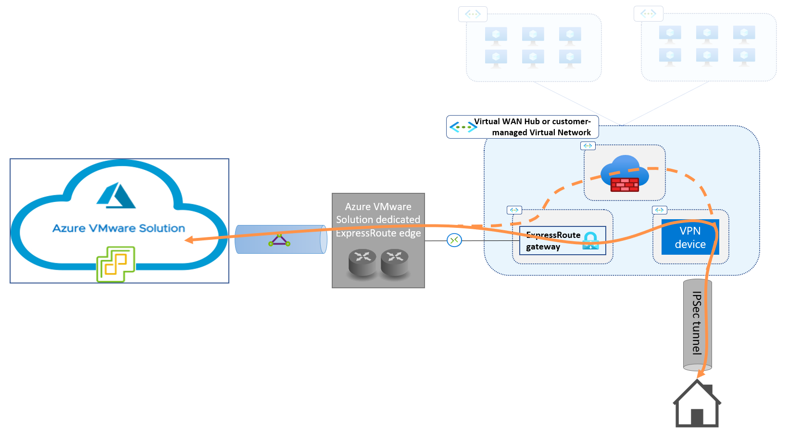
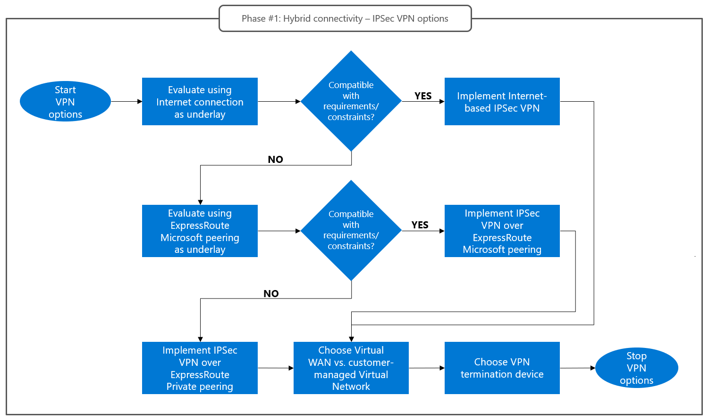
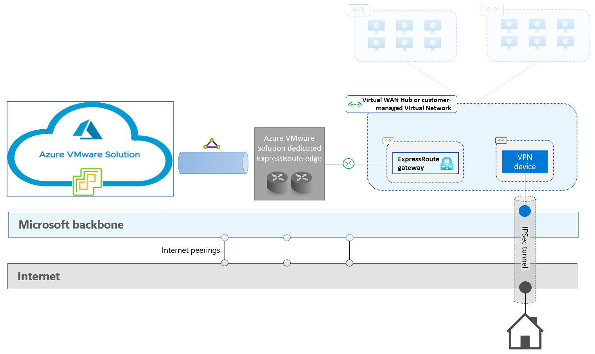
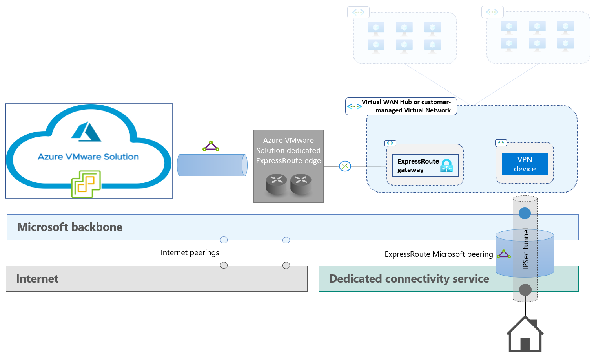
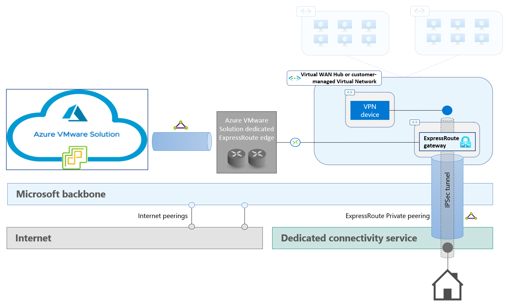
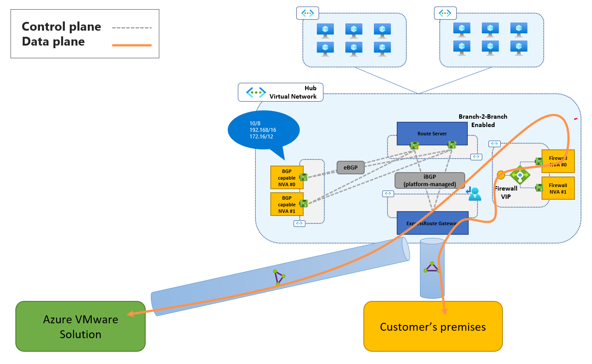
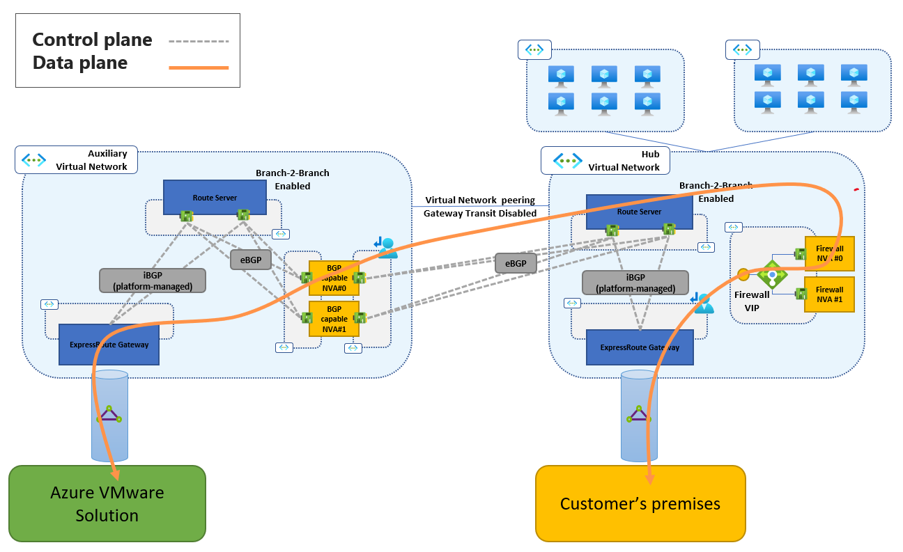

# Design phase #1: Connectivity with on-premises sites
Connectivity with on-premises datacenters is the most critical design area for Azure VMware Solution networking. The key requirements that must be addressed are the following:
- High throughput: Migrations from on-premises vSphere environments and disaster recovery solutions require moving large volumes of data between on-premises sites and private clouds.
- Low latency: Distributed applications may require low latency for connections between Azure VMware Solution virtual machines and on-premises systems.
- Performance predictability: Mission critical applications deployed on Azure VMware Solution may require connections to on-premises hosts to exhibit predictable throughput and latency, which can be achieved only by using dedicated connectivity services between on-premises sites and the edge of the Microsoft network (ExpressRoute).

This section describes the options supported by Azure VMware Solution for connectivity with on-premises sites: 
- [ExpressRoute Global Reach](#expressroute-global-reach)
- [IPSec VPNs](#ipsec-vpns)
- [Transit over ExpressRoute Private Peering](#transit-over-expressroute-private-peering)

The options are presented in order of decreasing ability to meet the key requirements listed above. An option should be discarded, and the next one considered, only if it conflicts with non-negotiable constraints that exist in a specific scenario, as shown in the flowchart below:
   

*Design phase #1. How to select a hybrid connectivity option for Azure VMware Solution.*

## ExpressRoute Global Reach
ExpressRoute Global Reach is the default hybrid connectivity option supported by Azure VMware Solution. It provides plain layer-3 connectivity between a private cloud and a remote site connected to a customer-managed ExpressRoute circuit, with minimal complexity. The customer-managed ExpressRoute circuit can be used to connect to Azure native services too. However it is possible, for security or bandwidth reservations purposes,  to deploy a separate customer-managed circuit exclusively dedicated to Azure VMware Solution traffic. 

The figure below shows the network topology when Global Reach is used for connectivity with on-premises sites.
 

*Hybrid connectivity with ExpressRoute Global Reach. Traffic between private clouds and on-premises sites does not transit through Azure VNets.*

Detailed instructions on how to connect an Azure VMware Solution private cloud to a customer managed ExpressRoute circuit using Global Reach are available in [the official Azure VMware Solution documentation](/azure/azure-vmware/tutorial-expressroute-global-reach-private-cloud).

Global Reach connectivity fully addresses the three key requirements listed above:  
- High throughput: ExpressRoute allows customers to connect to the edge of the Microsoft network from their premises over dedicated lines, and to provision the network capacity they need (up to 10 Gbps for provider-based ExpressRoute, or 100 Gbps for ExpressRoute Direct). 
- Low latency: Global Reach allows routing traffic directly from the edge of the Microsoft network to the Azure VMware Solution vSphere clusters. Global Reach minimizes the number of network hops between on-premises sites and private clouds.
- Predictable performance: When using ExpressRoute Global Reach, traffic is routed over links that will not experience congestion issues (up to the maximum provisioned capacity). Therefore, the round-trip time (RTT) between virtual machines running on Azure VMware Solution and on-premises hosts remains constant over time.

Using Global Reach for connectivity with on-premises sites is not an option in scenarios where one or more of the following constraints apply:
  - ExpressRoute Global Reach is unavailable in the Azure region of the Azure VMware Solution private cloud and/or the meet-me location of the customer-managed ExpressRoute circuit. This is an ExpressRoute limitation for which no workaround exists. Please refer to the [official ExpressRoute documentation](/azure/expressroute/expressroute-global-reach#availability) for up-to-date information about Global Reach availability.
  - Non-negotiable network security requirements. If a firewall device cannot be deployed at the on-premises side of the customer-managed ExpressRoute circuit, using Global Reach exposes all Azure VMware Solution network segments, including management networks (vCenter Server and NSX-T Manager), to the entire network connected to the circuit. The most typical scenario where this issue arises is customer-managed ExpressRoute circuits implemented on top of MPLS network services (aka [ExpressRoute "any-to-any" connectivity model](/azure/expressroute/expressroute-connectivity-models)), as shown in the figure below.
 

*ExpressRoute (ER) connectivity implemented on top of MPLS IPVPNs makes it impossible to deploy firewalls in a single location/facility to inspect all traffic to/from Azure VMware Solution. Typically, customers that use MPLS networks deploy firewalls in large datacenters, not in all MPLS connected sites (which can be small branches/offices/stores).*

## IPSec VPNs
Connectivity between Azure VMware Solution private clouds and on-premises sites can be implemented by routing traffic through a "transit" virtual network in Azure. The transit network is connected to the Azure VMware Solution private cloud through the managed ExpressRoute circuit. The transit virtual network is connected to the on-premises site using an IPSec VPN, as shown in the diagram below.

*The IPSec VPN connectivity option covered in this section. Traffic between Azure VMware Solution private clouds and on-premises sites is routed through a transit virtual network in Azure.*

Implementing IPSec connectivity between on-premises sites and transit VNets entails three design decisions:
1. Which network service to use as the underlay for the IPSec tunnel. The available options are internet connectivity, ExpressRoute "Microsoft" peering and ExpressRoute "Private" peering.
2. Where to host the virtual devices that terminate the IPSec tunnel on the Azure side. The available options are using a customer-managed virtual network or a Virtual WAN hub. 
3. Which virtual device terminates the IPSec tunnel on the Azure side. The choice of the device also determines the required Azure configuration to route traffic between the IPSec tunnel and the Azure VMware Solution managed circuit. The available options are native Azure VPN gateway or 3rd party IPSec NVAs.

*Design process for IPSec connectivity.*

The criteria that drive these design decisions are covered next.

### IPSec VPN design decision #1: Underlay network service
This guide strongly advocates considering the three available options for the VPN underlay in the order they are presented below. 

- **Internet connectivity**. An internet connection is used at the on-premises site to reach the edge of the Microsoft network and the public IP of a VPN device hosted in the transit virtual network, which serves as the remote endpoint of the IPSec tunnel. Due to its low complexity and cost, internet connectivity should be always tested and assessed from a performance standpoint (achievable IPSec throughput, see the “IPSec bandwidth considerations” section below). It should be dismissed only when the observed performance is too low and/or not consistent over time.

*Internet connection as the IPSec tunnel underlay.*

- **ExpressRoute "Microsoft" peering**: The ExpressRoute "Microsoft" peering provides layer-3 connectivity to public Azure endpoints over dedicated links. Just like internet connections, it allows reaching the public IP of a VPN device hosted in the transit virtual network, which serves as the remote endpoint of the IPSec tunnel. This option should be dismissed only when the [Microsoft peering's routing requirements](/azure/expressroute/expressroute-routing#ip-addresses-used-for-microsoft-peering) cannot be met.

*ExpressRoute "Microsoft" peering as the IPSec tunnel underlay.*

- **ExpressRoute "Private" peering**: The ExpressRoute "Private" peering provides layer-3 connectivity between an on-premises site and Azure virtual networks over dedicated links. As such, it allows establishing an IPSec tunnel from the on-premises site towards the private IP address of a VPN device hosted in a virtual network. The ExpressRoute "Private" peering may introduce bandwidth limitations (due to the presence of the ExpressRoute Gateway in the transit virtual network, which is in the data path unless [ExpressRoute FastPath](/azure/expressroute/about-fastpath) can be used) and requires more complex routing configuration on the on-premises side (see [this article](/azure/vpn-gateway/site-to-site-vpn-private-peering?toc=%2Fazure%2Fexpressroute%2Ftoc.json) for more details).

*ExpressRoute "Private" peering as the IPSec tunnel underlay.*

### IPSec VPN design decision #2: Customer-managed virtual network vs. Virtual WAN hub
This design decision is driven by the characteristics of the pre-existing Azure environment (if any) and by the desired trade-off between management effort and ability to tailor the configuration to specific needs. The key considerations are listed below.
- Pre-existing Azure network infrastructure should be leveraged for Azure VMware Solution connectivity. If a customer-managed hub-spoke network is already present, then the IPSec termination devices should be deployed in the existing hub. If a hub and spoke network based on Virtual WAN is present, then the Virtual WAN hub should be used for IPSec termination.
- In a customer-managed hub-spoke network, routing traffic between an IPSec tunnel and the ExpressRoute managed circuit requires deploying an [Azure Route Server instance](/azure/route-server/overview) in the hub virtual network, configured to [allow “Branch-to-branch” traffic](/azure/route-server/expressroute-vpn-support).
- In a customer managed virtual network, it is possible to customize routing so that traffic between Azure VMware Solution private clouds and on-premises sites is inspected by firewall devices deployed in an Azure virtual network.
- Virtual WAN hubs natively support routing traffic between the IPSec tunnel connected to the on-premises site and the Azure VMware Solution managed ExpressRoute circuit.
- When using Virtual WAN, inspection for traffic between Azure VMware Solution private clouds and on-premises sites is enabled by [Virtual WAN Routing Intent/Routing Policies](/azure/virtual-wan/how-to-routing-policies). Regional availability and limitations should be reviewed.

### IPSec VPN design decision #3: IPSec termination device
The IPSec tunnel that provides connectivity to the on-premises site can be terminated by Azure VPN Gateways or by 3rd party NVAs. This design decision is driven by the characteristics of the pre-existing Azure environment (if any) and by the desired trade-off between management effort and ability to tailor the configuration to specific needs. The key considerations are listed below.

- **Azure VPN Gateways**, both in customer-managed and Virtual-WAN-based hub-spoke networks, can be used to terminate IPSec tunnels connected to on-premises sites. Being platform-managed, Azure VPN Gateways require minimal management effort. Pre-existing gateways can be used even if they support other connectivity scenarios. The following documentation articles should be reviewed to understand supported settings and expected performance:
    - [VPN Gateway SKUs and expected performance levels (standalone)](/azure/vpn-gateway/vpn-gateway-about-vpn-gateway-settings#benchmark)
    - [VPN Gateway cryptographic requirements (standalone)](/azure/vpn-gateway/vpn-gateway-about-compliance-crypto)
    - [VPN Gateway settings (Virtual WAN)](/azure/virtual-wan/gateway-settings#s2s)
    - [VPN Gateway cryptographic requirements (Virtual WAN)](/azure/virtual-wan/virtual-wan-ipsec) 

- **Third-party NVAs** are typically used to terminate tunnels from on-premises sites in the following situations:
    - The NVA is the CPE of an SDWAN solution deployed both in Azure and the on-premises site.
    - The NVA is a firewall that enforces the required security policy for connections between the on-premises site and Azure VMware Solution.

   Using third-party devices may provide more flexibility (and access to advanced network functions not supported by native VPN gateways) but increases complexity: high availability becomes the user's responsibility, multiple instances should be deployed, etc.

## Transit over ExpressRoute Private peering
ExpressRoute Private peering is the most common choice for connecting an on-premises site to an Azure virtual network (or hub-spoke network) in enterprise scenarios. The Azure virtual network (or the hub virtual network in hub-spoke topologies) contains an ExpressRoute Gateway, configured with a connection to the ExpressRoute circuit. This setup provides layer-3 connectivity between the virtual network (or the whole hub and spoke network) and the on-premises site's network. However, it does not natively provide layer-3 connectivity to Azure VMware Solution private clouds connected to the same virtual network (or hub virtual network, in hub-spoke networks) through a managed ExpressRoute circuit (see section ["What is the role played by ExpressRoute Global Reach?"](network-design-guide-avs-networking-basics.md#what-is-the-role-played-by-expressroute-global-reach)).

By deploying additional routing devices in the Azure virtual network, it is possible to overcome this limitation. This design allows routing traffic through firewall NVAs hosted in the virtual network, which provides an effective way to enforce a network security policy for Azure VMware Solution resources and Azure VMware Solution management networks. While this approach may seem desirable, it has complexity and performance implications. It should be considered only when ExpressRoute Global Reach and IPSec VPNs (covered in the previous sections) are not applicable.

Two implementation options exist:
- Single virtual network. When using this option, both the customer-managed and the Azure VMware Solution managed circuits are connected to the same ExpressRoute Gateway.
- Auxiliary transit virtual network. When using this option, the customer-managed ExpressRoute circuit that provides connectivity to the on-premises site is connected to the (typically pre-existing) ExpressRoute Gateway in the hub virtual network. The Azure VMware Solution managed circuit is connected to a different ExpressRoute Gateway deployed in an auxiliary transit virtual network.

The two options provide different trade-offs between performance, cost (i.e. required Azure resources) and management overhead. The following sections cover control plane implementation (i.e. how routes are exchanged between the on-premises site and the private cloud) and data plane implementation (i.e. how network packets are routed between the on-premises site and the private cloud) for both options. Both options rely, for their control plane implementations, on [Azure Route Server](/azure/route-server/overview). Azure Route Server propagates routes between the customer-owned ExpressRoute circuit and the private cloud's managed ExpressRoute circuit. Azure Route Server must be configured with the [branch-to-branch setting](/azure/route-server/expressroute-vpn-support) enabled.

### Single virtual network
In the single virtual network approach, both the private cloud's managed circuit and the customer-owned circuit are connected to the same ExpressRoute gateway, typically the hub network. Traffic between the private cloud and the on-premises site can be routed through firewall NVAs deployed in the hub network. The single virtual network architecture is shown in the figure below.
 

*The single virtual network option for ExpressRoute transit.*

The control plane and the data plane are implemented as follows.
- Control plane. As the ExpressRoute Gateway deployed in the Azure virtual network cannot propagate routes between the Azure VMware Solution managed and the customer managed ExpressRoute circuits, Azure Route Server is used to inject, in both circuits, routes for supernets that include the private cloud's address space (management networks and workload segments) and the on-premises address space. Using supernets, instead of the exact prefixes that comprise those address spaces, is required because the exact prefixes are announced in the opposite direction (by the private cloud and the on-premises site). Supernets as large as RFC 1918 prefixes may be used if compatible with the network configuration of the on-premises sites. In most cases, the smallest supernets that include that include the private cloud’s address space and the on-premises address space should be used instead, to minimize the risks of conflicts with the routing configuration of the on-premises sites. The routes for the supernets are originated by BGP-capable NVAs. The NVAs are configured to establish a BPG session with the Azure Route Server. The NVAs are only part of the control plane and do not route actual traffic between the on-premises site and the private cloud. The control plane implementation is shown by the grey lines in the figure above.
- Data plane. The control plane implementation described above achieves the effect of attracting to the ExpressRoute Gateway (a) traffic from the on-premises site, destined to the Azure VMware Solution private cloud; and (b) traffic from the private cloud, destined to the on-premises site. If no UDR's are applied to the GatewaySubnet, traffic flows directly between the on-premises site and the private cloud. By applying UDR's to the GatewaySubnet, it is possible to route traffic to an intermediate next hop, such as firewall NVAs that enforce network security policies on connections between on-premises sites and private clouds (for example, protecting access to Azure VMware Solution management networks).

### Auxiliary virtual network
An auxiliary virtual network can be used to host a second ExpressRoute gateway, only connected to the private cloud's managed circuit. By connecting the private cloud's managed circuit and the customer-managed circuit to different ExpressRoute gateways, and injecting proper routes into them via Route Server instances, it is possible to granularly control route propagation between the private cloud and the on-premises site. Announcing supernets is no longer necessary (as it is the case for the single virtual network option covered in the previous section). Management overhead for UDR's in the GatewaySubnet is also reduced. This approach allows routing traffic between the private cloud and the on-premises site through firewall NVAs in the hub virtual network. The auxiliary virtual network implementation option is shown in the figure below.
 

*The auxiliary virtual network implementation option.*

The control plane and the data plane are implemented as follows.
- Control plane. To enable route propagation between the private cloud's managed circuit and the customer-owned circuit, an Azure Route Server instance is needed in each virtual network. As the two Azure Route Server instances [cannot establish a BGP adjacency](/azure/route-server/route-server-faq#can-i-peer-two-route-servers-in-two-peered-virtual-networks-and-enable-the-nvas-connected-to-the-route-servers-to-talk-to-each-other), BGP-capable NVAs are needed to propagate routes between them. At least two NVA instances should be deployed for high availability. More instances may be added to increase throughput. The BGP-capable NVAs must have two NICs, attached to different subnets. BGP sessions towards the two Route Servers (in the auxiliary VNet and the hub VNet) must be established over different NICs. Routes originated by the private cloud and by the on-premises site are learned over ExpressRoute circuits: Their AS Path contains ASN 65515 (Azure-reserved ASN used by ExpressRoute Gateways) and ASN 12076 (Microsoft-owned ASN used by the MSEEs in all peering locations). The BGP-capable NVAs must manipulate the AS Path by removing them, to prevent routes from being dropped by BGP loop detection. Additional details on the required BGP configuration are provided in [this step-by-step configuration guide](https://github.com/Azure/Enterprise-Scale-for-AVS/tree/main/BrownField/Networking/Step-By-Step-Guides/Expressroute%20connectivity%20for%20AVS%20without%20Global%20Reach).
- Data plane. In the auxiliary virtual network, traffic between the private cloud and the on-premises site is routed through the BGP-capable NVAs. Traffic to/from the private cloud leaves/enters the NVAs through the NIC used for the BGP session with the auxiliary virtual network's Route Server. Traffic to/from the on-premises site leaves/enters the NVAs through the NIC used for the BGP session with the hub VNet’s Route Server. This NIC is attached to subnet associated to a custom route table that (i) disables learning BGP routes from the Route Server (to avoid loops) and (ii) inserts the hub network's firewall in the datapath. To ensure that traffic is symmetrically routed via the hub firewall, UDRs for the all the prefixes used in the private cloud must be configured on the hub's GatewaySubnet. Additional details are provided in [this step-by-step configuration guide](https://github.com/Azure/Enterprise-Scale-for-AVS/tree/main/BrownField/Networking/Step-By-Step-Guides/Expressroute%20connectivity%20for%20AVS%20without%20Global%20Reach).

## Next Steps
- Go to the next section to learn about [connectivity between Azure VMware Solution and Azure Virtual Networks](network-design-guide-vnet-connectivity.md) 
- Go back to [Azure VMware Solution Networking Basics](network-design-guide-avs-networking-basics.md)
- Go back to the Azure VMware Solution Network Design Guide [introduction](network-design-guide-intro.md)
