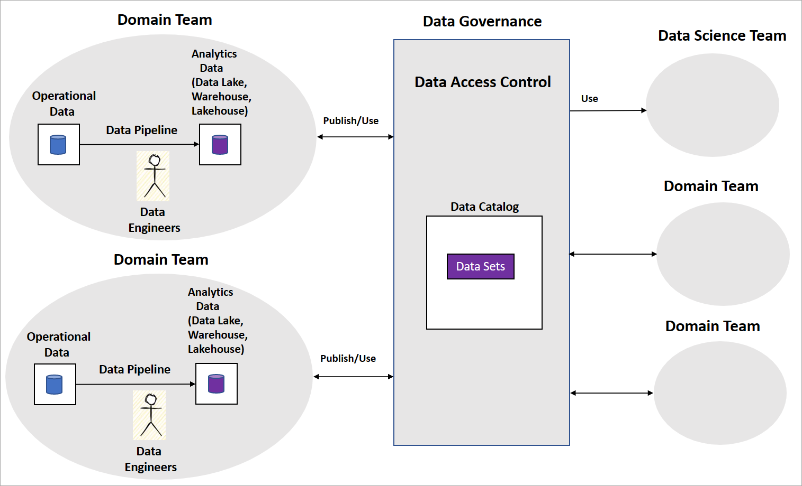

# Operationalize data mesh for AI/ML domain driven feature engineering

Data mesh helps organizations move from a centralized data lake or data warehouse to a domain-driven decentralization of analytics data underlined by four principles: Domain Ownership, Data as a Product, Self-serve Data Platform, and Federated Computational governance. [Data mesh](what-is-data-mesh.md) provides the benefits of distributed data ownership and improved data quality and governance that accelerates business and time to value for organizations.

## Data mesh implementation

A typical data mesh implementation includes domain teams with data engineers who build data pipelines. The team maintains operational and analytical data stores, like data lakes, data warehouse, or data lakehouse, and releases the pipelines as [data products](what-is-data-product.md) for other domain teams or data science teams to consume. Other teams consume the data products using a central data governance platform as shown in the following diagram.

Data mesh concept is quite clear on how Data Products serve transformed and aggregated data sets for business intelligence. However, it is not very explicit on the approach organizations should adopt to build AI/ML models, structure their data science teams, AI/ML model governance and sharing of AI/ML models or features among domain teams. In the next section, we discuss a couple of strategies which organizations could undertake to develop AI/ML capabilities within Data Mesh and then propose our strategy termed as Domain Driven Feature Engineering or Feature Mesh. 

## Next steps

- [Data Sharing Overview](data-contracts.md)
