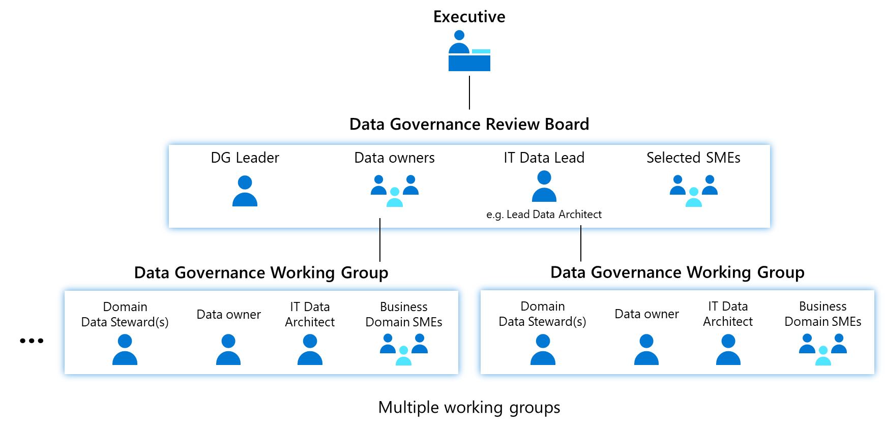

---
# This basic template provides core metadata fields for Markdown articles on docs.microsoft.com.

# Mandatory fields.
title: Enterprise Scale Analytics and AI Teams
description: Enterprise Scale Analytics and AI Architecture operation and teams structure
author:
ms.author: # Microsoft employees only
ms.date: 12/8/2020
ms.topic: conceptual
ms.service: architecture-center
ms.subservice: enterprise-scale-analytics
# Use ms.service for services or ms.prod for on-prem products. Remove the # before the relevant field.
# ms.service: service-name-from-white-list
# ms.prod: product-name-from-white-list

# Optional fields. Don't forget to remove # if you need a field.
# ms.custom: can-be-multiple-comma-separated
# ms.reviewer: MSFT-alias-of-reviewer
# manager: MSFT-alias-of-manager-or-PM-counterpart
---

# Personas and Teams

The Enterprise Scale Analytics and AI moves teams from being a centralized data team, working horizontally across each tier such as Ingest, Processing, Analysis, Consumption and Visualization to vertical Data Landing Zone Groups coexisting together in an agile team. Platform teams such as Data Platform Ops and Platform Ops are groups together under a common Platform Group.

Figure 1: Enterprise Scale Analytics and AI Teams

## Personas

There are multiple personas involved in an Enterprise Scale Analytics and AI deployment. The following sections attempts to give a high insight to those which we see are key to the success.

| Persona | Role |
|-|-|
|Product Owners| Product Owners leverage Azure to transform your solutions and bring agility to the business and optimize business processes.|
| Solution Architects | Define Solutions to drive across the boundaries of the enterprise business network.  Learn how to deal with Diagnosis, Analysis, Design, Deployment and integration of Azure services. |
|Developer/DevOps Engineers|Design, Build, deploy, test and maintain continuous integration and delivery process with Azure DevOps or GitHub.|
| Security Engineer * | Enable your teams to design and implement a secure infrastructure on Azure leveraging best practices. |
| Technical/Business Managers *|Build an overall understanding of Azure services.  Control your Cloud costs and Optimize your operations and the agility of your team.|
|Decision Maker/ Business Users|Leverage Azure to access actionable insight, expecting it to be delivered in most relevant form. Leverage AI embedded in existing solutions to optimize business processes.|
| Data Manager | Responsible for provisioning and managing access to data assets. |
|Data Analyst/Performance Analyst |Leverage Azure to discover and share new insights from existing data assets or ad-hoc data. Create one-click AI transformations, consume pre-built models and Generate ML models in clicks.|
|Data Engineer | Leverage Azure to build, integrate, and manage data and analytics products. Created AI enabled application / solutions when applicable.|
|Citizen Data Scientist |Create ML model via powerful visual drag-and-drop/step-by-step where no coding is necessary |
| Data Scientist | Use your preferred tools and machine learning frameworks to build scalable data science solutions. Accelerate end-to-end ML lifecycle.|
| ML Engineer | Responsible for enable right processes and infrastructure for easy model deployment and model management. |

>[!NOTE] * These roles are assisted by using Azure Policies to control some of the scope that they would have guidance and control over.

## Data Landing Zone Teams

The Data Landing Zone Group consists of three teams.

### Data Product Scrum Teams (Per Product)

* They are responsible for delivering new Data Products such as insights, reports, workbooks, and apps.
* They partner closely with business analysts and stakeholders.

### Domain Ops (Per Domain)

* They Ingests and Registers new data sources.
* Manage access hierarchy (groups) and approval requests.
* Furnish meta data in Hub data catalogue.

### Data Landing Zone Ops (One group per Data Landing Zone)

* Operate and maintain their Data Landing Zone instance.
* Respond to new Domain and Data Product service requests.

## Platform Group Teams

### Data Platform Ops

* The Data Platform Ops Group define common blueprints for Data Landing Zone and Domain services.
* They provisioning and operative hub services such as data catalogue and shared integration runtimes.
* The instantiate Data Landing Zone scaffolding such as Data Lakes and Meta Data Management configuration before passing over to the Data Landing Zone Ops.
* Provide support and concierge to stakeholders.

### Platform Ops

* Operate and own the cloud platform all up.
* They instantiate Data Management Subscription and Data Landing Zone scaffolding such as networking, peering, core service and monitoring.

## Other Groups

Across the whole operating model, companies have the option to run several smaller teams with key stakeholders and subject matter experts to maintain a centralized view.

### Data Governance Review Board

Figure 2: Data Data Governance Review Board

The Data Governance Review board is the body that governs your organization's data governance policies, guides, and advises your data strategy, prioritizes, and approves your data governance initiatives and projects, and offers ongoing support for these.

### Architecture Review Board

The Architecture Review Board performs the primary function of reviewing and assessing architectures and creating and maintaining standards and references. The Board consists of individuals who are experts in their field; typically, these will be the Domain architects and other technical leaders invited to give opinions where required.

The Feedback and Support Operating Board are responsible for taking feedback on processes and working with the other groups to create backlog items to address gaps and improvements to the solution.

For further details on all how the groups align inside Data Landing Zone and hubs please see [Data Management Subscription and Data Landing Zones](#principals-for-data-node-division).

## Further Reading

[Data Landing Zone Division and Consumption](03-nodedivision.md)

>[!div class="step-by-step"]
>[Previous](01-overview.md)
>[Next](03-nodedivision.md)
