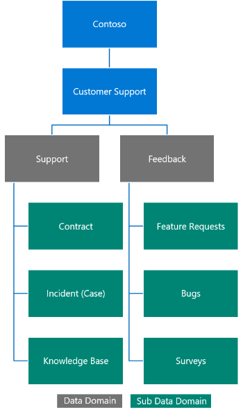
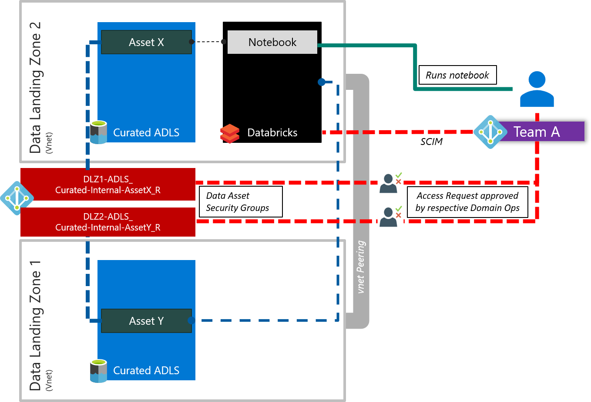

# Data Landing Zone Division and Consumption

If the enterprise has settled on implementing a harmonized mesh, they should give consideration on how they wish to separate the Data Landing Zones into business groups, integrators, and enablers. If they are going for a core service provider pattern, they should consider the [domains](#domain-division) which they will need to provision.

Data Landing Zones can be added and removed over time subject to business acquisitions and divestments. Consumption of data has some input into the division of Data Landing Zones. If a Data Landing Zone constantly accesses a high percentage of data from another Data Landing Zone, there might be a case to consolidate Data Landing Zones.

## Principals for Data Landing Zone

Contoso has identified the following business units to onboard to their Enterprise Scale Analytics and AI solution:

Figure 1: Contoso Business Units

- Customer Support
- Sales and Marketing
- Human Resources
- Finance
- Legal
- IT

Using the concepts of a [Domain-driven design (DDD)](https://docs.microsoft.com/dotnet/architecture/microservices/microservice-ddd-cqrs-patterns/ddd-oriented-microservice) which advocates modeling based on the reality of business as relevant to your use cases. We can apply this to designing our Data Landing Zones using **data** Domain-driven design. We focus firstly on the Domains residing with the business unit and then followed by the Sub-Domain.

>[!NOTE]
>Domain separation allows you to separate data, processing, and tasks into logical groupings called Domains.

Looking at the previous list of Contoso business units, we should see if there are cases where:

- Data would be highly shared between business units
- Data ownership goes across multiple business units

In our example, Human Resources, Finance, Legal, and the CEO business units use a common set of data and many of the Domains overlap. They could be put into a Corp Data Landing Zone with the Domains being split into Human Resources, Finance, Legal, and IT.

The other units are unlikely to have a high amount of data re-usage as they are very different business units and have vastly different Domains. From initial discussions with the business units, we have discovered the following Domains:

| Business Unit       | Domains                              |
|---------------------|--------------------------------------|
| Customer Support    | - Support   - Feedback          |
| Sales and Marketing | - Sales   - Marketing           |

The difference of Domains would lead to us to create two Data Landing Zones with two Domains in each.

> [!TIP]
>You should have an understanding of the amount of crossover of data requirements for each business unit. The higher the amount of data crossover then the more likely the business units should sit in the same Data Landing Zone.

### Domain Division

Having decided upon the number of Data Landing Zones, the business should work to split out the Domains into sub-Domains and delegate responsibility to those Domains for ingesting into the Enterprise Scale Analytics and AI solution pattern.

Figure 2: Contoso Customer Support Domains

In the worked example, for our Customer Support business unit, we have identified a natural grouping for sub-Domains under the Support and Feedback Domains.

## Other Inputs

Other factors which can affect the number of Data Landing Zones required include:

- Business units which span multiple regions and have requirements to keep certain data within a region.
- How cost ownership is typically driven by where businesses sit within the enterprise organization.
- Data programs and projects which can be realized via common services within the Data Landing Zone or as a data product extension. They should not warrant the instantiation of a new Data Landing Zone.

## Inter-Data Landing Zone Consumption

In a harmonized mesh pattern, data assets ingested by one Data Landing Zone can be consumed via other Data Landing Zones as needed. For instance, the central corporate finance function resides in the Corp Data Landing Zone and can run *ad hoc* finance reports by consuming finance data assets distributed across other Data Landing Zones.

The illustration above shows how data assets can be shared in-place between Data Landing Zones subject to the consumer/user being part of the correct "data-asset-security-group". Data assets are registered in the data catalog, for users to discover.

- Users can request access to the particular security group, approved by the Domain Ops team responsible for the data asset.

- Users in one Data Landing Zone should be able query data from another Data Landing Zone in Synapse or Databricks leveraging credential passthrough and/or Databricks Table Access Control.

- Data never leaves the private network as data travels through Private Link and across VNets. This principle applies even when using Azure PaaS services.

> [!TIP]
>Some systems such as ERP (*e.g.* SAP) are complex due to their inherently monolithic structure that cuts across several Domains, combined with the fact that an organization may have multiple Enterprise Resource Planning (ERP) solutions within different business groups. \
\
In this setup each business unit ingests their data from their ERP into their Data Landing Zone. Data is presented in the enriched layer (having passed through raw and enrich) and is accessible subject to AAD group access controls. \
\
The central corporate finance team can curate and ingest the finance objects into a single curated data asset conducive to their requirements in the corporate Data Landing Zone.

## Additional resources

- **DevIQ. Persistence Ignorance Principle** \
  <https://deviq.com/persistence-ignorance/>

- **Oren Eini. Infrastructure Ignorance** \
  <https://ayende.com/blog/3137/infrastructure-ignorance>

- **Angel Lopez. Layered Architecture in Domain-Driven Design** \
  <https://ajlopez.wordpress.com/2008/09/12/layered-architecture-in-Domain-driven-design/>

## Log Feedback to Enterprise Scale Analytics v-team

[Log Feedback for this page](https://github.com/Azure/enterprise-scale-analytics/issues/new?title=&body=%0A%0A%5BEnter%20feedback%20here%5D%0A%0A%0A---%0A%23%23%23%23%20Document%20Details%0A%0A%E2%9A%A0%20*Do%20not%20edit%20this%20section.%20It%20is%20required%20for%20Solution%20Engineering%20%E2%9E%9F%20GitHub%20issue%20linking.*%0A%0A*%20Content%3A%2001-overview%20%E2%9E%9F%2003-dlzdivision.md)

>[Previous](02-esa-ai-teams.md)
>[Next](04-policy.md)
