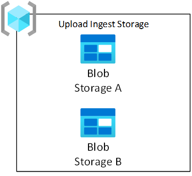
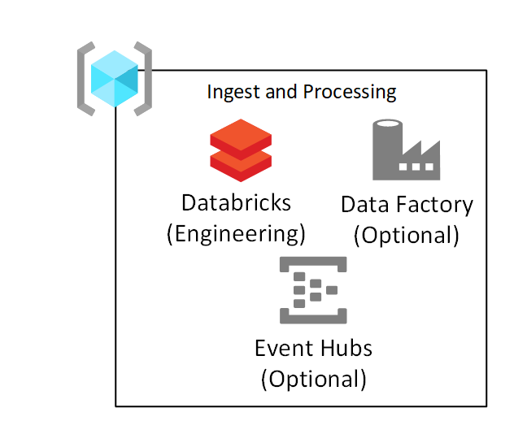
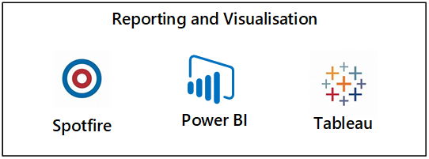

# Enterprise Scale Analytics and AI Architecture Data Landing Zone Overview

Data Landing Zones (spokes) are connected to the Data Management Landing Zone by VNet Peering and are considered a Data Landing Zone in relation to the [Enterprise-Scale Architecture](https://docs.microsoft.com/azure/cloud-adoption-framework/ready/enterprise-scale/).

Before provisioning a Data Landing Zone, you should have your DevOps CI/CD operating model in place and a Data Management Landing Zone deployed. It is highly recommended that you also consider the number of initial Data Landing Zones you want to deploy.

Figure 1: Data Landing Zone

A Data Landing Zone has several layers to enable agility to service the domains within the Data Landing Zone. A new Data Landing Zone is always deployed with a standard set of services to enable the Data Landing Zone to start ingesting and analyzing data.

## Data Landing Zone Provisioning

Every new Data Landing Zone will contain the following resource groups:

- A single Network
- Security
- Ingest and Processing
- An empty Ingest Storage Service
- Data Lake Services
- Shared Synapse
- Shared Databricks
- Metadata Services

### Networking

The `network` resource group contains core enterprise components such as NSG, Network Watcher, and Virtual Network. These will be deployed into a single resource group. As part of a Data Landing Zone deployment, the network of a Data Landing Zone is automatically peered with the Data Management Landing Zone VNet and Connectivity Subscription VNet.

### Monitoring

The Enterprise Scale pattern recommends that all logs should be sent to a central Log Analytics workspace.  However, we also create a Monitoring resource group in each Data Landing Zone.  This workspace should only be used for capturing Databricks Spark logs. The resource group contains a shared Log Analytics workspace and Key Vault to store the Log Analytics keys. These two services are deployed into a single resource group.

### Data Lake Services

Three [Azure Data Lake Storage Gen V2 (ADLS)](https://docs.microsoft.com/azure/storage/blobs/data-lake-storage-introduction) accounts will be provisioned in the Data Lake Services Resource Group. The data transformed at different stages will be saved on one of the Data Landing Zone's three data lakes and will be available for the Analytics, Data Products, Data Science, and Visualizations teams to consume. These will be deployed into a single resource group.

### Upload Ingest Storage Service

Third-party data publishers require the ability to land their data into the platform so domains can pull it into their Data Lakes. The Upload Ingest Storage resource group enables provisioning of blob stores for third-parties. As the provisioning of Azure Storage Blobs is on an as-needed basis, an empty storage service resource group will be deployed in each new Data Landing Zone.

Figure 3: Upload Ingest Storage Service

These storage blobs are requested by the Domain Ops Teams and approved by the Data Landing Zone Ops Team.

Once the data has been pulled from the storage blobs into RAW, the data should be removed from the source storage blob.

>[!IMPORTANT]
>Deploy an empty storage services resource group per Data Landing Zone.

### Ingestion and Processing Resource Group

If your enterprise has already developed an ingestion framework engine for automatically ingesting data based on registering metadata which includes connection strings, path to copy data from and to, and ingestion schedule, the ingestion and processing resource group has key services to leverage such a framework.

Ingest and Processing will be deployed into a single resource group.

Figure 4: Data Landing Zone Ingest and Processing

The ingestion framework engine should copy data through the layers of the data lake service from source to raw to enriched.

As data sources are registered and integrated into respective data lakes using a repeatable and consistent framework, the data should be registered with Azure Purview for discovery.

If you have an ingestion framework engine, we recommend using Azure Data Factory as the primary orchestration engine for getting data into RAW and to ENRICHED.

>[!IMPORTANT]
>Ingestion and Processing is discussed at length under [Data Ingestion](../04-ingestion/01-overview.md).

#### Azure Databricks

Azure Databricks should always deployed because it would be used by the Domains for ingestion, transformation, and loading of data. See the [Azure Databricks](#shared-azure-databricks) section for details of workspace deployments.

An Azure Databricks workspace is provisioned for Ingestion and Processing which will connect to Azure Data Lake via Azure Service Principals. These are referred to as **Azure Databricks Engineering Workspaces**.

The Databricks workspaces are locked down to only allow deployment of notebooks or jars from the Domains Azure DevOps Repo via a Data Domains Service Principal.

#### Real-Time Streaming

IOT Hubs and Event Hubs could be used by your ingestion framework engine for real-time streaming to Event Hubs and for processing of both batch and streaming via a Databricks Engineering Workspace.

### Metadata Services

Across the Data Landing Zone there is the requirement for a number of shared metadata services which provide functionality to other shared services. These will be deployed into a single resource group.

Figure 2: Data Landing Zone Metadata Services

If you have decided to develop your own ingestion framework engine based on the recommendations in the Enterprise Scale Analytics and AI ingestion flow, using either a PowerApp or a .Net Application, in the Data Management Landing Zone, we would suggest deploying an Azure SQL DB to hold metadata for Azure Data Factory to use. Having this custom application will speed up the onboarding of data sources, allowing teams to create new data sources for ingestion for landing into the RAW to ENRICHED in the Data Landing Zone data lakes.

A Self-Hosted Integration Runtime will be deployed for use with Azure Purview to scan data inside the Data Landing Zone. Although the DevOps CI/CD process will handle the registration of these runtimes into Azure Purview, we recommend understanding [Create and manage a self-hosted integration runtime](https://docs.microsoft.com/azure/purview/manage-integration-runtimes).

An Azure Key Vault will be provisioned to store secrets relating to Data Landing Zone Services such as:

- Azure Data Factory Metastore credentials
- Azure Databricks PAT tokens for use with the automated ingestion process
- Service Principal Credentials for the automated ingestion process
- Data Landing Zone Data Lake Services Keys

The types of data which you will store in the Data Landing Zone will help determine any additional services which should reside here. For example, if you are storing sensitive data, you may choose to include a tokenization engine to ensure that all sensitive data can be tokenized as it is ingested into the data lake.

## Integration

To enable rapid onboarding of datasets, to the Data Landing Zone, we recommend deploying a pair of Self Hosted Integration Runtimes, into the Data Management Landing Zone. These should be hosted in the Integration Resource Group.

To enable you would need to: -

- Create at least one Azure Data Factory in the Integration RG, in the Data Landing Zone, which would only be used for link the Shared Integration Runtime and not for data pipelines.
- Create at least two Virtual Machines, with a Self-Hosted Integration Runtime inside an availability zone using the [ARM template](https://github.com/Azure/Azure-quickstart-templates/tree/master/101-vms-with-selfhost-integration-runtime).
- [The Self Hosted Integration Runtimes should be setup in high availability mode](https://docs.microsoft.com/Azure/data-factory/create-self-hosted-integration-runtime#high-availability-and-scalability).
- The Self Hosted Integration Runtimes should be associated with Azure Data Factories in the Data Landing Zone(s).
- [Azure Automation should be setup to update the Self Hosted Integration Runtime periodically](https://docs.microsoft.com/Azure/data-factory/self-hosted-integration-runtime-automation-scripts)

>[!NOTE]
>This does not restrict the deployment of Integration Runtimes inside a Data Landing Zone or into 3rd party clouds.

### Integration with Databricks and HDInsight

To integrate data from both the Azure Databricks and HDInsight Hive Metastore, you will need to use the Atlas API to update Azure Purview.

While it is possible to reverse engineer the table form by scanning all the Parquet files generated by Databricks and HDInsight, it is preferable to enable catalog updates by using the metadata which has been created in the Hive Metastore.

The pattern is to have a single Hive Metadata Store in the Data Landing Zone for all Databricks Workspaces and HDInsight instances.

This single database would be scanned by Azure Data Factory to extract the tables and paths to update the Event Data Management Landing Zone associated with Azure Purview.

### Shared Products

For each Data Landing Zone, a shared Synapse Analytics workspace and Azure Databricks workspaces will be provisioned for use by everybody in the Data Landing Zone for exploratory purposes.

#### Shared Azure Databricks

Azure Databricks service is envisioned to be one of the key consumers of the data lake storage service. The atomic file operations are optimized for Spark Analytic Engines. This speeds up completion of Spark jobs issued from the Databricks service.

An Azure Databricks workspace provisioned for all Data Scientists and Data Ops called the **Azure Databricks Analytics and Data Science Workspace**. It can be configured to connect to the Azure Data Lake using AAD Passthrough or Table Access Control.

Depending on the use case Conditional Access can be configured as an additional security measure.

The Enterprise Scale Analytics and AI solution pattern takes into account the following best practices for integrating Azure Databricks into the solution pattern:

- [Securing access to Azure Data Lake Gen 2 from Azure Databricks](https://github.com/hurtn/datalake-ADLS-access-patterns-with-Databricks/blob/master/readme.md)
- [Azure Databricks Best Practices](https://github.com/Azure/AzureDatabricksBestPractices/blob/master/toc.md)

#### Shared Azure Synapse Analytics

**Azure Synapse** is the provisioned integrated analytics service that accelerates time to insight across data warehouses and big data systems. Azure Synapse brings together the best of **SQL** technologies used in enterprise data warehousing, **Spark** technologies used for big data, and **Pipelines** for data integration and ETL/ELT. **Synapse Studio** provides a unified experience for management, monitoring, coding and security. Synapse has deep integration with other Azure services such as **Power BI**, **CosmosDB** and **Azure Machine Learning**.

During the initial setup of a Data Landing Zone a single Azure Synapse Analytics Workspace will be deployed to for use by all Domains. Additional ones can be optionally setup for Domains should costs management and recharge be required. Domain and Data Products teams might make use of Synapse Analytics for creating dedicated SQL Pools, as a Read Data Store, which is used by the visualization layer.

## Domain *X*

The Domain resource groups are provisioned for each domain added to a Data Landing Zone. Further reading on onboarding [Domains](05-Domains.md) explains the process for creating the services and resource groups.

## Data Products

A Data Landing Zone can have multiple data products which are created by ingesting data from domains either inside the same Data Landing Zone or from across multiple Data Landing Zones (subject to approval of the domain). The resource group for a data product includes all the service required to make that data product.

For example, there is a requirement to have an Azure Database for MySQL which is used by a visualization tool. The data must be ingested and transformed before landing into the MySQL database. To achieve this, you would deploy both an Azure Data Factory and Azure Database for MySQL into the Data Product Resource Group.

Further reading on onboarding [Data Products](06-dataproducts.md) explains the process for creating the services and resource groups.

## Visualization

For every Data Landing Zone, an empty visualization resource group will be created. This group can be filled with services required to implement your visualization solution. Using the existing VNet will enable your solution to connect to Data Products.

Figure 5: Visualization Resource Group

This resource group could host third-party Virtual Machines for services such as Spotfire or Tableau.

>[!TIP]
>Licensing costs might mean that is it more economical to deploy third-party products such Spotfire and Tableau into the Data Management Landing Zone and for the products to connect across Data Landing Zone(s) to pull data back.

## Log Feedback to Enterprise Scale Analytics v-team

[Log Feedback for this page](https://github.com/Azure/enterprise-scale-analytics/issues/new?title=&body=%0A%0A%5BEnter%20feedback%20here%5D%0A%0A%0A---%0A%23%23%23%23%20Document%20Details%0A%0A%E2%9A%A0%20*Do%20not%20edit%20this%20section.%20It%20is%20required%20for%20Solution%20Engineering%20%E2%9E%9F%20GitHub%20issue%20linking.*%0A%0A*%20Content%3A%2003-datalandingzone%20%E2%9E%9F%2002-datalandingzone)

>[Previous](../02-datamanagement/01-overview.md)
>[Next](02-datalakeservices.md)
