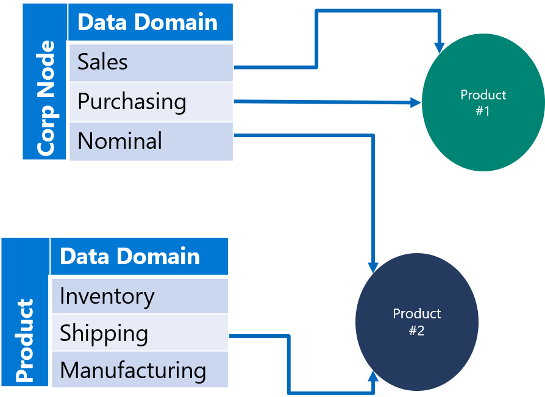

---
# This basic template provides core metadata fields for Markdown articles on docs.microsoft.com.

# Mandatory fields.
title: Enterprise Scale Analytics and AI Data Products
description: Enterprise Scale Analytics and AI Data Products
author: mboswell
ms.author: mboswell # Microsoft employees only
ms.date: 03/01/2021
ms.topic: conceptual
ms.service: cloud-adoption-framework
ms.subservice: ready
---
# Data Products

## Multiple Resource Groups by Data Domain

Data Products are compute or polyglot persistence services that may be required depending on the use case. We therefore expect multiple resource groups by data product.

Examples of Data Products include:

* Functions
* App Service
* Logic Apps
* Azure Analysis Services
* Cognitive Services
* Azure Machine Learning
* Azure SQL DB
* Azure MySQL
* Azure CosmosDB

Azure Policy would drive the default configuration of these services within a Data Landing Zone.

Therefore, we can consider operational analytics as multiple resource groups, which the Data Product Scrum Team can request from a standard service catalog. By using Azure Policy, we can configure the security boundary and required feature set.

These services would be considered an incremental deployment to the Data Landing Zone.

Data Products should be automatically registered in Azure Purview to allow scanning of data.

>[!IMPORTANT]
>To drive consistency we recommend configuring an Azure Policy per Data Domain Product.

## Creating a Data Product

Figure 1 illustrates how a Data Product is created. It shows how a Data Landing Zone hosts multiple data domains and that a Domain logical boundary is driven by data ownership and knowledge. A Data Product is created by ingesting data from Domains either inside the same Data Landing Zone or from across multiple Data Landing Zones subject to approval of the Domain.

Figure 1: Creating a Data Product

## Azure Machine Learning (Optional)

Azure Machine Learning should be considered a data product and can be used to enable the end-to-end data science development activities. Data Product and Science teams will interact with this workspace to explore and pre-process data, iterate through the machine learning model development cycle and operationalize models.

Azure Machine Learning will cover all aspects of the data science lifecycle from datastore and dataset registration to model deployment. It can be used for any kind of machine learning, from classical ML to deep learning, including both supervised and unsupervised learning. Whether you prefer to write Python or R code or use zero-code/low-code options such as the designer, you can build, train, and track highly accurate machine learning and deep learning models in an Azure Machine Learning Workspace.

Figure 2: Sample Data Science workflow

For a production-grade deployment, it is advised to use three workspaces (cf. Figure 21), one for development, one for testing (and making sure that results are reproducible), and one for production. Data scientists should only have access to the dev environment and (optionally) to the test environment. Azure Data Factory can be used in the production environment to orchestrate data flows and to trigger registered machine learning pipelines.

>[!IMPORTANT]
>Deploy three Azure Machine Learning workspaces per project and use Azure Data Factory for orchestrating workflows and triggering registered machine learning pipelines.\
\
Azure Machine Learning clusters should be used for production-grade model training, and Azure Kubernetes Service (AKS) should be used for production-grade deployments.

>[!TIP]
>Azure Machine Learning should be used for data science projects since it covers the end-to-end workflow with various sub-services and features and, in addition, allows to the process to be fully automated.

## Reporting and Visualization

For every Data Landing Zone, an empty Visualization Resource Group is created. Visualization is considered a **data product** and, depending on the complexity, can be created via a self-serve process or managed by a data product team.

>[!NOTE]
>Licensing costs might mean that is it more economical to deploy third-party products such as Spotfire and Tableau into the Data Management Landing Zone and for the products to connect across to the Data Landing Zone to pull data back.

Whilst an initial Reporting and Visualization Resource Group would be deployed for a new Data Landing Zone, Data Products might require their own Reporting and Visualization Resource Group due to security boundaries or a requirement to cross-charge the Domain for usage. However, it is important to remember that using Azure Active Directory Passthrough authentication from services such as Power BI and Azure Analysis Services often reduces the need for a separated security boundary.

Power BI is the strategic visualization tool for self-service analytics and for citizen data scientists. Our recommendation is to leverage the current well-established processes for data refresh scheduling, security, compliance, and data confidentiality handling.

Aligned to Microsoft investments and roadmap, we recommend when necessary and if possible to leverage Power BI Premium as the primary option for specific cases where refresh frequency, performance, or users licensing cannot be met by Power BI Pro.

Azure Analysis Services is recommended to be used on an exception basis. There are specific use cases where it might be required such as multi-dimensional models, CI/CD advanced requirements, etc.

Therefore, as part of low-level design, we recommend enterprises consider an approach that allows access to a "trial" PBI Premium capacity by business users who would like to evaluate if it is a good fit for their use cases.

>[Previous](05-domains.md)
>[Next](../04-ingestion/01-overview.md)
