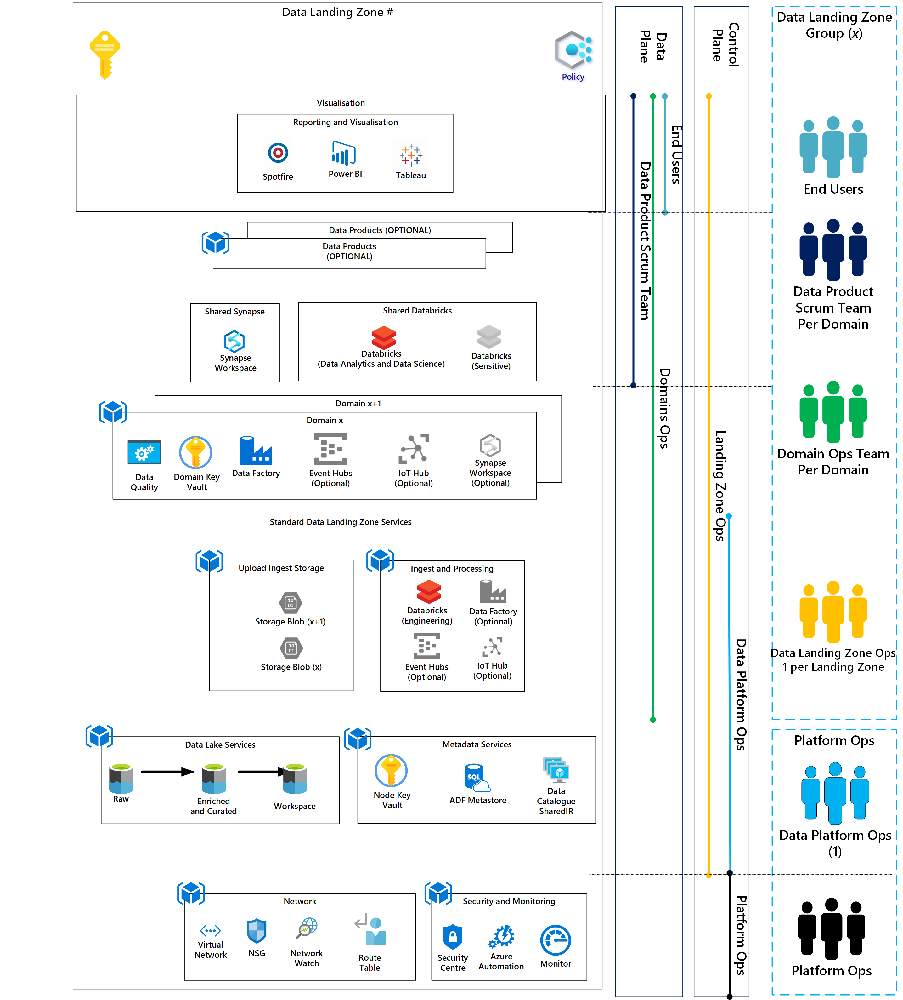

---
# This basic template provides core metadata fields for Markdown articles on docs.microsoft.com.

# Mandatory fields.
title: Enterprise Scale Analytics and AI Data Products
description: Enterprise Scale Analytics and AI Data Products
author: mboswell
ms.author: mboswell # Microsoft employees only
ms.date: 02/09/2021
ms.topic: conceptual
ms.service: cloud-adoption-framework
ms.subservice: ready
---
# Data Quality

In the shift from monolithic architectures to separate Domains, Domains will become responsible for producing Data Sets and Products that are consumed by other Domains. Data Product owners are responsible for the business-aligned Key Performance Indicators (KPIs) and the Service Level Objective around consumption of their Data Products. Moving Data Quality to the Domain aligns definition and measurement of quality with the teams that have the domain knowledge.

Data cleansing and data integrity validation should be at the point of Data Product creation. Moving quality metrics and validation to the Domain aligns the quality process with the team(s) that are closest to the data and understand the Domain. Data Lineage also provides data quality confidence and should be provided for all Data Sets and Products.

High-quality Data Sets and Products should be discoverable and descriptive. This role is fulfilled by the Data Catalogue. Ideally Data Sets and Products should be usable with minimal hand-holding.

Figure 1: Data Landing Zone Quality

## Log Feedback to Enterprise Scale Analytics v-team

[Log Feedback for this page](https://github.com/Azure/enterprise-scale-analytics/issues/new?title=&body=%0A%0A%5BEnter%20feedback%20here%5D%0A%0A%0A---%0A%23%23%23%23%20Document%20Details%0A%0A%E2%9A%A0%20*Do%20not%20edit%20this%20section.%20It%20is%20required%20for%20Solution%20Engineering%20%E2%9E%9F%20GitHub%20issue%20linking.*%0A%0A*%20Content%3A%2003-datalandingzones%20%E2%9E%9F%2007-dataquality.md)

>[Previous](06-dataproducts.md)
>[Next](../04-ingestion/01-overview.md)
