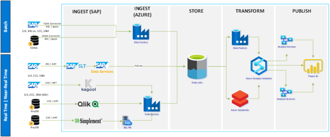

\
**General disclaimer: DO NOT COPY - UNDER DEVELOPMENT - MS INTERNAL ONLY** \
&nbsp;

# SAP Ingestion

Azure can support many different approaches for extracting and ingesting data from SAP data sources (including from Business Ware and ERP Central Component). Depending upon data volumes and latency requirements, one of the three following patterns should be leveraged to support the ingest requirements.

SAP systems are complex due to their inherently monolithic structure that cuts across several domains.

Our recommended pattern is that each business group ingests their data from SAP into their Data Landing Zone. Data is presented in the enriched layer (having passed through raw), accessible subject to AAD group access controls. Central finance teams can curate and ingest the finance objects into a single data asset conducive to their requirements in their Data Landing Zone.

The figure above illustrates three options for getting data into Azure.

## Azure Data Factory

[Azure Data Factory](https://docs.microsoft.com/azure/data-factory/connector-overview) provides several connectors to SAP systems and various databases (including SAP HANA). These can be used to build simple, code-free data transformations in minutes. Delta replication is not available out-of-the-box but can be achieved with some programming. Data Factory is only supported for batch processing or micro-batches at a minimum of 15-minute intervals.

The Azure Data Factory option supports single sign-on and secure network communication authentication into SAP. It also provides the ability to easily build resilient data flows via code-free data transformations and can be easily integrated with Azure Databricks for flexible data preparation and enrichment coding. It is limited to batch processing and requires coding logic to support delta extracts.

This option can be described as the PULL option.

## SAP Landscape Transformation Replication Server and SAP Business Objects Data Services

SAP Landscape Transformation Replication Server (SLT) is an add-on to SAP NetWeaver that uses trigger-based replication to extract the data. This will then be integrated with Business Objects Data Services (BODS) at the source to provide ELT capabilities and create the dataset files to be transferred. This option can be considered for both batch and near-real-time ingestion.

This SAP-based option facilitates trigger-based replication and near-real-time extraction with a simple and unified configuration for all SAP data. This requires SAP licensing, additional downstream steps, and scheduling to move data to Azure, including a reliance on a file copy tool such as AzCopy via several network hops.

This option can be described as the PUSH option.

## Third-Party Tools

There are many third-party tools that can provide value-added extraction and ingestion from SAP sources in real-time. Microsoft recommends [Qlik Replicate](https://www.qlik.com/us/products/technology/sap) (formerly known as Attunity), [Simplement Data Liberator](https://www.simplement.us/), and [Kagool Velocity](https://www.kagool.com/). Each provides similar functionality, being able to extract data from SAP in near real time and provide business context and intelligence out of the box. However they differ in their technical architectures.

Qlik Replicate and Simplement Data Liberator provide near-real-time replication by identifying changes in the source database logs. Kogool Velocity uses an add-on to SAP NetWeaver to expose data using RFC from the application layer.

All of the above options provide better out-of-the-box functionality and near-real-time support compared to the previous options but require the use of third-party technology.

## Recommended Option

Our recommendation focuses a hybrid option using a combination of options as an ingestion strategy for SAP data.

SLT, BODS, and Attunity are used to extract the data from SAP transactional systems (ECC), and ADF is then used to pull the data into Azure and convert it to Parquet format before writing to Data Lake storage.

Azure Data Factory alone is used to extract data from SAP BW leveraging the existing framework.

## Log Feedback to Enterprise Scale Analytics v-team

[Log Feedback for this page](https://github.com/Azure/enterprise-scale-analytics/issues/new?title=&body=%0A%0A%5BEnter%20feedback%20here%5D%0A%0A%0A---%0A%23%23%23%23%20Document%20Details%0A%0A%E2%9A%A0%20*Do%20not%20edit%20this%20section.%20It%20is%20required%20for%20Solution%20Engineering%20%E2%9E%9F%20GitHub%20issue%20linking.*%0A%0A*%20Content%3A%2004-ingestion%20%E2%9E%9F%2001-sapingestion.md)

>[Previous](01-overview.md)
>[Next](03-dataonboarding.md)
