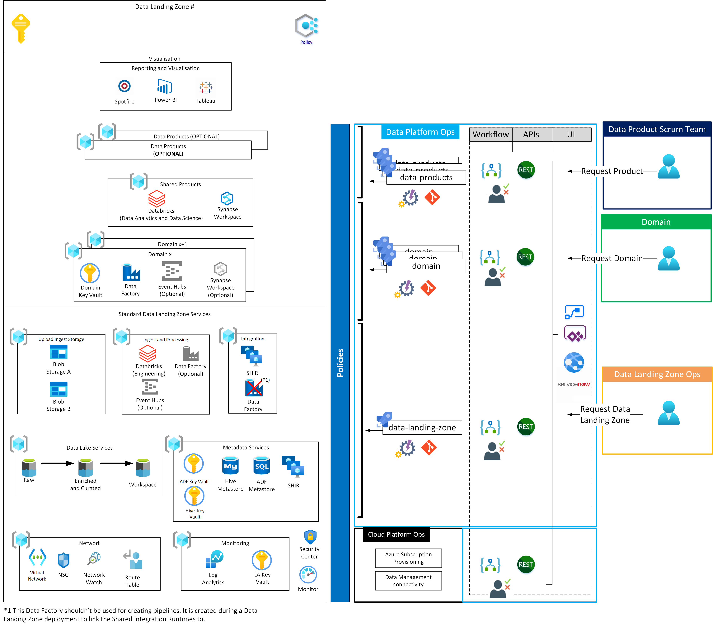
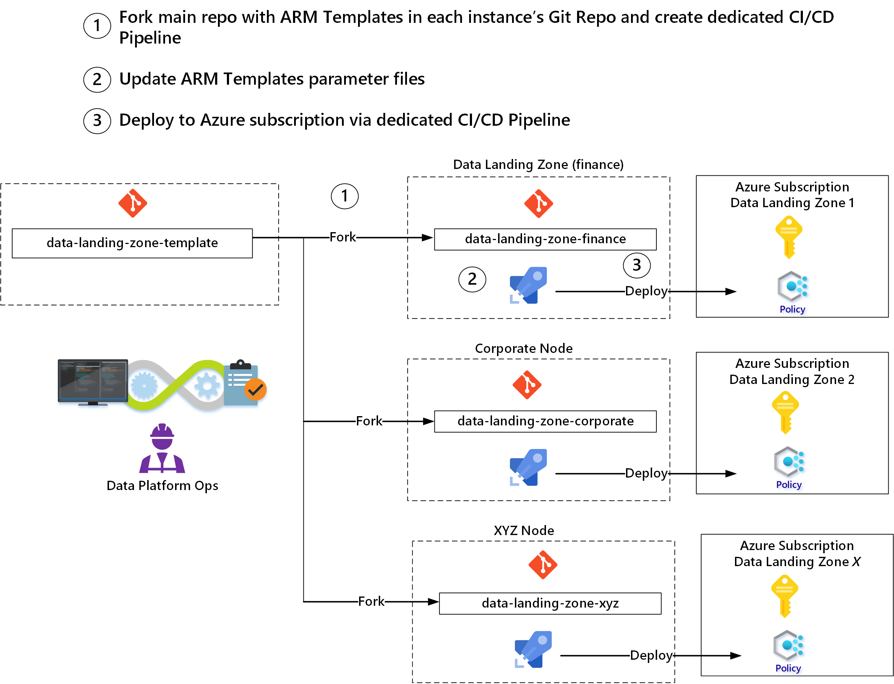
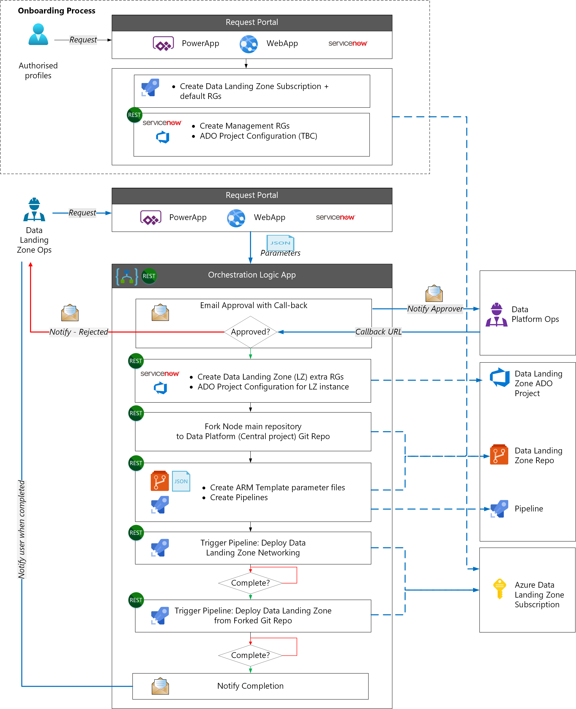
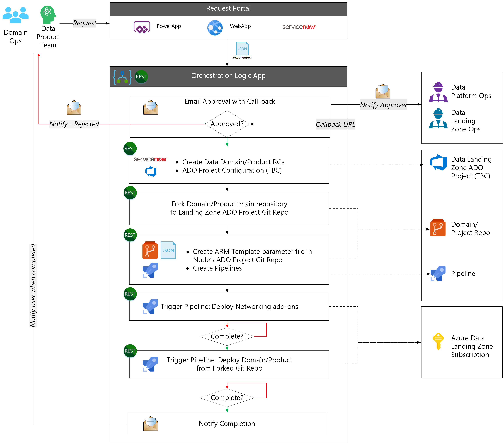
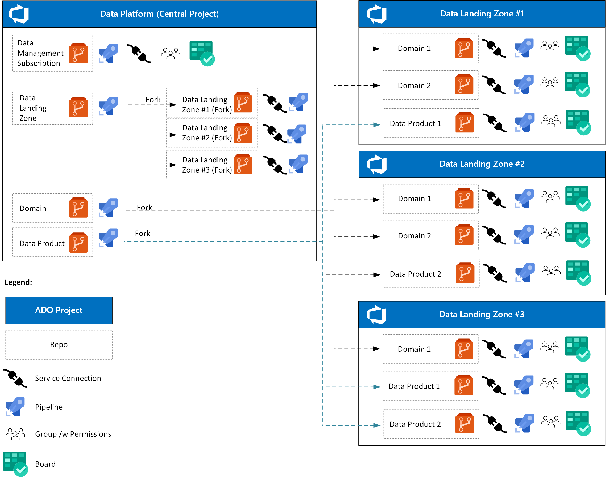

# Enterprise Scale Analytics and AI DevOps Models

The Enterprise Scale Analytics and AI solution pattern consists of:-

- A Data Management Subscription.
- One or more Data Landing Zones.
- One or more Domains in each Data Landing Zone.
- One or more Data Products in each Data Landing Zone.

Each of these assets can evolve independently over time, because of different requirements and lifecycles (e.g. one of the Data Landing Zones may requires RA-GRS storage accounts at some point). Therefore it is important to have an IaC representation of each of these assets in a repository, so that changes can be implemented based on requirements in the respective Data Landing Zone, Domain or product.

Table 1, summarizes the teams involved in an Enterprise Scale Analytics and AI deployment.

|Name  |Role|# of teams|
|-|-|-|
|Cloud Platform Ops| The Azure Cloud Platform team in your organization| One for the whole Azure platform |
|Data Platform Ops|In charge of creating and maintaining ARM template repositories for the different levels of the Enterprise Scale Analytics and AI. Also maintains the Data Management Subscription and supports other ops teams in case of deployment issues or required enhancements.| One for the Enterprise Scale Analytics and AI |
|Data Landing Zone Ops |In charge of deploying and maintaining a specific Data Landing Zone. Also, supports the deployment and enhancement of data Domains and Data Products. | One team per Data Landing Zone |
|Domain Ops|In charge of Domain deployment and updates| One team per Domain |
|Data Product Team|In charge of Data Products deployment and updates| One team per Data Product |

Table 1: Enterprise Scale Analytic and AI Teams

## Automation High Level Overview

The solution pattern has focused on separating the runtime, automation and users layers.

Users interaction, to Automation interaction, should focus on using User Interfaces (PowerApps, Custom WebApp, ITSM tool). These should integrate with REST APIs and a workflow engine for approval process and sequencing of deployment steps.

Automation to Runtime interaction is done via Azure DevOps Pipelines and scripted ARM Templates.

>[!IMPORTANT]
>The Enterprise Scale Analytics and AI solution pattern uses [Azure policies](https://docs.microsoft.com/azure/governance/policy/overview) to put boundaries in place and ensure that changes performed by the Data Landing Zone Ops teams are compliant.

Enterprise Scale Analytics and AI uses Policies to enforce:

- Naming conventions
- Network rules
- Optional: Non-allowed Services

Over the standard configuration the Data Landing Zone has specific requirements:

- Size of subnets
- Number of subnets
- Number of RGs
- Name of RGs
- Key Vaults

Figure 1: Automation High Level Principles

Figure 1, illustrates how their automation principle are implemented for a Data Landing Zone. How they call API's and the functions of each team.

## Data Management Subscription Deployment Process

 The Data Platform Ops team are responsible for deploying a Data Management Subscription before any Data Landing Zones are created. The Data Management Subscription should have its own repository which is maintained by the Data Platform team.  

>[!CAUTION]
>A Data Management Subscription must be created before any Data Landing Zones are deployed.

## Data Landing Zone Deployment Process

To avoid starting from scratch for each asset, teams can leverage the templates provided by the Data Platform Ops team. In order to automate the deployment of a deployment template, it is recommended to implement a forking pattern.

For example, if a new Data Landing Zone needs to be created, the responsible Data Landing Zone ops team can request a new Data Landing Zone through a management tool like ServiceNow, Power Apps or other kinds of applications. After the request has been approved, the following process gets kicked off based on the provided parameters:

1. New subscription gets deployed for the new Data Landing Zone,
1. Master branch of the Data Landing Zone template gets forked into a new repository,
1. Service connection is created in the repository,
1. Parameters in forked repository gets updated based on the parameters and checked back into the repository,
1. By updating the parameters and checking in the updated code, the deployment pipeline gets kicked off and deploys the services
1. Data Landing Zone Ops team gets access to the repository.
1. Data Landing Zone Ops team can change or add ARM templates.

The workflow mentioned above needs to be orchestrated, which can be achieved through multiple sets of services on the Azure platform. Some of the steps should be handled through CI/CD pipelines, such as renaming parameters in parameter files, others can be executed in other workflow orchestration tools such as Logic Apps.

Figure 2: Forked DevOps Model with Enterprise Scale Analytics and AI

As illustrated in Figure 2, a forking pattern should be chosen, because it allows the different ops teams to follow the lifecycle of the original templates that the repository were forked from and that were used for the initial deployment. If new enhancements or changes are implemented in the template repositories, ops teams get the possibility to pull changes back to their repository, to leverage improvements and new features.

Best practices for repositories should be adopted in order to enforce the use of branches and pull requests. This includes:

- Securing the main branch
- Using branches for changes, updates and improvements
- Defining code owners, who have to approve pull requests, before merging them into the main branch
- Validating branches through automated testing
- Limiting the number of actions and persons in the team, who can trigger build and release pipelines
- etc.

>[!TIP]
>Because code repositories are forked, ARM templates can be updated via 'pulls changes' whenever changes occur in the master templates and changes are to be replicated to all Data Landing Zone instances. This requires coordinated activities amongst the teams.

Figure 3: Data Landing Zone Automation Process

Figure 3 expands on the the previous Figure 2 in illustrating how you can control the approval process using a [Logic App](https://docs.microsoft.com/azure/logic-apps/logic-apps-overview) to control the process. We can use Logic Apps to email for approval and to call Rest APIs.

Overall, this approach gives the different teams much greater flexibility, while also making sure that performed actions are compliant with the requirements of the company and, in addition, a lifecycle management is introduced, which allows to leverage new feature enhancements or optimizations added to the original templates.

## Domain & Data Product Deployment Process

After a Data Landing Zone has been created, Domain and Data Products can start onboarding. Deployment is requested by Domain Ops or Data Product Team which is the approved by the Data Landing Zone Ops.

This process is done either directly using DevOps tooling or called via pipelines/workflows exposed as APIs. Similarly to the Data Landing Zone, it requires first for the code master code repo to be forked.

Figure 4 : Domain and Product Deployment Automation

Figure 4 illustrates the process to onboard a new Domain or data product.

- Step 1: the user makes a request for a new Data Domain or Data Product
- Step 2: the workflow process sends a request to the Data Platform Ops for Approve/Decline.
- Step 3: the workflow calls the SNOW CE API to create required CE/RGs. This includes the creation of ADO service connection and Team allocated to the ADO project.
- Step 4: the workflow Forks the repository to the destination ADO project.
- Step 5: the workflow creates an ARM Parameter file and Pipelines.
- Step 6-7: the workflow then calls a 1st Pipeline to create the networking requirements and a 2nd ADO Pipeline to deploy the Data Domain/Products services
- On completion the user is notified

## Summary

By using the above patterns we can facilitate both control, agility, self service and a way to keep our policies up to date.

Figure 5: Data Ops Model

At the start of the project, the Data Platform will have one Azure DevOps project with one or many ado boards. They will be formed into one AzureOps teams and will focus on:

- One repository for the Data Management Subscription with pipelines and a service connection to the cloud environment
- One template repository for the Data Landing Zone with pipelines to deploy a Data Landing Zone instance with corresponding ADO connections to cloud environments.
- One template repository for a Data Domain with pipelines to deploy a Data Domain instance with corresponding ADO connections to cloud environments.  These are forked to Data Landing Zone ADO projects.
- One template repository for Data Products with pipelines to deploy a Data Product instance with corresponding ADO connections to cloud environments. These are forked to Data Landing Zone ADO projects.

Once Data Landing Zones have been deployed then the Enterprise Scale Analytics and AI solution pattern prescribes that:

- Each Data Landing Zone wil have its own ADO Project with one or many ADO boards.
- For each new Data Domain or Data Product, the respective template gets forked to the respective Data Landing Zone ADO Project after the request has been approved.
- For each Data Domain or Data Product there is a:-
  - Service connection.
  - A registered Pipeline.
  - An ADO team with access to their ADO Board, and repository.
  - Different policies are defined for the forked repository.

To control the deployment of Domain and Data Products we implement the principles of: -

- Main branch is secured and owned by Data Landing Zone Ops team.
- Only main branch can be used to deploy to test and prod environments.
- Feature branches can deploy to dev environment.
- Feature branches are owned by Domain and Data Product teams and should be used for updating the existing configuration and for testing feature updates.
- Merging of feature branches into other feature branches can be handled by Data Domain and Data Product teams without approval.
- Merging feature branches into the main branch requires opening a pull request and an approval on that pull request from the Data Landing Zone Ops team.
- Merging changes from template with forked repository possible to add features downstream over time.

## Deployment Templates

The Enterprise Scale Analytic and AI solution has create the following core **starter** templates:

|Repo|Content|Required Y/N|Deployment model|
|-|-|-|-|
|[Data Management Subscription Template](https://github.com/Azure/data-hub)| Central data management services as well as shared data services such as data catalog, SHIR etc. | Mandatory | One per Enterprise Scale Analytics and AI |
|[Data Landing Zone Template](https://github.com/Azure/data-node)| Shared services for a Data Landing Zone like data storage and ingestion services as well as management services | Mandatory | One per Data Landing Zone |
| [Domain Template](https://github.com/Azure/data-Domain) | Additional services required for a data Domain | Optional | One or many per Data Landing Zone |
|[Data Product Template - Standard](https://github.com/Azure/data-product)| Additional services required for a data product | Optional | One or many per Data Landing Zone |
| [Data Product Template - Analytics](https://github.com/Azure/data-product-analytics) | Additional services required for a data product | Optional | One or many per Data Landing Zone|

These templates should not only contain ARM templates and the respective parameter files, but also CI/CD pipeline definitions for deploying the resources.
Because of new requirements and new services on Azure, these templates will evolve over time. Therefore the `main` branch of these repositories should be secured to ensure that it is always error free and ready for consumption and deployment. A development subscription should be used to test changes to the configuration of the templates, before merging feature enhancements back into the `main` branch.

>[!div class="step-by-step"]
>[Previous](01-overview.md)
>[Next](03-teamfunctions.md)
