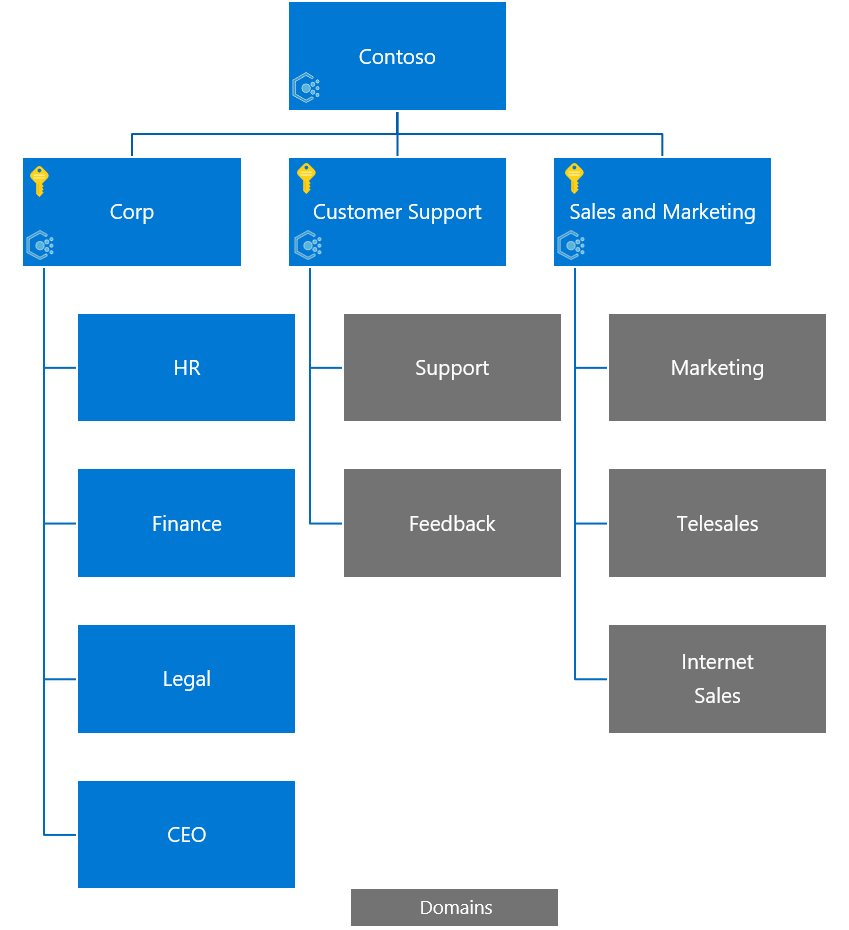
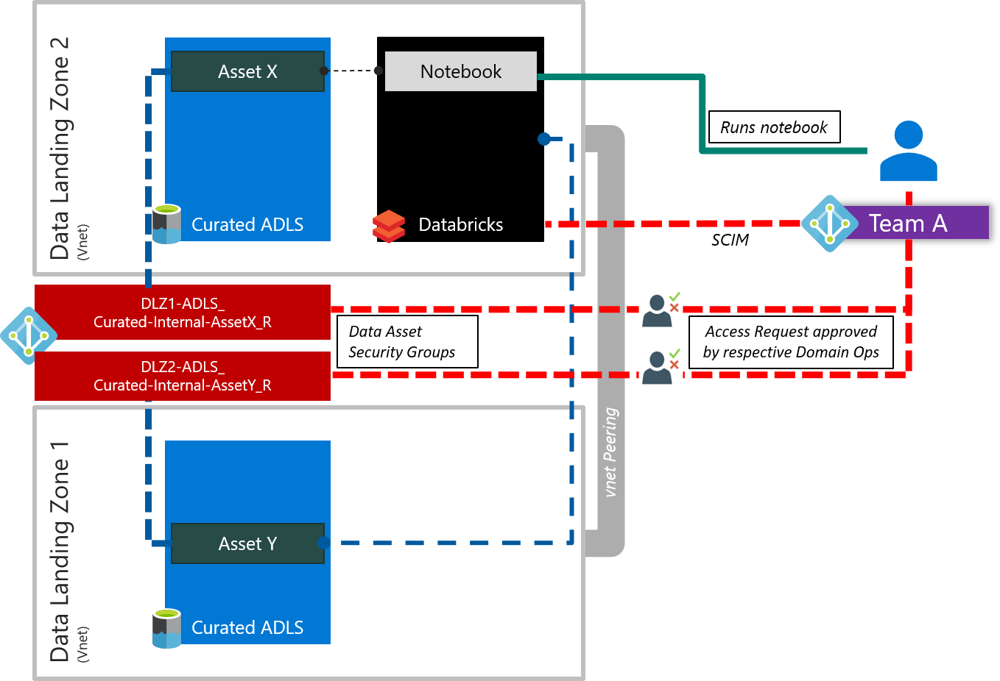

# Data Landing Zone Division and Consumption

Enterprise Scale Analytics and AI can be deployed with a single or multiple data landing zone.

If you have hundreds of data engineers and very large domains then it will make sense to have multiple landing zones. Multiple landing zone subscriptions should be used as a unit of management and scale aligned with business needs and priorities to support business areas and portfolio owners to accelerate development.

If you are a smaller organization and are never likely to hit the limits of an Azure subscription then you may wish to look at deploying a single landing zone.

Limits which should consider when deciding on single v multiple are:

* [Azure Data Factory Limits](/azure/azure-resource-manager/management/azure-subscription-service-limits#data-factory-limits)
* [Data Lake Gen 2 Limits](/azure/storage/common/scalability-targets-standard-account?toc=/azure/storage/blobs/toc.json#scale-targets-for-standard-storage-accounts)
* [Azure RBAC Limit](/azure/azure-resource-manager/management/azure-subscription-service-limits#azure-rbac-limits)

Data Landing Zones can be added and removed over time subject to business acquisitions and divestment's.

## Principals for Data Landing Zone

If you wish to follow a multi landing zone pattern (our recommended path for large domains) this section gives recommendation on how to approach this separation.

For example, Contoso has identified the following business units to onboard to their Enterprise Scale Analytics and AI solution:

Figure 1: Contoso Business Units

* Human Resources
* Finance
* Legal
* IT
* Customer Support
* Sales and Marketing

Looking at the previous list of Contoso business units, we should see if there are cases where:

* Data would be highly shared between business units
* Data ownership goes across multiple business units
* Business units which span multiple regions and have requirements to keep certain data within a region.
* How cost ownership is typically driven by where businesses sit within the enterprise organization.
* Data programs and projects which can be realized via common services within the Data Landing Zone or as a data product extension. They should not warrant the instantiation of a new Data Landing Zone.

### Landing Zone Division

In our example, Human Resources, Finance, Legal, and the CEO business units use a common set of data and many of the Domains overlap. They could be put into a Corp Data Landing Zone with the Domains being split into Human Resources, Finance, Legal, and IT.

>[!NOTE]
>Domain separation allows you to separate data, processing, and tasks into logical groupings called Domains.

The other units are unlikely to have a high amount of data re-usage as they are very different business units and have vastly different Domains. From initial discussions with the business units, we have discovered the following Domains:

| Data Landing Zone   | Domains                              |
|---------------------|--------------------------------------|
| Customer Support    | - Support   - Feedback          |
| Sales and Marketing | - Sales   - Marketing           |

The difference of Domains would lead to us to create two Data Landing Zones with two Domains in each.

> [!TIP]
>You should have an understanding of the amount of crossover of data requirements for each business unit. The higher the amount of data crossover then the more likely the business units should sit in the same Data Landing Zone.

Figure 2: Contoso Customer Support Domains

In the worked example, for our Customer Support business unit, we have identified a natural grouping for sub-Domains under the Support and Feedback Domains.

## Inter-Data Landing Zone Consumption

In the scenario where multiple data landing zones are deployed, data assets ingested by one Data Landing Zone can be consumed via other Data Landing Zones as needed. For instance, the central corporate finance function resides in the Corp Data Landing Zone and can run *ad hoc* finance reports by consuming finance data assets distributed across other Data Landing Zones.

The illustration above shows how data assets can be shared in-place between Data Landing Zones subject to the consumer/user being part of the correct "data-asset-security-group". Data assets are registered in the data catalog, for users to discover.

- Users can request access to the particular security group, approved by the Integration Ops team responsible for the data asset.

- Users in one Data Landing Zone should be able query data from another Data Landing Zone in Synapse or Databricks leveraging credential passthrough and/or Databricks Table Access Control.

- Data never leaves the private network as data travels through Private Link and across VNets. This principle applies even when using Azure PaaS services.

> [!TIP]
>Some systems such as ERP (*e.g.* SAP) are complex due to their inherently monolithic structure that cuts across several Domains, combined with the fact that an organization may have multiple Enterprise Resource Planning (ERP) solutions within different business groups. \
\
In this setup each business unit ingests their data from their ERP into their Data Landing Zone. Data is presented in the enriched layer (having passed through raw and enrich) and is accessible subject to AAD group access controls. \
\
The central corporate finance team can curate and ingest the finance objects into a single curated data asset conducive to their requirements in the corporate Data Landing Zone.

## Additional resources

- **DevIQ. Persistence Ignorance Principle** \
  <https://deviq.com/persistence-ignorance/>

- **Oren Eini. Infrastructure Ignorance** \
  <https://ayende.com/blog/3137/infrastructure-ignorance>

- **Angel Lopez. Layered Architecture in Domain-Driven Design** \
  <https://ajlopez.wordpress.com/2008/09/12/layered-architecture-in-Domain-driven-design/>
