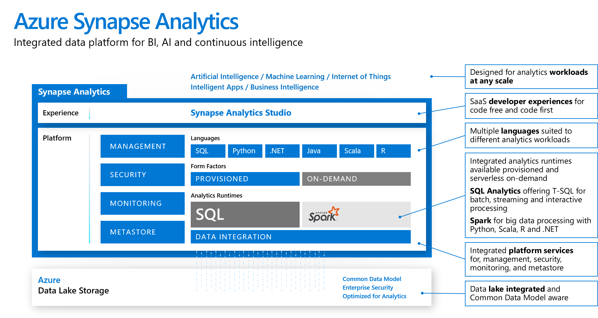

# Power your data strategy with Azure Synapse Analytics

Choosing the right set of tools and technologies to power your data strategy is essential for success. Here are some key considerations when selecting an analytics service, such as Azure Synapse Analytics.

## Think big, start small, and act fast

Avoid getting stuck in a never-ending design loop. This loop, known as analysis paralysis, is where you repeatedly rebuild your proof of concept. Beyond a certain point, extra time spent in this cycle doesn't add equivalent value to your organization's business objectives.

Even if you haven't identified all design features, it's important to deliver business value early. Leave the rest to product innovation by vendors and new capabilities that you add with each build iteration. A growth mindset is best cultivated when we accomplish more with less using creativity and innovation.

At Microsoft, we've been innovating for our customers and have many services for data procurement, storage, analytics, visualization, and data science. Along with offering flexibility and options, we understand that simplicity is key. Simplicity helps get you started early, so you see a quicker return on investment.

For example, [Azure Synapse Analytics](https://azure.microsoft.com/services/synapse-analytics/) unifies a broad category of services. Data product teams have access to a single integrated platform for business intelligence (BI), AI, and continuous intelligence (CI). Azure Synapse is designed for analytics workloads of any scale.

Azure Synapse has several key features and capabilities:

- Integrated platform services for management, security, monitoring, and metastore.
- A data integration layer that interfaces with a decoupled storage layer.
- Integrated analytics runtimes, either provisioned or serverless on-demand.
- Azure SQL Analytics using T-SQL for batch, streaming, and interactive processing.
- Apache Spark for big data processing.
- Multiple languages suited to different analytic workloads, available through a single interface called Azure Synapse Analytics studio. Languages include Python, .NET, Java, Scala, and R.
- Integration options for both your own and third-party ISV applications and solutions.
- Can be integrated into a data management and analytics scenario as a shared workspace. Data product teams can access the shared workspace to run exploitative analytics.
- Can be deployed as a data product for relevant use cases.

Build a strong data strategy. Choose the right tools and technology as the backbone for your data products and services. Design your data strategy for repeatability and scalability across all current and future use cases that affect business outcomes.

## Next steps

[Use Azure Synapse Analytics with enterprise-scale for analytics and AI](./azure-synapse-analytics-implementation.md).
