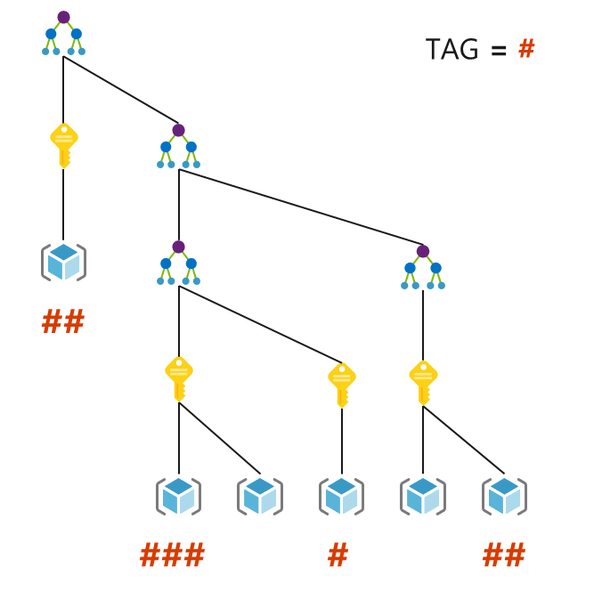

# Cost Management

Cost transparency across a technical estate is a critical management challenge faced by every large enterprise organization. Different principles should be followed to reduce, optimize, and allocate cost between organizations.

A well-planned organizational structure for your Azure billing and resource hierarchies helps to give you a good understanding and control over costs as you create your Enterprise Scale Analytics and AI solution.

We recommend checking that your enterprise is aligned to the Cloud Adoption Framework methodology for [Managing Cloud Costs](https://docs.microsoft.com/azure/cloud-adoption-framework/get-started/manage-costs).

## Example of Tagging in Azure

You should use Azure Policy to set and track ARM tagging policies. For example, we could require that all of Azure resources are created with the following tags:

* Finance codes - CostCenter tag, etc.
* Application context - AppService tag, etc.
* Deployment context - Environment tag, etc.
* Who is accountable - BusinessOwner tag, etc.

*Figure 2: Example of Tagging in Azure*

## Design Considerations

- Resource tags should be used for cost categorization and resource grouping. This model allows a chargeback mechanism for workloads that share a Data Landing Zone or for workloads that span across Data Landing Zones. 
- Resource tags should be enforced and appended through Azure Policy to query and horizontally navigate across the management group hierarchy.
- Azure cost management should be used at the first level of aggregation and should be made available to data landing zone owners.

>[!TIP]
>Azure Advisor should be used to implement cost optimization recommendations.

>[!NOTE]
>Regulatory and compliance requirements definitions and Azure RBAC role assignments.