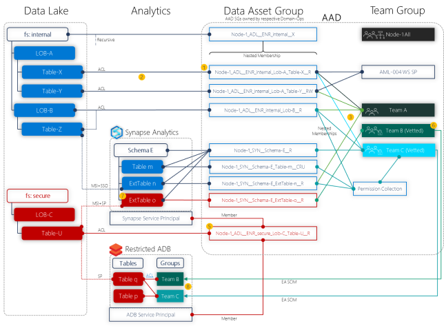

# Identity and access management for data management Enterprise-Scale scenario

Enterprise Scale Analytics and AI supports an access control model using Azure Active Directory (AAD) identities which utilizes both Role-based Access Control (Azure RBAC) and Access Control Lists (ACLs).

## Managing access to central datasets

Granting access to datasets should be done only on an [ACL level of the data lakes](/azure/storage/blobs/data-lake-storage-access-control-model) to allow for "finer grain" access. Most of our native services such as Azure Machine Learning, Azure Synapse Analytics and Azure Databricks already support this and more services will follow. This also gives a single pane of glass and allows reviewing access rights in a holistic way inside the Azure Graph.

<!--Not adding this as it is not GA yet.
 In addition to managing access using AAD identities using RBACs and ACLs, ADLS Gen2 also supports using SAS tokens and storage keys for managing access to data in your Gen2 account. In order to make sure that every request to Storage Account is authorized through AAD, there is a new feature (currently in preview) of disabling Key based access that permits to disallow requests to the specific storage account in case the requests were authorized with Shared Key. CAE Team is recommending enabling this feature once GA to enforce AAD level access. -->

### Design considerations for standard and sensitive data

In the case of **standard data**, the following recommendations should be considered:

1. Each data asset in Azure Data Lake Storage should own a matching AAD Data Asset group.
1. Data asset AAD registration should be automated via a script and restricted to [Domain Ops](eslz-team-functions.md#domain-ops).
1. Teams should request access via a Security Group (SG) join request which is approved by Domain Ops.
1. Once approved, teams should access data from a storage client (SSO authenticated), Azure Synapse Analytics, Azure Databricks etc.

In the case of **secure and sensitive data**, the following recommendations should be considered:

1. Access to a data asset group should only be granted to analytic services via Managed Identities or Service Principals, as opposed to individual teams.
1. Teams with access to secure data must ensure members are vetted. This can be implemented via dynamic groups.
1. Azure Synapse Analytics, like Azure Storage, should expose table-asset groups to control access.
    1. Project external tables via PolyBase and control filtering.
    1. Data is copied into table enabling row and column filtering and masking.
1. Teams should be given access to Azure Databricks (ADB) via Azure Active Directory Enterprise Application SCIM
    1. Azure Databricks table is defined to external table, optionally.
    1. Azure Databricks ACLs are mapped to groups.

### Example implementation

The figure below shows how ACLs and Groups can be applied to an Enterprise Scale Analytics and AI deployment:

*Figure 1: Data Access Model* 