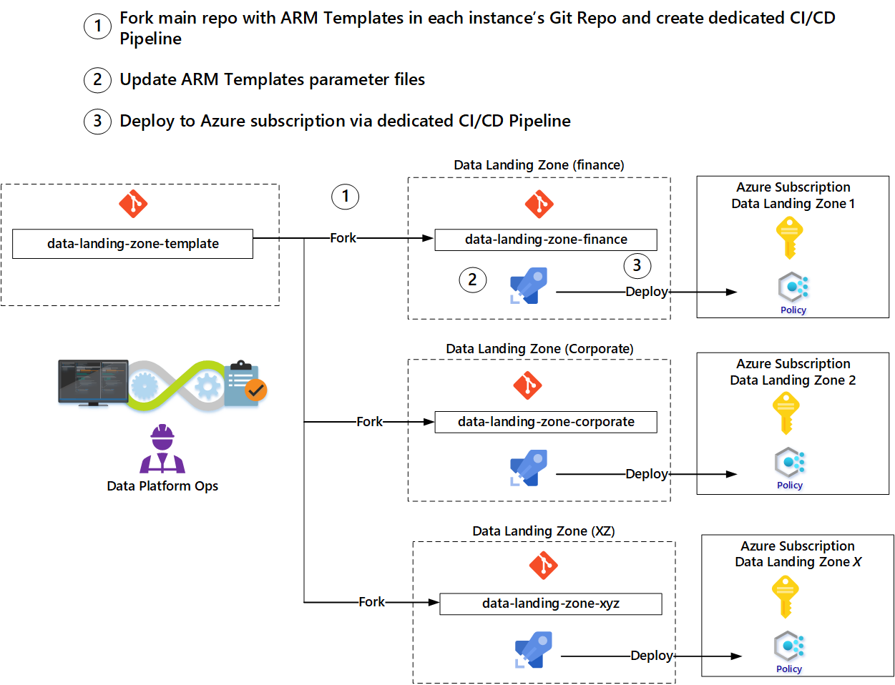
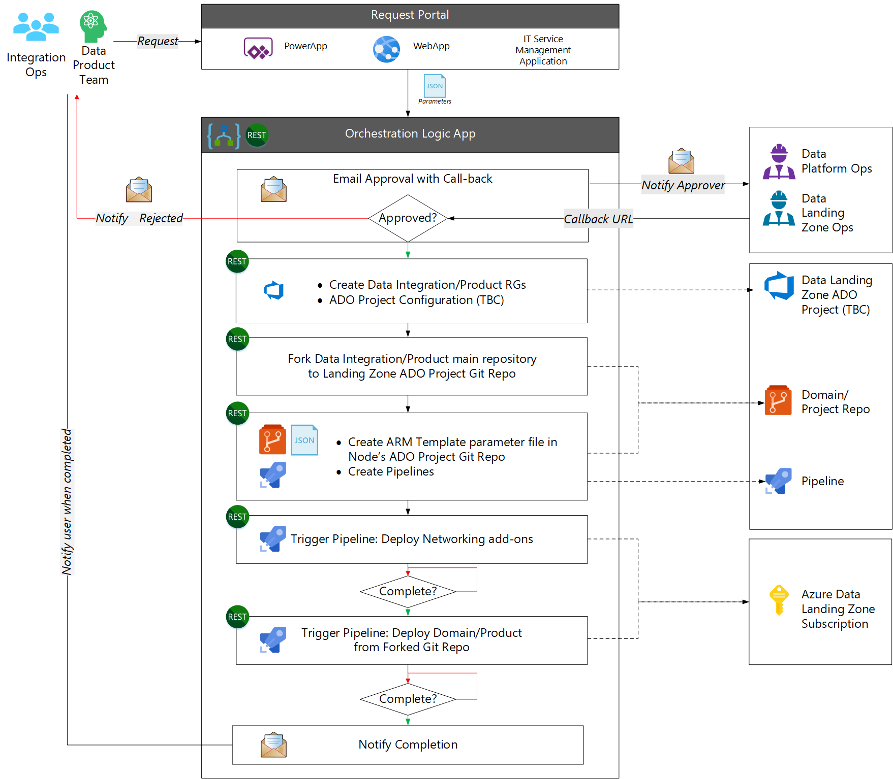

# Provisioning the Enterprise Scale Analytics and AI platform

## Data Management Landing Zone Deployment Process

 The Data Platform Ops team are responsible for deploying a Data Management Landing Zone before any Data Landing Zones are created. The Data Management Landing Zone should have its own repository which is maintained by the Data Platform team.  

>[!CAUTION]
>A Data Management Landing Zone must be created before any Data Landing Zones are deployed.

## Data Landing Zone Deployment Process

To avoid starting from scratch for each asset, teams can leverage the templates provided by the Data Platform Ops team. In order to automate the deployment of a deployment template, it is recommended to implement a forking pattern.

For example, if a new Data Landing Zone needs to be created, the responsible Data Landing Zone ops team can request a new Data Landing Zone through a management tool like ServiceNow, Power Apps or other kinds of applications. After the request has been approved, the following process gets kicked off based on the provided parameters:

1. New subscription gets deployed for the new Data Landing Zone,
1. Main branch of the Data Landing Zone template gets forked into a new repository,
1. Service connection is created in the repository,
1. Parameters in forked repository gets updated based on the parameters and checked back into the repository,
1. By updating the parameters and checking in the updated code, the deployment pipeline gets kicked off and deploys the services
1. Data Landing Zone Ops team gets access to the repository.
1. Data Landing Zone Ops team can change or add ARM templates.

The workflow mentioned above needs to be orchestrated, which can be achieved through multiple sets of services on the Azure platform. Some of the steps should be handled through CI/CD pipelines, such as renaming parameters in parameter files, others can be executed in other workflow orchestration tools such as Logic Apps.

*Figure 1: Forked DevOps Model with Enterprise Scale Analytics and AI*

As illustrated in Figure 1, a forking pattern should be chosen, because it allows the different ops teams to follow the lifecycle of the original templates that the repository were forked from and that were used for the initial deployment. If new enhancements or changes are implemented in the template repositories, ops teams get the possibility to pull changes back to their repository, to leverage improvements and new features.

Best practices for repositories should be adopted in order to enforce the use of branches and pull requests. This includes:

- Securing the main branch
- Using branches for changes, updates and improvements
- Defining code owners, who have to approve pull requests, before merging them into the main branch
- Validating branches through automated testing
- Limiting the number of actions and persons in the team, who can trigger build and release pipelines
- etc.

>[!TIP]
>Because code repositories are forked, ARM templates can be updated via 'pulls changes' whenever changes occur in the master templates and changes are to be replicated to all Data Landing Zone instances. This requires coordinated activities amongst the teams.

*Figure 2: Data Landing Zone Automation Process*

Figure 2 illustrates how the On-boarding process is separated from the Data Landing Zone deployment based on the assumption that most organization have a standard Azure subscription deployment process as part of their Cloud Operation Model. In this case, the first step process is used to deploy standard corporate components (e.g. via a 3rd party ITSM tool such as ServiceNow) and the second step to deploy the Data Landing Zone specific components.

As of now, there is no Git APIs available which would allow to clone/update/commit/push in the proposed automation solution. Therefore, our approach is to use an [Azure Automation Account](/azure/automation/automation-intro), which will contain the PowerShell runbooks, where we can use specific PowerShell module for working with Git repositories. The Automation Account will contain the following runbooks:

- Setting up Data Landing Zone
- Forking the main repository to Data Platform Git Repo
- Setting up the subnet configurations for Data Landing Zone
- Setting up Azure Active Directory

As mentioned, following this approach, we need to use Git specific functions, which are defined in the [`GitAutomation`](https://github.com/webmd-health-services/GitAutomation) Powershell module. By installing this module inside the Azure Automation Account, users are able to create, clone, query and even more with Git repositories.

:::image type="content" source="./images/git-automation.png" alt-text="GitAutomation Module for Automation" lightbox="./images/git-automation.png":::

From this module, users can leverage the `Copy-GitRepository` function, which  clones the main Git repository from the URL specified by `URL` to the Data Platform Git path specified by `DestinationPath`.

Overall, this approach gives the different teams much greater flexibility, while also making sure that performed actions are compliant with the requirements of the company and, in addition, a lifecycle management is introduced, which allows to leverage new feature enhancements or optimizations added to the original templates.

## Data Integration & Data Product Deployment Process

After a Data Landing Zone has been created, Data Integration and Data Products can start onboarding. Deployment is requested by Integration Ops or Data Product Team which is the approved by the Data Landing Zone Ops.

This process is done either directly using DevOps tooling or called via pipelines/workflows exposed as APIs. Similarly to the Data Landing Zone, it requires first for the code master code repo to be forked.

*Figure 3: Integration and Product Deployment Automation*

Figure 3 illustrates the process to onboard a new Data Integration or Data Product.

1. The user makes a request for a new Data Integration or Data Product
1. The workflow process sends a request to the Data Platform Ops for Approve/Decline.
1. The workflow calls the SNOW CE API to create required CE/RGs. This includes the creation of ADO service connection and Team allocated to the ADO project.
1. The workflow Forks the repository to the destination ADO project.
1. The workflow creates an ARM Parameter file and Pipelines.
1. The workflow then calls a 1st Pipeline to create the networking requirements and a 2nd ADO Pipeline to deploy the Data Integration or Data Products services
1. On completion the user is notified

>[!TIP]
>If you are new to DataOps the Architecture Center has a hands-on lab for [DataOps for the modern data warehouse](/azure/architecture/example-scenario/data-warehouse/dataops-mdw). In this scenario it describes how a fictional city planning office could use this solution. The solution provides an end-to-end data pipeline that follows the MDW architectural pattern, along with corresponding DevOps and DataOps processes, to assess parking use and make more informed business decisions.

## Summary

By using the above patterns we can facilitate both control, agility, self service and a way to keep our policies up to date.

*Figure 4: Data Ops Model*

At the start of the project, the Data Platform will have one Azure DevOps project with one or many ado boards. They will be formed into one AzureOps teams and will focus on:

- One repository for the Data Management Landing Zone with pipelines and a service connection to the cloud environment
- One template repository for the Data Landing Zone with pipelines to deploy a Data Landing Zone instance with corresponding ADO connections to cloud environments.
- One template repository for a Data Integration with pipelines to deploy a Data Integration resource group with corresponding ADO connections to cloud environments.  These are forked to Data Landing Zone ADO projects.
- One template repository for Data Products with pipelines to deploy a Data Product instance with corresponding ADO connections to cloud environments. These are forked to Data Landing Zone ADO projects.

Once Data Landing Zones have been deployed then the Enterprise Scale Analytics and AI construction set prescribes that:

- Each Data Landing Zone wil have its own ADO Project with one or many ADO boards.
- For each new Data Integration or Data Product, the respective template gets forked to the respective Data Landing Zone ADO Project after the request has been approved.
- For each Data Integration or Data Product there is a:
  - Service connection.
  - A registered Pipeline.
  - An ADO team with access to their ADO Board, and repository.
  - Different policies are defined for the forked repository.

To control the deployment of Data Integrations and Data Products we implement the principles of:

- Main branch is secured and owned by Data Landing Zone Ops team.
- Only main branch can be used to deploy to test and prod environments.
- Feature branches can deploy to dev environment.
- Feature branches are owned by Integration Ops and Data Product teams and should be used for updating the existing configuration and for testing feature updates.
- Merging of feature branches into other feature branches can be handled by Data Integration and Data Product teams without approval.
- Merging feature branches into the main branch requires opening a pull request and an approval on that pull request from the Data Landing Zone Ops team.
- Merging changes from template with forked repository possible to add features downstream over time.