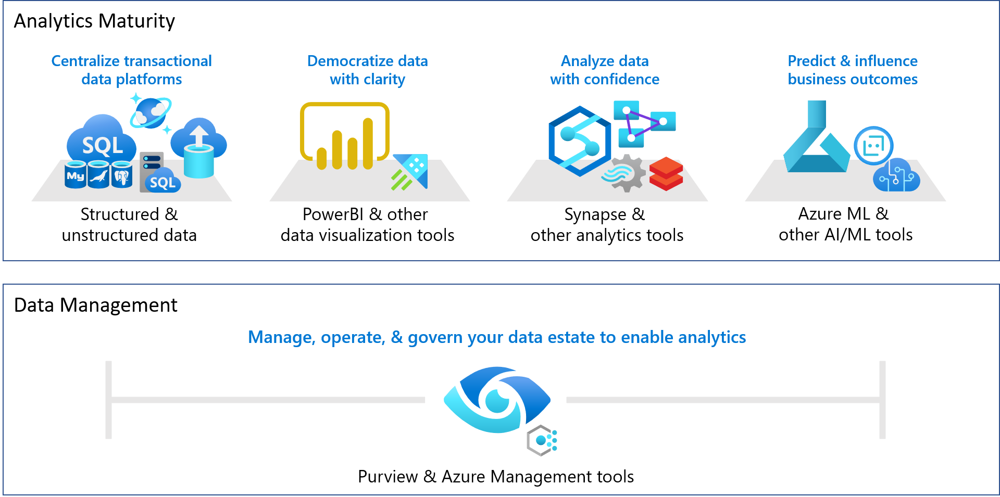

# Introduction to the 'Enterprise Scale Analytics and AI' scenario

As customers address larger, more sophisticated forms of cloud adoption, their journey to the cloud becomes slightly more complex. This article series consolidates the various technical and non-technical considerations required to prepare for 'Enterprise Scale Analytics and AI' in the cloud. While this guidance strives to be cloud agnostic to allow for hybrid and multicloud adoption, the technical implementation examples will focus on Azure products.

This scenario focuses on enabling two targeted outcomes:

- [Analytics maturity](./intro-analytics-maturity.md): Use the cloud to deliver increasingly more mature analytics solutions. Migrate data platforms to the cloud. Democratize data using advanced visualization tools. Answer complex analytical questions with cloud based analytics tools. Extend workloads with machine learning.
- [Data governance](./intro-data-governance.md): Properly manage your data estate to ensure x,y,&z across all cloud deployments of your data. Govern how data is classified, categorized, and used to ensure your data is protected and reliable across all cloud deployments.

## Components of the scenario

This scenario is designed to guide the end-2-end customer journey, throughout the cloud adoption lifecycle. Delivery of the full journey requires a few key components, or guidance sets:

- Cloud Adoption Framework: Managing and governing data is a lifecycle process that starts by building on your existing cloud strategy & carries all the way through to ongoing operations management. The Cloud Adoption Framework will aid in guiding the full lifecycle for your data estate.
- Well-Architected Framework: Workload architecture and operations has a direct impact on data. Understand how your architecture can improve management and governance of the data used by your workload.
- Reference architectures: These reference solutions aid in accelerating deployment for a number of common 'Enterprise Scale Analytics and AI' solutions.
- Best Practices: These level 300+ articles help central IT teams deploy the tools and manage the processes to ensure proper management and governance of your data.
- Feature Azure Products: Learn more about the products that support 'Enterprise Scale Analytics and AI' in Azure.
- Learn Modules: Gain the hands-on skills required to implement, maintain, and support 'Enterprise Scale Analytics and AI' solutions.

## Common customer journeys

**Prepare for centralized operations:** Use the cloud adoption framework articles to establish the processes and approaches required to support an entire portfolio of workloads across your data estate.

**Improve controls across your data estate:** Focus on the Govern and Manage articles to integrate 'Enterprise Scale Analytics and AI' into your existing operations processes. Use the Ready article to deploy controls across all of your cloud environments.

**Influence changes to individual workloads (Central IT & governance):** As your 'Enterprise Scale Analytics and AI' processes improve improve, the central data governance teams will encounter requirements that depend on knowledge of the architecture behind individual workloads. Use the Well-architected guidance to help workload owners understand potential improvements to their workloads that will improve data operations.

**Optimize individual workloads (Workload teams):** Workload owners should start with the well-architected guidance to understand the best ways to integrate 'Enterprise Scale Analytics and AI' strategies into their workloads. If the team is also supported by central IT and governance teams, this guidance will provide insights into best practices and architectures that the those teams are typically accountable to deliver to accelerate your workload development.

**Processes to onboard individual assets:** Use the best practices section to execute a series of processes to onboard all of your data estate into a single 'Enterprise Scale Analytics and AI' control plane.

**Implement specific Azure products:** Accelerate and improve 'Enterprise Scale Analytics and AI' capabilities using a variety of Azure products outlined in the featured products section.
