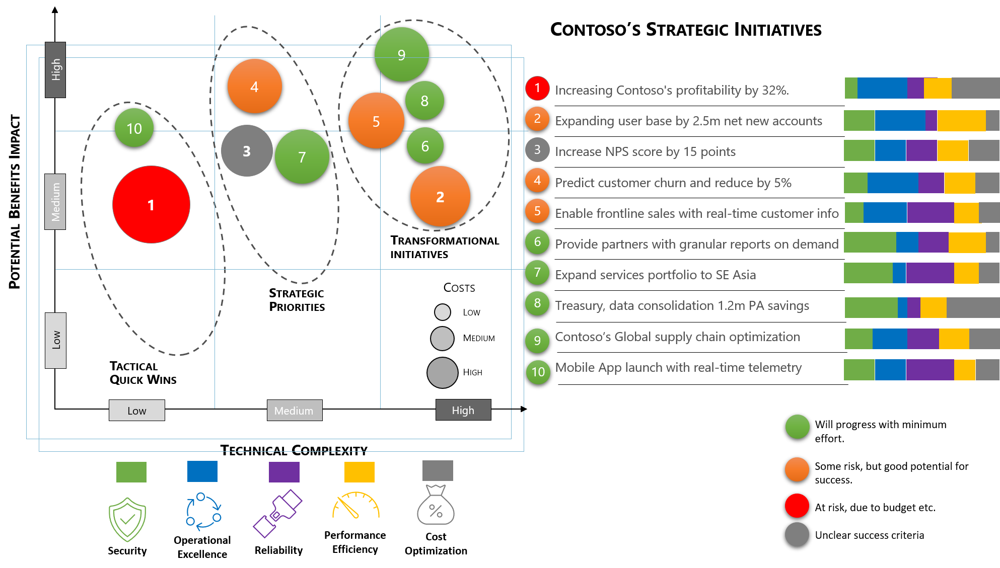
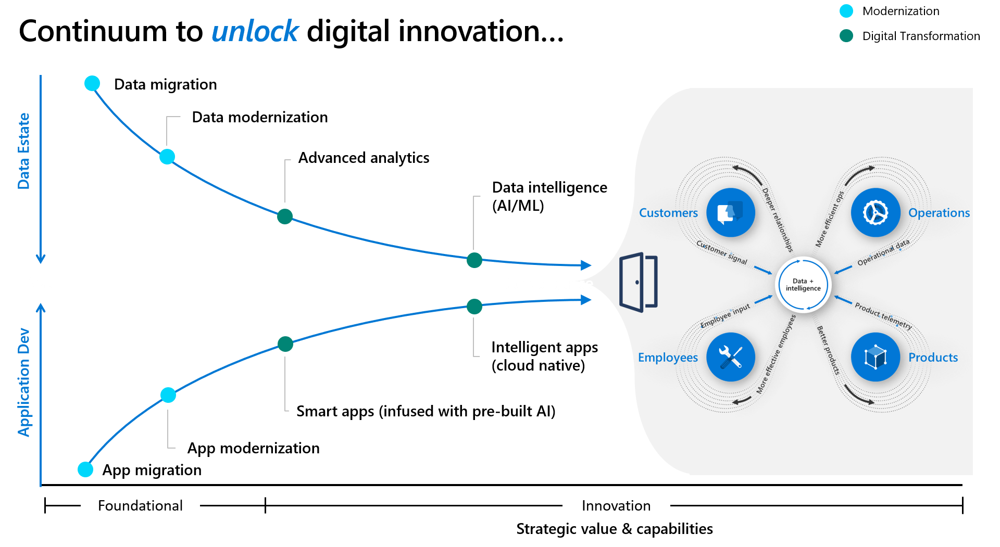

# Develop a plan for 'data management and analytics'

[Cloud Adoption Framework's Plan methodology](../../plan/index.md) helps create an overall cloud adoption plan to guide the programs and teams involved in your cloud-based digital transformation. This guidance provides templates for creating your backlog and plans for building necessary skills across your teams, all based on what you are trying to do in the cloud.

Much of the guidance in the Plan methodology focuses on the [five rs of rationalizing your digital estate](../../digital-estate/5-rs-of-rationalization.md). This scenario narrows the primary focus of rationalization to the **data estate**, which is a subset of the overall digital estate. This plan will also look broader and deeper at the data estate than you might in other plans. Specifically, it must include plans for your overall [analytics maturity](./intro-analytics-maturity.md) and the [data governance practices](./intro-data-governance.md) required to support the desired maturity.

## Prepare for potential challenges and roadblocks early

It can be difficult to harness the power of data in a secure and compliant manner. Sometimes, you can run into challenges like organizational silos, building a data-driven culture, and a never-ending challenge coming out of running multiple tools and technologies across the organization. Time to market is one of the most critical factors these days for all businesses. Organizations can have great ideas and data can be an enabler, but with so many challenges it can take weeks, if not months, before they can start getting insights and ultimately deliver business value from data.

## Data estate rationalization

To properly rationalize your data estate, begin by aligning your business outcomes to each of your data initiatives. This will aid in prioritization and a clear understanding of the value your can derive from each data initiative. Initiatives which represent little business value could easily be included in you cloud migration plan to deliver quick efficiency gains. Initiatives with greater business impact and greater technical complexity would likely require richer planning to enable long term innovation value.

Figure 1: Strategic Initiatives

Benchmarking your current estate is critical to measure success. This allows you to quantify the exact investment needed in terms of people, process and technology. You'll be able to see where you are on the Maturity Model, and the gaps you need to bridge.

To can help you get started. Here is a table showing the thought process:

|Category| Action Areas | Current Status focusing on 5 pillars of architecture |
|----------|--------------|-------------------------------------|
|**Preparation**| There are about 8-10 topics here starting from Strategy, Charter, Ethics, etc.| |
| **Agility**| Depending on the organizations there could be 5 to 10 topics here, such as strategy around Data Lake, Catalogue, Common Data Model etc. |  |
| **Resilience**|10-20 topics are here starting from discovery, recovery and anomaly detection. |  |

Table 1: Assessing your current estate and capability is key in ensuring you can track progress and celebrate success. Using the maturity level detailed further below, you can rate your current capability 0-4 and use the 5 pillars of architecture to guide those benchmarks.

Once you're clear about the business outcomes you're looking to drive through your data strategy, the next step is to build the capability to deliver them.

## A principled approach to your data strategy

With data governance in mind, the following diagram shows the essential stages for data lifecycle:

An effective data strategy must have provisions for data governance, but they are mutually inclusive, but not the same thing.

For the purpose of this blog, let's take a closer look at the considerations to take when building design principles for the four layers that are key in your data strategy, focused towards delivering business outcome and value from data.

### Data ingestion

A key consideration for data ingestion is the ability to build a data pipeline extremely fast, from requirements to production, in a secure and compliant manner. Elements such as metadata driven, self-service, low-code technologies to hydrating your data lake are key. When building a pipeline, consider design, the ability to do data wrangling, scale compute and also data distribution capabilities. In addition, having the right DevOps support for the continuous integration and delivery of your pipeline is critical. Tools such as Azure Data Factory support a plethora of on-premises, Software as a Service and data sources from other public clouds. Having such agility from the get-go is always helpful.

### Storage

Data needs to be tagged and organized in physical and logical layers. Data lakes are key in all modern data analytics architectures. Organizations need to apply appropriate data privacy, security and compliance requirements based on data classification and the industry compliance requirements they operate in. The other key considerations are cataloguing and self-service to aid organization level data democratization to fuel innovation, guided by appreciate access control.

Choosing the right storage based on the workload is key, but even if you don't get it right the first time, the cloud provides you options to failover quickly and provide options to restart the journey reasonably easily. You can choose the right database based on your application requirements. When choosing an analytics platform, make sure you consider the ability to process batch and streaming data.

### Data processing

Your data processing needs will vary according to workload, for example most big data processing has elements of both real-time and batch processing. Most enterprises also have elements of time series processing requirements and the need to process free-form text for enterprise search capabilities.

The most popular organizational processing requirements come from Online Transaction Processing (OLTP). Certain workloads need specialized processing such as High Performance Computing (HPC), also called 'Big Compute'. These use many CPU or GPU-based computers to solve complex mathematical tasks.

For certain specialized workloads, customers can secure execution environments such as Azure confidential computing which helps users secure data while it's 'in use' on public cloud platforms (a state required for efficient processing). The data is protected inside a Trusted Execution Environment (TEE), also known as an enclave. This protects the code and data against viewing and modification from outside of the TEE.  This can provide the ability to train AI models using data sources from different organizations without sacrificing data confidentiality.

### Analytics

Extract, transform, load construct or otherwise called ETL (or ELT depending on where the transform happens) relates to online analytical processing (OLAP), and data warehousing needs. One of the useful capabilities here is the ability to automatically detect schema drift. Consider end-to-end architectures like automated enterprise BI with Azure Synapse Analytics and Azure Data Factory. To support advanced analytics including Machine Learning and AI capabilities, it is key to consider the reusability of platform technologies already in use for other processing requirements of similar nature. Here is a quick start guide with working example for end-to-end processing.

Batch processing on Databricks, R, Python or for deep learning models are common examples. Compute, storage, networking, orchestration and DevOps/MLOps are key considerations here. For super large models, look at distributed training of deep learning models on Azure or the Turning Project. You also need to consider the ability to deal with data and model drift too.

Azure Enterprise Scale Analytics and AI Construction Set helps collate all the four layers together with people, process, security, and compliance. We also suggest using the recommended architectures from Azure Landing Zones to get started. It uses the Microsoft Cloud Adoption Framework and culminates our experience working through thousands of large scale enterprise deployments.

Now that we have covered the four stages, the following representation shows the key capabilities needed on top of your data platform to provide end to end data governance capability.  

## Data Strategy Summary

Taking a principled approach on additional, but very relevant considerations, such as data governance and responsible AI will pay dividends later.

At Microsoft, we use four core principles of fairness, reliability and safety, privacy and security, and inclusiveness. Underpinning this is two foundational principles of transparency and accountability.

We put responsible AI and our principles into practice through the development of resources and a system of governance. Some of our guidelines focus on human-AI interaction, conversational AI, inclusive design, an AI fairness checklist, and a datasheet for datasets.

In addition to practices, we've developed a set of tools to help others understand, protect, and control AI at every stage of innovation. Our tools are a result of collaboration across various disciplines to strengthen and accelerate responsible AI, spanning software engineering and development, to social sciences, user research, law, and policy.

To further collaboration, we also open-sourced many tools such as Interpret ML and Fair Learn that others can use to contribute and build upon alongside democratising tools through Azure Machine Learning.

The pivot to becoming a data-driven organization is fundamental to deliver competitive advantage in the new normal. We want to help our customers shift from an application only approach to an application and data-led approach, helping to create an end-to-end Data Strategy that can ensure repeatability and scalability across current and future use cases that impact business outcomes.

## Develop a skilling plan

Clear mapping out the Product, Services or Tools capabilities Maturity Assessment along with People skills, who will help deliver on the achieving the overall objectives.

The above is not an exhaustive list by any means and could vary depending on the organization type/structure.

### Assess Capability Maturity

There must be an exercise in assessing the Data Analytics & AI capabilities required to deliver on a specific use case, holistically or at an organizational level. However, there has to be some guiding principles/process to go about the assessment:

- Define current capabilities and ambition
- Identify risks and blockers to progress
- Clearly state benefits and key stakeholders
- Link benefits to stated business objectives
- Identify key dependencies

As a next step, look at Azure native services, and start mapping what you need to deliver success.

Along with capability maturity assessment, culture is also another important aspect which is the key focus of this framework to make it successful.

### Initial org alignment: Center of Excellence

Center of Excellence would assist in:

- Driving adoption, standards, best practices and innovation
- Funded team for full delivery and specialist skills provision
- Deep technical skills in key technologies
- Active participation and evangelizing in Communities of Practice

### Adopting Agile Delivery Method

Agile is the ability to create and respond to change. It is a way of dealing with, and ultimately succeeding in, an uncertain and turbulent
environment.

It's really about thinking through how you can understand what's going on in the environment that you're in today, identify what uncertainty you're facing, and figure out how you can adapt to that as you go along.

## Next step: Assess for 'data management and analytics'

The following list of articles will take you to guidance found at specific points throughout the cloud adoption journey to help you be successful in the cloud adoption scenario.

* [Review your environment or Azure Landing Zone(s)](./ready.md)
* [Assess for 'data management and analytics' migration](./migrate-assess.md)
* [Migrate 'data management and analytics'](./migrate-deploy.md)
* [Release 'data management and analytics' to production](./migrate-release.md)
* [Innovate with 'data management and analytics'](./innovate.md)
* [Govern 'data management and analytics'](./govern.md)
* [Manage 'data management and analytics'](./manage.md)
