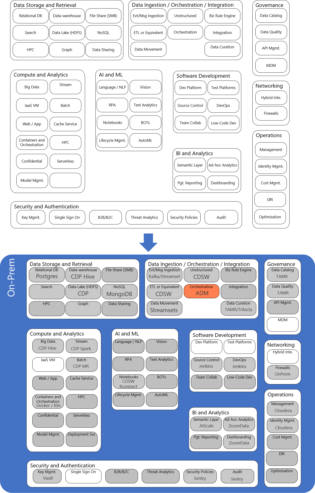
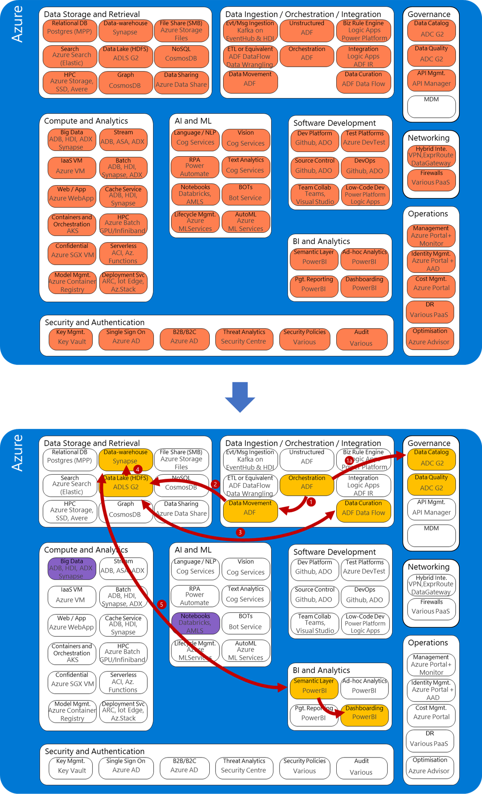
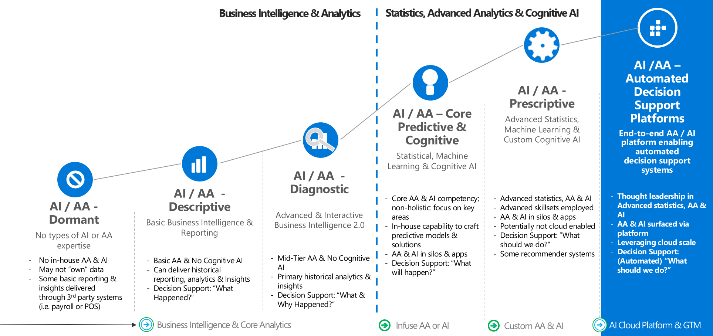
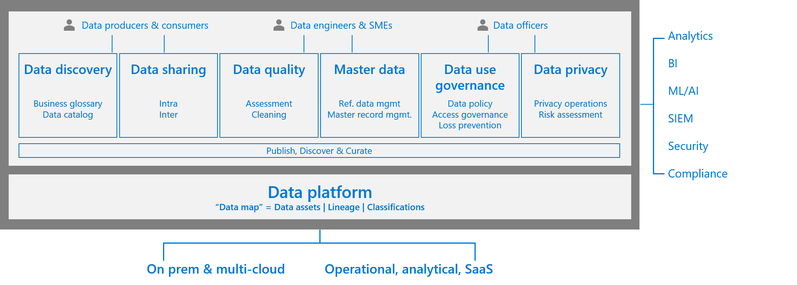
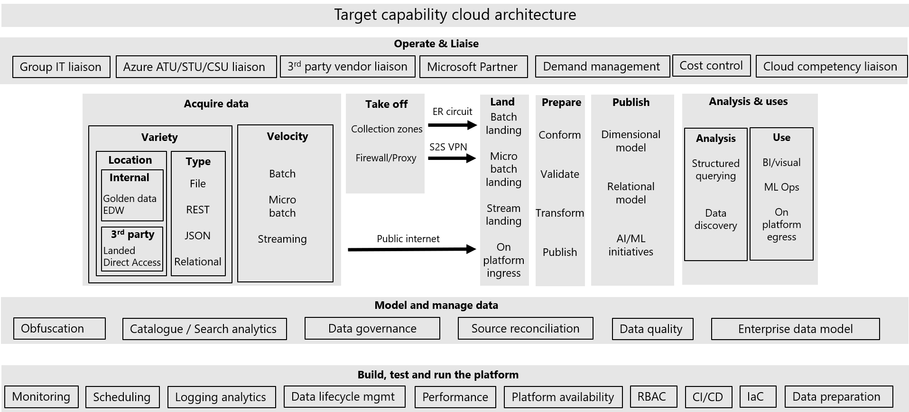

# Defining a Data Strategy Overview

Leveraging data to build better products and higher value services as a point of competitive advantage is nothing new. What is new is the volume, velocity, and variety of data that has been enabled by cloud computing. Designing a modern data analytics platform in the cloud is the convergence of security, governance, monitoring, on-demand scaling, data-ops, and self-service. What distinguishes a great data strategy from a good one is understanding how these facets interplay. We use tools like the Cloud Adoption Framework and the Well Architected Framework to ensure architectural cohesiveness, integrity, and best practices.

## Identify potential challenges and roadblocks to overcome

It can be difficult to harness the power of data in a secure and compliant manner. Sometimes, you can run into challenges like organizational silos, building a data-driven culture, and a never-ending challenge coming out of running multiple tools and technologies across the organization. Time to market is one of the most critical factors these days for all businesses. Organizations can have great ideas and data can be an enabler, but with so many challenges it can take weeks, if not months, before they can start getting insights and ultimately deliver business value from data.

## Understand the 7 attributes of data for a strong data strategy

To build a strong data strategy, you first need to understand how data works. Understanding these core characteristics will help you build a principled practice around how to deal with data.

1. Data travels fast, but the velocity of data movement cannot defy the laws of physics. It must conform to the laws of the land or the industry that created it.
1. Data never changes by itself, but it is prone to changes and accidental loss, unless explicit measures are in place to mitigate such challenges. Ensure controls, databases and storage anti-corruption measures, monitoring, audits, alerts and downstream processes are in place to deal planned or unforeseen changes.
1. Data by itself, and simply though the act of storing it, does not produce any insights or yield any value. In order to discover insights or extract value, most (if not all) data, independent of the volume, velocity, variety and veracity, has to go through four discrete steps: ingestion, storage, processing, and analytics. These each have their own set of principles, processes, tools, and technologies. Withholding data assets and related insights may affect socio-economic, political, research and investment decisions, hence it is of paramount importance for organizations to build the capability to provide insights in a secure and responsible manner.
1. All data generated or procured must go through a data classification exercise, unless otherwise explicitly stated. Where needed, the gold standard for dealing with confidential data is encryption at rest and in transit.
1. Data has gravity. This means that data, applications, and services all have their own gravitational pull. But data is the heaviest here, and therefore has the most gravitational pull. Unlike Newton's apple, data doesn't have a physical mass to draw in surrounding objects; instead, latency and throughput act as accelerators to the analytics process.
1. Latency, throughput, and ease of access often warrants that data is duplicated even when that is not the desired outcome. Set up people, processes, tools, and technologies appropriately to balance such requirements against organization's data polices.
1. The speed at which data can be processed is governed by architectural constructs, and facilitated through innovations in software, hardware, and networking. Some of the key architectural considerations are: setting up data distribution, partitioning, cache technologies, batch vs stream-processing, and balancing backend vs client-side processing.

## Prioritize the business outcomes you want your data strategy to achieve

It is key to align your data strategy with your business outcomes. Having a successful data strategy will give you competitive advantage. In essence, most business outcomes can be classified under one or more of these four umbrella categories:

1. **Empower your employees**  
Consider enabling your workforce with real-time knowledge of customers/devices/machines, efficiently collaborating to meet customer or business needs with agility.
2. **Engage with customers**
Deliver a personalized, rich, connected experience, inspired through your brand. Drive loyalty along every step of the customer journey by harnessing the power of data and insights.
3. **Optimise operations**  
Increase the flow of information across your entire business operation. Keep your business processes synchronized and make every interaction valuable through a data driven approach.
4. **Transform your products and development lifecycle**
Gather telemetry data about your services and offerings. Use the data to prioritize a release or create a new feature, and evaluate effectiveness and adoption continuously.

Once you have prioritized your business outcomes, it is key to look at current projects, long-term strategic initiatives and classify them accordingly. Consider combining the 4 business outcomes in a matrix format shown below, based on complexity and impact. Also, think about adding the architectural pillars to help you dive deeper into the scenario.

## Benchmark your current data estate and capability

Figure 1: Strategic Initiatives

Benchmarking your current estate is critical to measure success. This allows you to quantify the exact investment needed in terms of people, process and technology. You'll be able to see where you are on the Maturity Model, and the gaps you need to bridge.

To can help you get started. Here is a table showing the thought process:

|Category| Action Areas | Current Status focusing on 5 pillars of architecture |
|----------|--------------|-------------------------------------|
|**Preparation**| There are about 8-10 topics here starting from Strategy, Charter, Ethics, etc.| |
| **Agility**| Depending on the organizations there could be 5 to 10 topics here, such as strategy around Data Lake, Catalogue, Common Data Model etc. |  |
| **Resilience**|10-20 topics are here starting from discovery, recovery and anomaly detection. |  |

Table 1: Assessing your current estate and capability is key in ensuring you can track progress and celebrate success. Using the maturity level detailed further below, you can rate your current capability 0-4 and use the 5 pillars of architecture to guide those benchmarks.

Once you're clear about the business outcomes you're looking to drive through your data strategy, the next step is to build the capability to deliver them.

## Building a capability organization-wide and project-wide

Now that you have your key projects mapped with business outcomes and calibrated with impact and complexity, and your baseline, you can start looking at building the capability to deliver them.

The first step would be to look at all capabilities you need, either at an organizational level holistically, or at a project level. Start by mapping what you have.

### Capabilities to As Is Capabilities

Figure 1: Exercise 1, assessing current capability.

As a next step, look at Azure native services, and start mapping what you need to deliver success.

Figure 2: Exercise 2, mapping to cloud native capabilities.

## Culture

To build a successful data strategy, you need a data-driven culture. One that fosters open, collaborative participation consistently. This is so the entire workforce can learn, communicate and improve the organization's business outcomes. It will also improve an employee's own ability to generate impact or influence, backed by data. Where you start on the journey will depend on your organization, your industry, and where you in the maturity curve. Let's look at what a maturity curve looks like:

### Level 0

Data is not exploited programmatically and consistently. The data focus within the company is from an application development perspective. On this level, we commonly see ad-hoc analytics projects. Additionally, each application is highly specialized to the unique data and stakeholder needs. Each has significant code bases and engineering teams, with many being engineered outside of IT as well. Finally, use case enablement – as well as analytics – are very siloed.

### Level 1

Here, we see teams being formed, strategy being created, but analytics still is departmentalized. At this level, organizations tend to be good at traditional data capture and analytics. They may also have a level of commitment to cloud-based approaches; for example, they may already be accessing data from the cloud.

### Level 2

The innovation platform is almost ready, with workflows in place to deal with data quality, and the organization is able to answer a few 'why' questions. At this level, organizations are actively looking for an end-to-end data strategy with centrally governed data lake stores controlling data store sprawl and improving data discoverability. They are ready for smart and intelligent apps that bring compute to the centrally governed data lake(s), reducing the need for federated copies of key data, reducing GDPR and privacy risks as well as reducing compute costs. They are also ready for multi-tenantable ,centrally hosted shared data services for common data computing tasks and recognize the value of this to enable the speed of insights from data science driven Intelligence Services.

### Level 3

Some of the characteristics of this level are a holistic approach to data and projects related to data being deeply integrated with business outcomes. We would also see predictions being done using analytics platforms. At this level, organizations are unlocking digital innovation from both a data estate and application development perspective. They have the foundational data services including data lake(s) and shared data services in place. Multiple teams across the company are successfully delivering on critical business workloads, key business use cases, and measurable outcomes. Telemetry is being utilized to identify new shared data services. IT is a trusted advisor to teams across the company to help improve critical business processes through the end-to-end trusted and connected data strategy.

### Level 4

Here we see the entire company using a data-driven culture, frameworks and standards enterprise. We also see automation, centres of excellence around analytics and/or automation, and data-driven feedback loops in action. One of the outcomes of a data-driven culture, is the use of AI in a meaningful way, and here it is easy to define a maturity model as the one shown below.

Figure 3: Maturity evolution of organization across reporting, deriving insights & decision support.

## Focus on architecture

When considering every data product or service, it's important to focus on the architectural principals. Think about whether you want to continue to manage and maintain your current service or products, or undertake new ones. The five architectural constructs are detailed in the [Azure Well Architected Framework](https://docs.microsoft.com/azure/architecture/framework/) and summarized below.  

### Security

This is about the [confidentiality and integrity of data, including privilege management, data privacy and establishing appropriate controls](https://azure.microsoft.com/resources/seven-key-principles-of-cloud-security-and-privacy/). For all data products and services, [consider network isolation](https://docs.microsoft.com/azure/security/fundamentals/network-best-practices), [end-to-end encryption](https://docs.microsoft.com/azure/security/fundamentals/encryption-overview), auditing and polices at platform level. For identity, consider single sign on integration, multi-factor authentication backed conditional access and managed service identities. It is essential to focus on separation of concerns, such as control pane versus data place, [role-based access control (RBAC)](https://docs.microsoft.com/azure/role-based-access-control/overview), and where possible, attribute-based access control (ABAC). Security and [data management](https://docs.microsoft.com/azure/architecture/patterns/category/data-management) must be baked into the architectural process at layers for every application and workload. In general, set up processes around regular or continuous vulnerability assessment, threat protection and compliance monitoring.

### Reliability

Everything has the potential to break and data pipelines are no exception. Hence, great architectures are designed with availability and resiliency in mind. The key considerations are how quickly you can detect change, and how quickly you can resume operations. When building your data platform, consider resilient architectures, cross region redundancies, service level SLAs and critical support. Set up auditing, monitoring, and alerting by using integrated monitoring, and a notification framework.

### Performance efficiency

User delight comes from the architectural constructs of performance and scalability. Performance can vary based on external factors. It is key to continuously gather performance telemetry and react as quickly as possible, i.e. using the architectural constructs for management and monitoring. The key considerations here are storage and compute abstraction, dynamic scaling, partitioning, storage pruning, enhanced drivers, and multi-layer cache. Take advantage of hardware acceleration such as FPGA network where possible.

### Cost optimization

Every bit of your platform investment must yield value. It is critical to architect with the right tool for the right solution in mind. This will help you analyse spend over time and the ability to scale out versus scale in when needed. For your data and analytics platform, consider reusability, on-demand scaling, reduced data duplication and certainly take advantage of the Azure advisor service.  

### Operational excellence

This is about making the operational management of your data products and service as seamless as possible through automation and your ability to quickly respond to events. Focus on data ops though process automation, automated testing, and consistency. For AI, considering building in a MLOps framework as part of your normal release cycle.

## Tools and technology to power your data strategy

The right set of tools and technologies will be the backbone for your data products and services. Here are some of the key considerations to take.

Avoid getting stuck in a never-ending learning or design loop, otherwise known as analysis paralysis, or building PoC after PoC. Beyond a certain point, additional time spent in this cycle does not add equivalent value to your organization's business objectives.

## Think big, start small, and act fast

Even if you don't have 100 percent of the features from the get-go, it is more important to get started in delivering business value iteratively. Leave the rest to product innovation from vendors and the capability you going to build with each iteration. Growth mindset is cultivated best when we accomplish more with less. This balance is an art, it fosters creativity and innovation.

Simplification is key. At Microsoft, we have been innovating on behalf of our customers. We have many services for data procurement and many more for storage – depending on the volume, variety, velocity, and veracity. Similarly, an array of services for analytics, visualization, and data science. Despite the flexibility and options, we understand that simplicity is important. A holistic solution that you can get started with immediately makes it easy to see return of investment quicker. For example, we see [Azure Synapse Analytics](https://azure.microsoft.com/services/synapse-analytics/) as a category in its own right. It has ample integration options in your current estate, as well as ISV solutions.

In a nutshell, what we have created is a single integrated platform for BI, AI and Continuous Intelligence. This is wrapped under four foundational capabilities of: management, security, monitoring and a metastore. Underpinning this is a decoupled storage layer, data integration layer, analytics runtimes (either on-demand as serverless, or provisioned). The runtimes provide choice, such as SQL with T-SQL for batch and interactive processing, or Spark for big data, and support of most languages such as SQL, Python, .NET, Java, Scala and are all made available through a single interface called Synapse Analytics Studio.

Figure 4: Azure Synapse Analytics for integrated data platform experience for BI, AI and continuous intelligence.

This principled approach will help you shift from an application-only approach to an application and data-led approach. This will help your organization build an end-to-end data strategy that can ensure repeatability and scalability across current and future use cases that impact business outcomes.

## A principled approach to your data strategy

With data governance in mind, the following diagram shows the essential stages for data lifecycle:

An effective data strategy must have provisions for data governance, but they are mutually inclusive, but not the same thing.

For the purpose of this blog, let's take a closer look at the considerations to take when building design principles for the four layers that are key in your data strategy, focused towards delivering business outcome and value from data.

### Data ingestion

A key consideration for data ingestion is the ability to build a data pipeline extremely fast, from requirements to production, in a secure and compliant manner. Elements such as metadata driven, self-service, low-code technologies to hydrating your data lake are key. When building a pipeline, consider design, the ability to do data wrangling, scale compute and also data distribution capabilities. In addition, having the right DevOps support for the continuous integration and delivery of your pipeline is critical. Tools such as Azure Data Factory support a plethora of on-premises, Software as a Service and data sources from other public clouds. Having such agility from the get-go is always helpful.

### Storage

Data needs to be tagged and organized in physical and logical layers. Data lakes are key in all modern data analytics architectures. Organizations need to apply appropriate data privacy, security and compliance requirements based on data classification and the industry compliance requirements they operate in. The other key considerations are cataloguing and self-service to aid organization level data democratization to fuel innovation, guided by appreciate access control.

Choosing the right storage based on the workload is key, but even if you don't get it right the first time, the cloud provides you options to failover quickly and provide options to restart the journey reasonably easily. You can choose the right database based on your application requirements. When choosing an analytics platform, make sure you consider the ability to process batch and streaming data.

### Data processing

Your data processing needs will vary according to workload, for example most big data processing has elements of both real-time and batch processing. Most enterprises also have elements of time series processing requirements and the need to process free-form text for enterprise search capabilities.

The most popular organizational processing requirements come from Online Transaction Processing (OLTP). Certain workloads need specialized processing such as High Performance Computing (HPC), also called 'Big Compute'. These use many CPU or GPU-based computers to solve complex mathematical tasks.

For certain specialized workloads, customers can secure execution environments such as Azure confidential computing which helps users secure data while it's 'in use' on public cloud platforms (a state required for efficient processing). The data is protected inside a Trusted Execution Environment (TEE), also known as an enclave. This protects the code and data against viewing and modification from outside of the TEE.  This can provide the ability to train AI models using data sources from different organizations without sacrificing data confidentiality.

### Analytics

Extract, transform, load construct or otherwise called ETL (or ELT depending on where the transform happens) relates to online analytical processing (OLAP), and data warehousing needs. One of the useful capabilities here is the ability to automatically detect schema drift. Consider end-to-end architectures like automated enterprise BI with Azure Synapse Analytics and Azure Data Factory. To support advanced analytics including Machine Learning and AI capabilities, it is key to consider the reusability of platform technologies already in use for other processing requirements of similar nature. Here is a quick start guide with working example for end-to-end processing.

Batch processing on Databricks, R, Python or for deep learning models are common examples. Compute, storage, networking, orchestration and DevOps/MLOps are key considerations here. For super large models, look at distributed training of deep learning models on Azure or the Turning Project. You also need to consider the ability to deal with data and model drift too.

Azure Enterprise Scale Analytics and AI Construction Set helps collate all the four layers together with people, process, security, and compliance. We also suggest using the recommended architectures from Azure Landing Zones to get started. It uses the Microsoft Cloud Adoption Framework and culminates our experience working through thousands of large scale enterprise deployments.

Now that we have covered the four stages, the following representation shows the key capabilities needed on top of your data platform to provide end to end data governance capability.  

## Building Blocks

After making all the capability provisions, and taking a principled architectural view as discussed in this section, you will most likely end up with the building blocks required for your cloud strategy journey which may look something like the below:

## Data Strategy Summary

Taking a principled approach on additional, but very relevant considerations, such as data governance and responsible AI will pay dividends later.

At Microsoft, we use four core principles of fairness, reliability and safety, privacy and security, and inclusiveness. Underpinning this is two foundational principles of transparency and accountability.

We put responsible AI and our principles into practice through the development of resources and a system of governance. Some of our guidelines focus on human-AI interaction, conversational AI, inclusive design, an AI fairness checklist, and a datasheet for datasets.

In addition to practices, we've developed a set of tools to help others understand, protect, and control AI at every stage of innovation. Our tools are a result of collaboration across various disciplines to strengthen and accelerate responsible AI, spanning software engineering and development, to social sciences, user research, law, and policy.

To further collaboration, we also open-sourced many tools such as Interpret ML and Fair Learn that others can use to contribute and build upon alongside democratising tools through Azure Machine Learning.

The pivot to becoming a data-driven organization is fundamental to deliver competitive advantage in the new normal. We want to help our customers shift from an application only approach to an application and data-led approach, helping to create an end-to-end Data Strategy that can ensure repeatability and scalability across current and future use cases that impact business outcomes.

## Further Reading

* [Explore the Azure Well Architected Framework](https://docs.microsoft.com/azure/architecture/framework/)
* [Driving effective data governance for improved quality and analytics](https://www.microsoft.com/itshowcase/driving-effective-data-governance-for-improved-quality-and-analytics)
* [Designing a modern data catalog at Microsoft to enable business insights](https://www.microsoft.com/itshowcase/designing-a-modern-data-catalog-at-microsoft-to-enable-business-insights)
* [Download: A Guide to Data Governance](https://query.prod.cms.rt.microsoft.com/cms/api/am/binary/RE4GEtu)

## Next step: Assess for 'data management and analytics'

The following list of articles will take you to guidance found at specific points throughout the cloud adoption journey to help you be successful in the cloud adoption scenario.

* [Plan for 'data management and analytics'](./plan.md)
* [Review your environment or Azure Landing Zone(s)](./ready.md)
* [Assess for 'data management and analytics' migration](./migrate-assess.md)
* [Migrate 'data management and analytics'](./migrate-deploy.md)
* [Release 'data management and analytics' to production](./migrate-release.md)
* [Innovate with 'data management and analytics'](./innovate.md)
* [Govern 'data management and analytics'](./govern.md)
* [Manage 'data management and analytics'](./manage.md)
