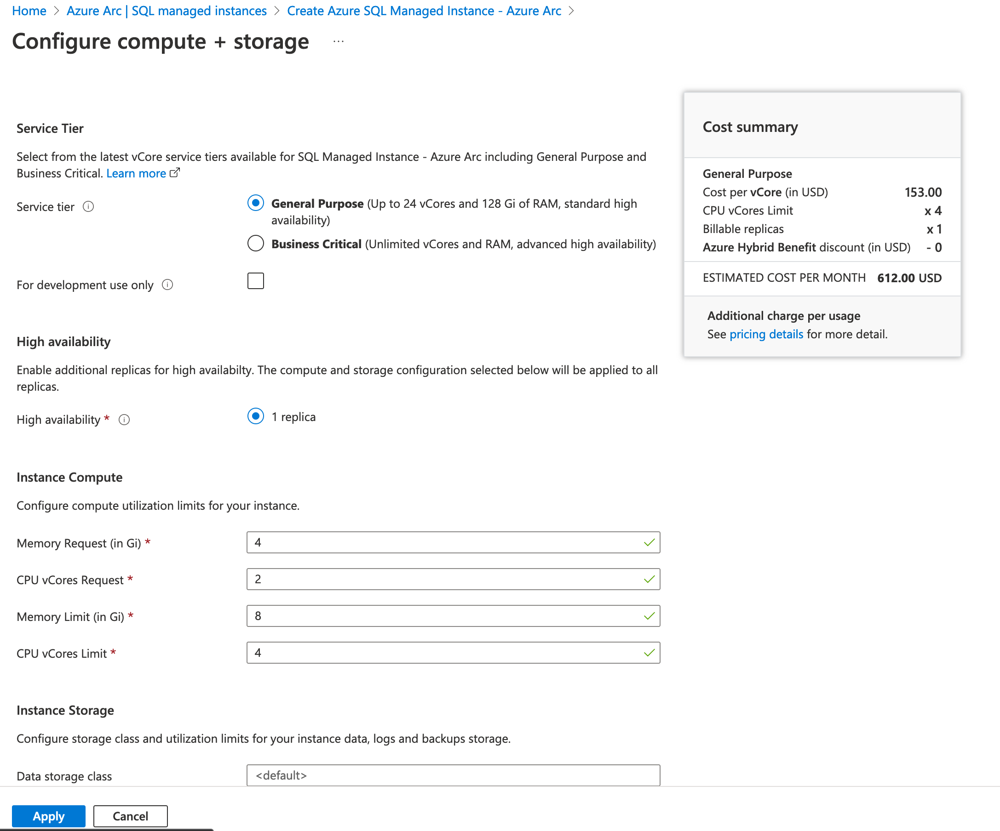
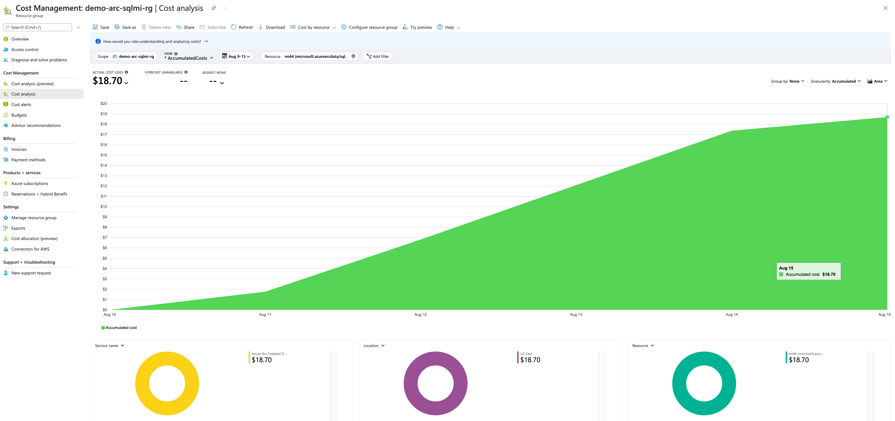

# Cost governance for Azure Arc-enabled SQL Managed Instance

Cost governance is the continuous process of implementing policies to control the costs of services you use in Azure. This document provides cost governance considerations and recommendations for you to keep in mind while using Azure Arc-enabled data services.

## Cost of Azure Arc-enabled SQL Managed Instance

Azure Arc-enabled SQL Managed Instance (MI) provides two types of service tiers:

- General Purpose
- Business Critical

Both tiers are priced per vCore and like many other Azure services, offers reserved instances and Azure Hybrid Benefit for additional savings.  

The costs of Arc-enabled SQL MI is in addition to any additional functionality deployed to your Azure Arc-enabled Kubernetes cluster.  More detail on design considerations and recommendations for the Kubernetes cluster is available [here](/azure/cloud-adoption-framework/scenarios/hybrid/arc-enabled-kubernetes/eslz-arc-kubernetes-cost-governance).

## Cost of High Availability Infrastructure

While not a direct cost of Arc-enabled SQL MI, consider that deploying an instance in the Business Critical tier offers high availability, which necessitates deploying and maintaining an additional Kubernetes cluster.

## Design considerations

- **Service Tier** Define the business requirements to determine the most appropriate service tier. In addition, consider the additional infrastructure needed to support [business continuity and disaster recovery](./eslz-arc-datasvc-sqlmi-bcdr.md).

- **Connectivity Modes** How usage and billing information is sent to Azure will vary depending on whether one is using the directly connected or indirectly connected mode.  If using the indirectly connected mode, consider how the usage and billing information will be regularly sent to Azure.

- **Reserved Instances** Based on the expected time for Arc-enabled SQL MI, consider whether pay-as-you-go, a one-year reserved instance, or a three-year reserved instance offers savings.

- **Azure Hybrid Benefit** For SQL Server, Azure Hybrid Benefits offers savings on both service tiers of Arc-enabled SQL MI.

Consider the combination of service tier needs, timeline for Arc-enabled SQL MI deployment(s), and whether your organization has [Azure Hybrid Benefit](/azure/azure-sql/azure-hybrid-benefit?view=azuresql&tabs=azure-portal).  In addition, [Dev/Test pricing](/pricing/dev-test/) is available for both service tiers, though this is only for development use.  Further, review the [cost management considerations]/azure/cloud-adoption-framework/ready/landing-zone/design-area/governance#cost-management-considerations) of Azure landing zones to understand broad cost-related considerations.  Finally, consider using the [Azure Hybrid Benefit Savings Calculator](https://azure.microsoft.com/pricing/hybrid-benefit/#calculator) and/or the [Total Cost of Ownership Calculator](https://azure.microsoft.com/pricing/tco/) to determine potential cost savings.

## Design recommendations

The following sections contain design recommendations for Arc-enabled SQL MI cost governance.

> [!NOTE]
> Pricing information shown in the provided screenshots are examples and provided to demonstrate cost governance concepts but don't reflect the actual pricing information you might see in your own Azure Arc deployments.

### Service Tier

The biggest cost component in an Arc-enabled SQL MI deployment is the service tier selected.  Choose the service tier that meets business requirements. Refer to the [Service tier comparison](/azure/azure-arc/data/service-tiers#service-tier-comparison) for more details.  Consider the need for high-availability and read scale-out, among other factors.  If this is an existing SQL Server deployment being migrated, consider the SQL edition currently in use and the features that will be required for the Arc-enabled SQL MI deployment.

### Connectivity Mode

If using the directly connected mode, no additional action is needed for the necessary usage and billing data to be sent to Azure.  If using the indirectly connected mode, establish an automated mechanism to transmit this data based on what is described in [Upload usage data to Azure in indirect mode](/azure/azure-arc/data/upload-usage-data).  Configure a cron job or other automated task to upload the data on a daily basis and monitor the job for failure.  While the uploaded data is only required to be sent every 30 days, uploading it on a daily basis reduces the chance of entering a degraded state.

### Reserved Instances

Based on the expected duration of the Arc-enabled SQL MI deployment, choose a one or three-year reserved instance if it will result in savings for the organization. Refer to the [Cloud Adoption Framework](/azure/cloud-adoption-framework/govern/cost-management/best-practices#best-practice-use-azure-reserved-vm-instances) for more details on reservation.

### Azure Hybrid Benefit

If your organization has [Azure Hybrid Benefit](/azure/azure-sql/azure-hybrid-benefit?view=azuresql&tabs=azure-portal), use it to lower the cost of Arc-enabled SQL MI.

### Governance

- Review the recommendations in the [resource organization](./eslz-arc-datasvc-sqlmi-resource-organization.md) and [governance disciplines](./eslz-arc-datasvc-sqlmi-governance-disciplines.md) critical design areas to implement a governance strategy, organize your resources for better cost control and visibility, and avoid unnecessary costs by using the least privileged access model for onboarding and management.  Further, review the broader recommendations for Azure Arc-enabled Kubernetes [resource organization](/azure/cloud-adoption-framework/scenarios/hybrid/arc-enabled-kubernetes/eslz-arc-kubernetes-resource-organization) and [governance discipline](/azure/cloud-adoption-framework/scenarios/hybrid/arc-enabled-kubernetes/eslz-arc-kubernetes-governance-disciplines) to understand governance principles outside of a data services context.

- Use [Azure cost management and billing](/azure/cost-management-billing/costs/quick-acm-cost-analysis) to understand Arc-enabled SQL MI costs.

### Azure Policy for Kubernetes

- Review [Azure Policy for Kubernetes pricing](https://azure.microsoft.com/pricing/details/azure-arc/).  This is an optional component that may complement Arc-enabled SQL MI by, for example, enforcing tagging or controlling the enablement of Azure services
- Review the [Security, governance, and compliance critical design area](./eslz-arc-datasvc-sqlmi-management-disciplines.md) to learn best practices and recommendations for implementing Azure Policy for Kubernetes. These best practices include:
  - Enforcing tagging for better cost visibility across clusters
  - Controlling the enablement of Azure services

## Next steps

For more information about your hybrid and multicloud cloud journey, see the following articles:

- Learn how to [Manage hybrid and multicloud environments](/azure/cloud-adoption-framework/scenarios/hybrid/manage).
- Experience Azure Arc-enabled data services automated scenarios with [Azure Arc Jumpstart](https://azurearcjumpstart.io/azure_arc_jumpstart/azure_arc_data/).
- Learn more about Azure Arc in the [Azure Arc learning path on Microsoft Learn](/learn/paths/manage-hybrid-infrastructure-with-azure-arc/).
- Review the Cloud Adoption Framework [best practices and recommendations](/azure/cloud-adoption-framework/get-started/manage-costs) to efficiently manage your cloud costs.
- See the [Frequently Asked Questions - Azure Arc-enabled](/azure/azure-arc/kubernetes/faq) to find answers to most common questions.
