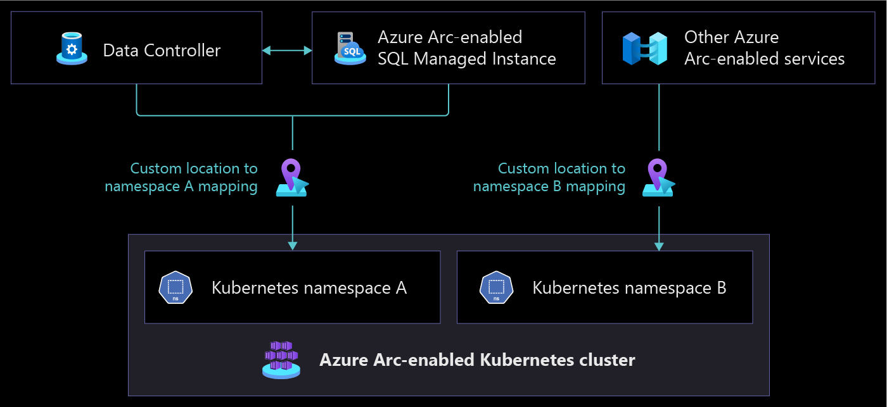
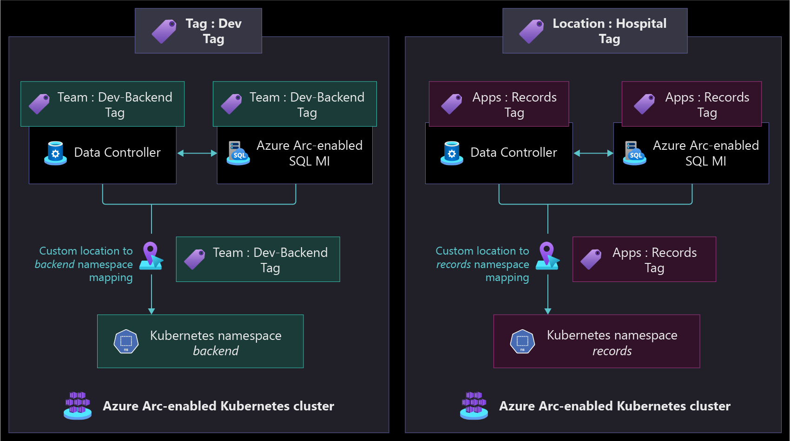

# Resource organization for Azure Arc-enabled SQL Managed Instance

Resource organization decisions are a foundation for all compliance-related design areas and involve preparing your environment and setting up your resources so you can efficiently secure, manage, and track costs related to your workloads.

The Cloud Adoption Framework [Ready methodology](/azure/cloud-adoption-framework/ready/) provides resource organization guidance you can review before deploying and implementing your workloads. This strategy should include your hybrid and multicloud resources and add business and operational details as components of inventory management and metadata tags.

It's important to know how to use consistent resource grouping, defined naming standards, relevant tagging, and fine-grained access control to optimize your resource organization when using Azure Arc-enabled data services.

## Resource consistency and organization

Before deploying Arc-enabled SQL MI, it's important to define a structure on how resources will be projected to Azure management scopes (management groups, subscriptions, and resource groups). Review the Cloud Adoption Framework recommendations on how to [organize resources](/azure/cloud-adoption-framework/ready/azure-setup-guide/organize-resources?tabs=AzureManagementGroupsAndHierarchy).

In addition, review the [resource organization design](/azure/cloud-adoption-framework/ready/landing-zone/design-area/resource-org) area of the Azure landing zones to assess the impact of Azure Arc-enabled SQL MI on your overall resource organization model.

In the directly connected mode, the Kubernetes cluster where the Azure Arc-enabled data services will be deployed needs to be an Azure Arc-enabled Kubernetes resource, this connects your Kubernetes cluster to Azure, so you can deploy and manage Azure Arc data services directly from the Azure portal. As the Kubernetes cluster becomes an ARM resource once Arc-enabled, it is recommended to review the best practices for [resource organization](/azure/cloud-adoption-framework/scenarios/hybrid/arc-enabled-kubernetes/eslz-arc-kubernetes-resource-organization) for Azure Arc-enabled Kubernetes.

This mapping is the key to determining how you can interact with these resources when applying [role-based access control (RBAC)](/azure/active-directory/roles/best-practices) and assigning [Azure Policy](/azure/governance/policy/overview) as part of your governance model.

When designing this structure, keep in mind the [Azure Resource Manager service limits](/azure/azure-resource-manager/management/azure-subscription-service-limits) as they might apply to  Arc-enabled SQL MI. While designing your structure, it's important to be aware of [resource group](/azure/azure-resource-manager/management/azure-subscription-service-limits) or [subscription](/azure-resource-manager/management/azure-subscription-service-limits) limits.

After you've created a taxonomy structure and agreed on naming standards, it's recommended to apply [tags](/azure/cloud-adoption-framework/ready/azure-best-practices/naming-and-tagging) to the Arc-enabled SQL MI resources. You can apply a tag either during Arc-enabled SQL MI onboarding or once it's registered in Azure (meaning your Arc-enabled SQL MI has a resource ID and is part of a resource group within your subscription) and it can benefit from standard Azure constructs such as resource tags.

Resource tags let you add metadata to a resource so you can quickly locate it and automate operational tasks, which is important for day-to-day operations. For detailed guidance on tagging, review the [Cloud Adoption Framework tagging strategy](/azure/cloud-adoption-framework/ready/azure-best-practices/naming-and-tagging).

Before deploying Arc-enabled SQL MI, review [Identity and access management](./eslz-arc-datasvc-sqlmi-identity-access-management.md) to get recommendations on identity and access management for the Azure Arc-enabled SQL MI. In addition, review [Network connectivity](./eslz-arc-datasvc-sqlmi-network-connectivity.md) and [Storage disciplines](./eslz-arc-datasvc-sqlmi-storage-disciplines.md) design areas for more considerations and recommendations.

After Arc-enabled SQL MI is deployed to a resource group and tags have been added, you can use [Resource Graph](/azure/governance/resource-graph/overview) queries, view groupings based on resource groups, or organize and inventory your resources using tags.

## Custom location

When planning for the deployment of Azure Arc-enabled data services in [directly connected mode](/azure/azure-arc/data/connectivity), consider that additional resource, ["Custom Location"](/azure/azure-arc/platform/conceptual-custom-locations) will be provisioned and will be projected in your Azure subscription.

It is recommended to include these resources as part of your resource organization methodology (tags and naming). It is especially important to consider that a Custom Location configures your Azure Arc-enabled Kubernetes clusters as target locations for deploying instances of Azure offerings and as such their naming and tagging should be relevant to your business and operations, aligning with a physical location, data center name, and cloud environment. Resource naming convention for Azure Arc-enabled SQL MI should align with your line of business apps (LOB) using data services.

## Next steps

For more information about your hybrid and multicloud cloud journey, see the following articles:

- Plan an [Azure Arc-enable data services deployment](/azure/azure-arc/data/plan-azure-arc-data-services)
- Review the [connectivity modes](/azure/azure-arc/data/connectivity)
- Review the [prerequisites](/azure/azure-arc/data/plan-azure-arc-data-services) for Arc-enable data services.
- Review the prerequisites for deploying Azure Arc data controller - [Indirect connectivity mode](/azure/azure-arc/data/create-data-controller-indirect-azure-data-studio)
- Review the prerequisites for deploying Azure Arc data controller - [Direct connectivity mode](/azure/azure-arc/data/create-data-controller-direct-prerequisites?tabs=azure-cli)
- Learn the fundamentals of [Azure Arc-enable data services](/learn/modules/intro-to-azure-arc/)
-Experience Azure Arc-enabled data services scenarios with [Azure Arc Jumpstart](https://azurearcjumpstart.io/azure_arc_jumpstart/azure_arc_data/).
