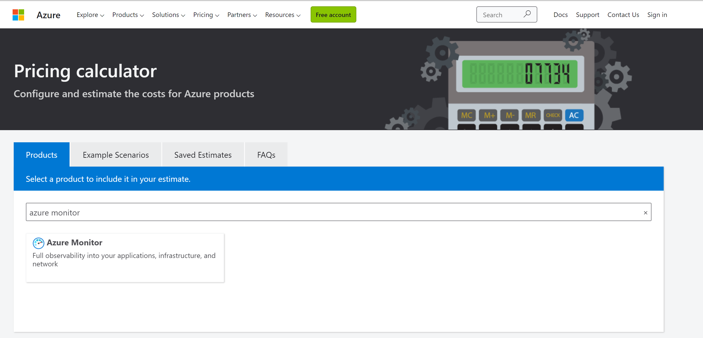
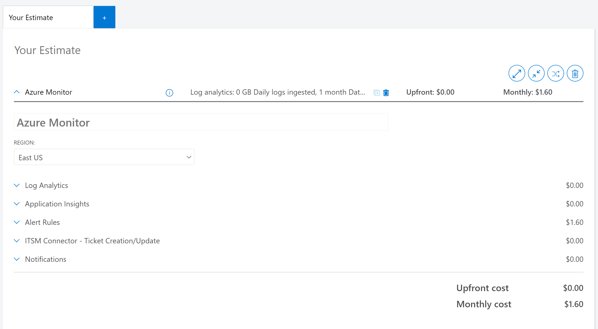
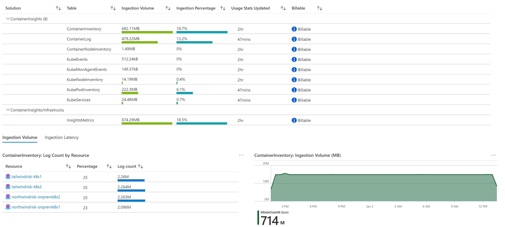
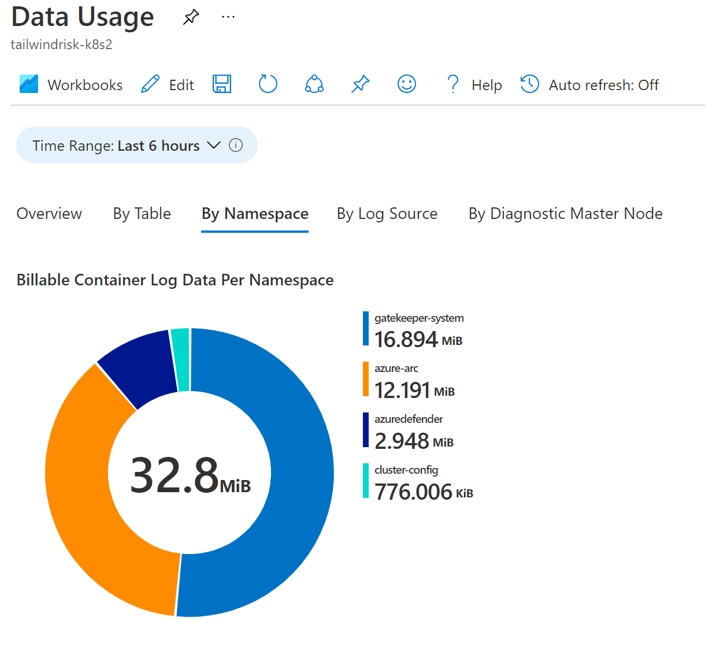

# Cost governance with Azure Arc-enabled Kubernetes

## Overview

Cost governance is the continuous process of implementing policies to control costs of services you are using on Azure. This document will walk you through the various cost governance considerations and recommendations when using Azure Arc-enabled Kubernetes.

## How much does Azure Arc-enabled Kubernetes cost?

Azure Arc-enabled Kubernetes provides two types of services:
1. Azure Arc control plane functionality, which is provided at no extra cost including:
   - Resource organization through Azure [management groups](/azure/governance/management-groups/overview) and [tags](/azure/azure-resource-manager/management/tag-resources?tabs=json).
   - Searching and indexing through [Azure Resource Graph](/azure/governance/resource-graph/overview).
   - Access control through [Azure role-based access control](/azure/role-based-access-control/overview) (RBAC) at subscription or resource group level.
   - Automation through [templates](/azure/azure-resource-manager/templates/overview) and [extensions](/azure/azure-arc/kubernetes/extensions).

2. Azure services used in conjunction with Azure Arc-enabled Kubernetes (but not limited to), incur costs according to their usage including:
   - [Kubernetes GitOps configuration](/azure/azure-arc/kubernetes/conceptual-configurations)
   - [Azure Policy for Kubernetes](/azure/governance/policy/concepts/policy-for-kubernetes)
   - [Azure Monitor Container Insights](/azure/azure-monitor/containers/container-insights-overview)
   - [Microsoft Defender for Containers](/azure/defender-for-cloud/defender-for-containers-introduction?tabs=defender-for-container-arch-aks)
   - [Microsoft Sentinel](/azure/sentinel/overview)
   - [Azure Key Vault](/azure/key-vault/general/basic-concepts)

> [!Note]
> If the Azure Arc-enabled Kubernetes cluster is on Azure Stack Edge, AKS on Azure Stack HCI, or AKS on Windows Server 2019 Datacenter, then Kubernetes configuration is included at no charge

## Design considerations

- **Governance:** Define a governance plan for your hybrid clusters that translates into Azure Policies, tags, naming standards and least-privilege controls.

- **Azure Monitor for Containers:** [Azure Monitor for Containers](/azure/azure-monitor/containers/container-insights-overview) gives you performance visibility by collecting memory and processor metrics from controllers, nodes, and containers that are available in Kubernetes through the Metrics API. Container logs are also collected. This is billed by data ingestion, retention, and export for Log Analytics.

- **Microsoft Defender for Cloud (formerly known as Azure Security Center):**  Microsoft Defender for Cloud is offered in [two modes](/azure/defender-for-cloud/enhanced-security-features-overview#what-are-the-benefits-of-enabling-enhanced-security-features):

   **Without enhanced security features (Free)** - [Defender for Cloud](/azure/defender-for-cloud/defender-for-cloud-introduction) is enabled for free on all your Azure subscriptions when you visit the workload protection dashboard in the Azure portal for the first time, or if enabled programmatically via API. Using this free mode provides the secure score and its related features: security policy, continuous security assessment, and actionable security recommendations to help you protect your Azure resources.

   **Microsoft Defender for Cloud with all enhanced security features (Paid)** - Enabling [Microsoft Defender for Cloud](/azure/defender-for-cloud/enhanced-security-features-overview) enhanced security extends the capabilities of the free mode to workloads running in private and other public clouds, providing unified security management and threat protection across your hybrid cloud workloads.

- **Kubernetes GitOps configuration:** [Kubernetes GitOps configuration](/azure/azure-arc/kubernetes/conceptual-configurations) delivers configuration management and application deployment using GitOps. With this capability, cluster admins can declare their cluster configuration and applications in Git. The development teams can then use pull requests and the tools they are familiar with (existing DevOps pipelines, Git, Kubernetes manifests, Helm charts) to easily deploy applications onto Azure Arc enabled Kubernetes clusters and make updates in production. Billing is based on the number of vCPUs/hour in the cluster and is charged monthly. Clusters incur a single charge for configuration management no matter how many repositories are connected.
>[!Note]
>Clusters can function without a constant connection to Azure. When disconnected, each cluster’s charge will be determined based on the last known number of vCPUs that were registered with Azure Arc. If your cluster will be disconnected from Azure and you don’t want to be charged for Kubernetes Configuration, you can delete the configurations. The vCPU count is updated every 5 minutes when connected. The first 6 vCPUs are included at no cost.

- **Azure Policy for Kubernetes:** [Azure Policy for Kubernetes](/azure/governance/policy/concepts/policy-for-kubernetes) extends Gatekeeper v3, an admission controller webhook for Open Policy Agent (OPA), to apply at-scale enforcements and safeguards on your clusters in a centralized, consistent manner. Azure Policy makes it possible to manage and report on the compliance state of your Kubernetes clusters from one place. There is currently no cost for Azure Policy for Kubernetes while in public preview.

- **Microsoft Sentinel:** Microsoft Sentinel provides intelligent security analytics across your enterprise. The data for this analysis is stored in an Azure Monitor Log Analytics workspace. Microsoft Sentinel is billed based on the volume of data ingested for analysis in Azure Sentinel and stored in the Azure Monitor Log Analytics workspace for your Azure Arc-enabled Kubernetes clusters.

- **Azure Key Vault:** The Azure Key Vault Provider for Secrets Store CSI Driver allows for the integration of an Azure key vault as a secrets store with a Kubernetes cluster via a CSI volume. Azure Key Vault is billed by the operations performed on the certificates, keys, and secrets.

## Design recommendations

Here are some general design recommendations for Azure Arc-enabled Kubernetes cost governance:
### Governance

- Review the [resource organization](./resource-organization.md) and [governance diciplines](./governance-diciplines.md) critical design areaa.
- Ensure that all Azure Arc-enabled Kubernetes clusters follow proper [naming and tagging conventions](/azure/cloud-adoption-framework/ready/azure-best-practices/naming-and-tagging).
- Use least privilege RBAC by assigning **[Kubernetes Cluster - Azure Arc Onboarding](/azure/role-based-access-control/built-in-roles#kubernetes-cluster---azure-arc-onboarding)** to only authorized users who will onboard Azure Arc-enabled Kubernetes clusters to avoid unnecessary costs.
- Use least privilege RBAC by assigning built-in roles to authorized users managing the Azure Arc-enabled Kubernetes clusters to avoid unnecessary costs. Review recommendations for [Identity and access management](./identity-access-management.md).
### Azure Monitor for Containers

- Review the [Management and monitoring critical design area](./management-disciplines.md) to decide on your monitoring requirements and review [Azure Monitor for Kubernetes pricing](https://azure.microsoft.com/pricing/details/monitor/).

-  Decide on the [required logs and events](/azure/azure-monitor/containers/container-insights-agent-config) for the Azure Arc-enabled Kubernetes clusters to be collected in the Log Analytics workspace.
-  Use the [Azure Pricing Calculator](https://azure.microsoft.com/pricing/calculator/) to calculate an estimate of the Azure Arc-enabled Kubernetes monitoring costs for Azure Log Analytics ingestion, alerts, and notifications.
  




- Use [Azure Cost Management and Billing](/azure/azure-monitor/usage-estimated-costs#azure-cost-management--billing) to have visibility on Azure Monitor for Containers costs.


- Use [Log Analytics workspaces insights](/azure/azure-monitor/logs/log-analytics-workspace-insights-overview) solution to understand and have visibility on the Azure Kubernetes clusters monitored, collected logs, and their ingestion rate to avoid unnecessary ingestion costs.



- Leverage the built-in [Azure Monitor workbooks](/azure/azure-monitor/containers/container-insights-reports#billing-workbooks) to gain more insights on your clusters' billable monitoring data.



- Evaluate possible data ingestion volume reducing, refer to these [tips for reducing data volume](/azure/azure-monitor/logs/manage-cost-storage#tips-for-reducing-data-volume) documentation to help configure data ingestion properly.
- Consider how long to retain data on Log Analytics. Data ingested into the Log Analytics workspace can be retained at no additional charge up to the first 31 days. Consider general aspects to configure the [Log Analytics workspace level default retention](/azure/azure-monitor/logs/manage-cost-storage#workspace-level-default-retention) and specific needs to configure data [retention by data type](/azure/azure-monitor/logs/manage-cost-storage#retention-by-data-type), that can be as low as 4 days. Example: Usually, performance data doesn't need to be retained longer, instead, security logs may need to be retained longer.
- To retain data longer than 730 days, consider using [Log Analytics workspace data export](/azure/azure-monitor/logs/logs-data-export).
- Consider using [Commitment Tier](/azure/azure-monitor/logs/manage-cost-storage#pricing-model) pricing based on your data ingestion volume.

### Microsoft Defender for Cloud (formerly known as Azure Security Center):

- Review the [Security, governance, and compliance critical design area](./management-disciplines.md) to understand how to use Microsoft Defender for Cloud to protect and secure your Azure Arc-enabled Kubernetes clusters.
- Review [Microsoft Defender for Containers pricing information](https://azure.microsoft.com/pricing/details/azure-defender/).
- Consider deploying the Microsoft Defender for Containers [cost estimation workbook](https://github.com/Azure/Microsoft-Defender-for-Cloud/tree/main/Workbooks/Defender%20for%20Containers%20Cost%20Estimation?WT.mc_id=m365-0000-rotrent) to understand the estimates of your Microsoft Defender for Containers cost.

### Kubernetes GitOps configuration

- Review [Kubernetes GitOps configuration pricing](https://azure.microsoft.com/pricing/details/azure-arc/).
- Review the [CI/CD workflow critical design area](./cicd-workflow.md) to understand the best practices and recommendations for managing and monitoring Kubernetes GitOps configuration on your Azure Arc-enabled Kubernetes clusters.
- Use [Azure Policy for Kubernetes](/azure/azure-arc/kubernetes/policy-reference) to enforce and ensure consistent configuration across all your Azure Arc-enabled Kubernetes clusters.
- Use [Azure Resource Graph](/azure/governance/resource-graph/overview) queries to review the number of cores you have for the Azure Arc-enabled Kubernetes clusters to estimate the cost of enabling Kubernetes GitOps configuration.

```python
Resources
| extend AgentVersion=properties.agentVersion, KubernetesVersion=properties.kubernetesVersion, Distribution= properties.distribution,Infrastructure=properties.infrastructure, NodeCount=properties.totalNodeCount,TotalCoreCount=toint(properties.totalCoreCount)
| project id, subscriptionId, location, type,AgentVersion ,KubernetesVersion ,Distribution,Infrastructure ,NodeCount , TotalCoreCount
| where type =~ 'Microsoft.Kubernetes/connectedClusters'
| order by TotalCoreCount
```
- Use [Azure Cost Management and Billing](/azure/cost-management-billing/cost-management-billing-overview) to have visibility on Kubernetes GitOps configuration costs.


### Azure Policy for Kubernetes

- Review [Azure Policy for Kubernetes pricing](https://azure.microsoft.com/pricing/details/azure-arc/).
- Review the [Security, governance, and compliance critical design area](./management-disciplines.md) to understand the best practices and recommendations for implementing Azure Policy for Kubernetes, including but not limited to enforcing tagging for better cost visibility across clusters, enforcmenet of Kubernetes GitOps configuration, and controlling the enablement of Azure services.

### Microsoft Sentinel

- Review [Azure Sentinel pricing](https://azure.microsoft.com/pricing/details/azure-sentinel/).
- Use the Azure Pricing Calculator to estimate [Azure Sentinel costs](/azure/sentinel/azure-sentinel-billing).


- Use [Azure Cost Management and Billing](/azure/sentinel/azure-sentinel-billing#manage-and-monitor-azure-sentinel-costs) to have visibility on Azure Sentinel analysis costs.


- Review [data retention costs](/azure/sentinel/azure-sentinel-billing#data-retention-costs) for data ingested into the Log Analytics workspace used by Azure Sentinel.
- Filter the [right level of logs and events](/azure/azure-monitor/containers/container-insights-agent-config) for the Azure Arc-enabled Kubernetes clusters to be collected in the Log Analytics workspace.
- Use [Log Analytics queries](/azure/sentinel/azure-sentinel-billing#run-queries-to-understand-your-data-ingestion) and the [Workspace Usage Report workbook](/azure/sentinel/azure-sentinel-billing#deploy-a-workbook-to-visualize-data-ingestion) to understand your data ingestion trends.
- Create a [cost management playbook](/azure/sentinel/azure-sentinel-billing#use-a-playbook-for-cost-management-alerts) to send notification if your Azure Sentinel workspace exceeds your budget.
- Azure Sentinel integrates with other Azure services to provide enhanced capabilities. Review the [pricing details](/azure/sentinel/azure-sentinel-billing#costs-for-other-services) for these services.
- Consider using [Commitment Tiers](/azure/sentinel/azure-sentinel-billing#set-or-change-pricing-tier) pricing based on your data ingestion volume.
- Consider [separating non-security](/azure/sentinel/azure-sentinel-billing#separate-non-security-data-in-a-different-workspace) operational data into a different Azure Log Analytics workspace.

### Azure Key Vault

- Review [Azure Key Vault pricing](https://azure.microsoft.com/pricing/details/key-vault/).
- Review [recommendations for security and governance](./management-disciplines.md).
- Use [Azure Key Vault insights](/azure/azure-monitor/insights/key-vault-insights-overview) to monitor secrets operations on your Azure Arc-enabled Kubernetes.


## Next steps

For more guidance for your hybrid cloud adoption journey, please review the following:

- Review [Azure Arc Jumpstart](https://azurearcjumpstart.io/azure_arc_jumpstart/azure_arc_servers/day2/) scenarios
- Review the [prerequisites](/azure/azure-arc/kubernetes/quickstart-connect-cluster?tabs=azure-cli#prerequisites) for Azure Arc-enabled Kubernetes
- Review [validated Kubernetes distributions](/azure/azure-arc/kubernetes/validation-program#validated-distributions) for Azure Arc-enabled Kubernetes
- Review the Cloud Adoption Framework [best practices and recommendations](/azure/cloud-adoption-framework/get-started/manage-costs) to efficiently manage your cloud costs.
- To learn more about Azure Arc, check out the [Azure Arc learning path on Microsoft Learn](/learn/paths/manage-hybrid-infrastructure-with-azure-arc/)