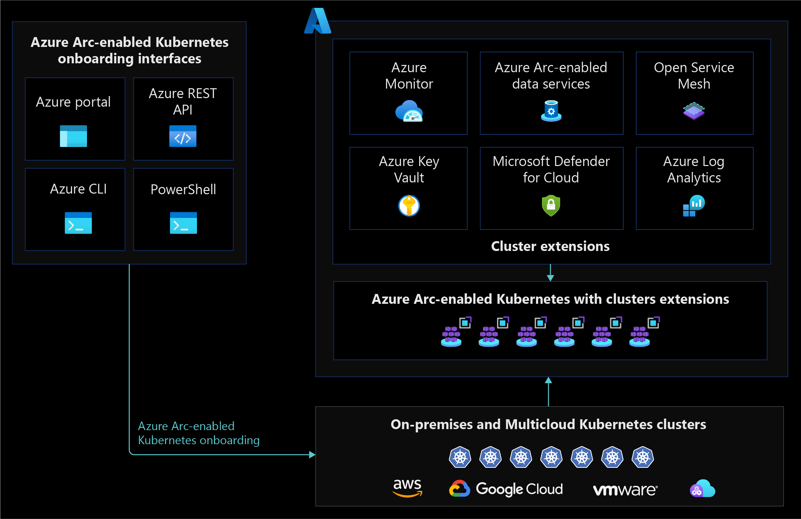

# Automation disciplines for Azure Arc-enabled Kubernetes

Azure Arc-enabled Kubernetes clusters allow you to manage your Kubernetes clusters that are hosted outside of Azure, on your corporate network, or on another cloud provider.  This document is written to help plan the automation of onboarding of clusters and adding additional capability through cluster extensions.  This article presents key recommendations for operations team(s) to onboard and automate Azure Arc-enabled clusters throughout their lifecycle.

## Architecture

The following image shows a conceptual reference architecture that highlights the onboarding and automation design areas for Azure Arc-enabled Kubernetes:

## Design Considerations

The following are some design considerations before onboarding Azure Arc-enabled Kubernetes clusters to Azure:

- **Review Requirements:** Your cluster runs a [Cloud Native Computing Foundation (CNCF)](/azure/azure-arc/kubernetes/overview#supported-kubernetes-distribution) distribution.  Note the list of [validated distributions](/azure/azure-arc/kubernetes/validation-program#validated-distributions).
- **Review Requirements:** You've reviewed the Azure Arc-enabled Kubernetes [agent](/azure/azure-arc/kubernetes/conceptual-agent-overview) overview
- **Network Connectivity:** Your cluster has connectivity from your on-premises network or third-party cloud providers to Azure - either directly connected, via a proxy server, or private endpoint.  See the [Network connectivity for Azure Arc-enabled Kubernetes critical design area](./eslz-arc-kubernetes-network-connectivity.md) of this guide for design considerations and recommendations.
- **Environment Preparation:** To deploy and configure the Azure Arc-enabled Kubernetes agent, a cluster admin role is required on your Kubernetes cluster.
- **Onboard Azure Arc-enabled Kubernetes:** Decide how you'll install and configure the Azure agent on your cluster.  Typically you'll deploy the agent using your organization's standard automation tool(s).
- **Cluster Extensions:** Determine which Azure capabilities you want on your Azure Arc-enabled Kubernetes cluster.  Some services require a cluster extension to be deployed.  See the [Extensions management critical design area](./eslz-arc-kubernetes-extensions-management.md) for more information specific to extensions.
- **Agent lifecycle automation:** Create an Azure Arc agent and Azure Arc-enabled Kubernetes extensions update management strategy.

## Design recommendations

The following are design recommendations for Azure Arc-enabled Kubernetes clusters:

### Environment preparation

- Review the [requirements](/azure/azure-arc/kubernetes/quickstart-connect-cluster?tabs=azure-cli#prerequisites) for onboarding Kubernetes clusters to Azure Arc.
- Review the [Identity and access management critical design area](./identity-access-management.md) for more information surrounding required permissions.
### Onboard Azure Arc-enabled Kubernetes clusters

- For onboarding multiple clusters, we recommended creating a service principal and onboarding your clusters using toolings such as Azure DevOps, GitHub Actions, or an another automation tool you currently in use for managing your Kubernetes clusters.
### Arc-enabled Kubernetes extensions

- For extensions that are only to be deployed to specific Azure Arc-enabled Kubernetes cluster(s), automate the installation of these extensions through Azure CLI and/or ARM templates using tools such as Azure DevOps or GitHub Actions.  In situations where extensions are common across all of your Arc-enabled Kubernetes clusters, or large groups of Arc-enabled Kubernetes clusters, we recommend automating the deployment of Arc extensions at scale via [Azure Policy](/azure/governance/policy/overview). Additionally, please review the [Extensions Management critical design area](./extensions-management.md). The following is an overview of the steps:

  - Create an [initiative](/azure/security-center/security-policy-concept#what-is-a-security-initiative) to deploy Azure Arc-enabled Kubernetes extensions at scale.
  - Use a "[DeployIfNotExists](/azure/governance/policy/concepts/effects#deployifnotexists)" policy effect to ensure the Azure Arc-enabled Kubernetes extensions get deployed automatically. As more Kubernetes clusters are onboarded, use Azure Policy to remediate any Kubernetes clusters where the extensions have been removed.
  - More details on using Azure Policy with Azure Arc-enabled Kubernetes clusters can be found in the [Governance and security disciplines critical design area](./governance-disciplines.md) section of this guide.
### Agent and extensions lifecycle automation

During the onboarding process, Azure Arc-enabled Kubernetes provision agents onto your Kubernetes cluster. These agent versions will change as Azure Arc technologies evolve and should be regularly upgraded.

- We recommend enabling the auto-upgrade feature for the Azure Arc agents running inside your cluster, this is the default behavior when onboarding a cluster to Azure Arc. Review the [Upgrade Agents guidance](/azure/azure-arc/kubernetes/agent-upgrade) and the [extensions management design area](./extensions-management.md) for more information on the auto-upgrade feature and version support policy.

- The other Azure Arc components that will require updates on your cluster are extensions. For any extension installed on your cluster, we recommend leaving the default behavior to automatically upgrade the extension minor version, which can optionally be disabled during provisioning. In the case of a major version upgrade, there will be a migration path documented to move to the extension major release. Review the [Extensions management critical design area](./extensions-management.md) for more information.
## Next steps

For more information about your hybrid and multicloud cloud journey, see the following articles:

- Review the [prerequisites](/azure/azure-arc/kubernetes/quickstart-connect-cluster?tabs=azure-cli#prerequisites) for Azure Arc-enabled Kubernetes.
- Review [validated Kubernetes distributions](/azure/azure-arc/kubernetes/validation-program#validated-distributions) for Azure Arc-enabled Kubernetes.
- Review [Manage hybrid and multicloud environments](/azure/cloud-adoption-framework/scenarios/hybrid/manage).
- Review [What is GitHub Actions for Azure](/azure/developer/github/github-actions) to understand more about how GitHub Actions can be used for automating deployments of Azure resources.
- Review [What is Azure Pipelines](/azure/devops/pipelines/get-started/what-is-azure-pipelines) to understand more about how Azure Pipelines can be used for automation.
- Experience Azure Arc-enabled Kubernetes automated scenarios with the [Azure Arc Jumpstart](https://azurearcjumpstart.io/azure_arc_jumpstart/azure_arc_k8s/).
- To learn more about Azure Arc, review the [Azure Arc learning path on Microsoft Learn](/learn/paths/manage-hybrid-infrastructure-with-azure-arc/).
- Review [Frequently Asked Questions - Azure Arc-enabled](/azure/azure-arc/kubernetes/faq) to get answers to most common questions.
