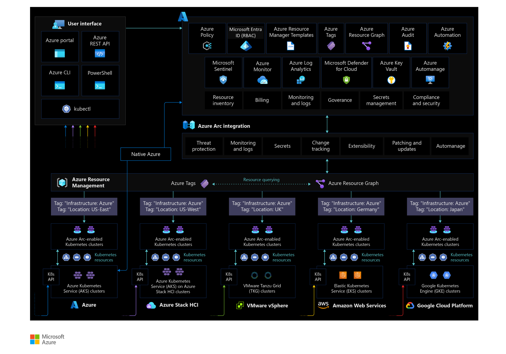

# Resource organization for Azure Arc-enabled Kubernetes

Resource organization involves preparing your environment and setting up your resources so you can efficiently find, consume, and manage them. The Cloud Adoption Framework's [Ready methodology](../../../ready/index.md) provides resource organization guidance you can review before deploying and implementing your workloads.

This article explains how you can use consistent resource grouping, defined naming standards, relevant tagging, and fine-grained access control to optimize your resource organization when using Azure Arc-enabled Kubernetes.

## Resource consistency and organization

Review the [resource organization design area](../../../ready/landing-zone/design-area/resource-org.md) of the Azure landing zones to assess the impact of Azure Arc-enabled Kubernetes on your overall resource organization model.

Before onboarding any Kubernetes cluster onto Azure Arc, define a structure for projecting your resources to Azure management scopes (management groups, subscriptions, and resource groups). This mapping determines how you can interact with these resources when applying [role-based access control (RBAC)](./eslz-arc-kubernetes-identity-access-management.md) roles and assigning Azure policies based on your governance model. Review the Cloud Adoption Framework recommendations for [organizing resources](../../../ready/landing-zone/design-area/resource-org.md).

Keep [Azure Resource Manager service limits](/azure/azure-resource-manager/management/azure-subscription-service-limits) in mind, as they apply to Azure Arc-enabled Kubernetes. While designing your structure, determine how many clusters should connect to a specific [resource group](/azure/azure-resource-manager/management/azure-subscription-service-limits#resource-group-limits) or [subscription](/azure/azure-resource-manager/management/azure-subscription-service-limits#azure-kubernetes-service-limits).

After you've created a taxonomy and agreed on naming standards, you should apply necessary [tags](../../../manage/hybrid/server/best-practices/arc-inventory-tagging.md) to your Azure Arc-enabled Kubernetes resources. Resource tags let you add metadata to a resource so you can quickly locate it and automate operational tasks, which is important for day-to-day operations.

For detailed guidance on tagging, review the [Cloud Adoption Framework tagging strategy](../../../ready/azure-best-practices/naming-and-tagging.md). You can apply a tag either during cluster onboarding or once your cluster is registered in Azure (meaning your cluster has a resource ID and is part of a resource group within your subscription).

Once you've onboarded clusters to resource groups and added tags, you can use [Resource Graph](/azure/governance/resource-graph/overview#:~:text=Azure%20Resource%20Graph%20is%20a,can%20effectively%20govern%20your%20environment.) queries, view groupings based on resource groups, or organize and inventory your resources using tags. For Arc-enabled Kubernetes, it's a good practice to include a tag that reflects the "hosting platform" or "infrastructure type" for Azure Arc-enabled resources and their physical location.

The following diagram provides a visual overview of resource tagging for Azure Arc-enabled Kubernetes:

## Next steps

For more information about your hybrid and multicloud cloud journey, see the following articles:

- Review the [prerequisites](/azure/azure-arc/kubernetes/quickstart-connect-cluster?tabs=azure-cli#prerequisites) for Azure Arc-enabled Kubernetes.
- Review the [validated Kubernetes distributions](/azure/azure-arc/kubernetes/validation-program#validated-distributions) for Azure Arc-enabled Kubernetes.
- Learn how to [Manage hybrid and multicloud environments](../manage.md).
- Learn how to [Connect an existing Kubernetes cluster to Azure Arc](/azure/azure-arc/kubernetes/quickstart-connect-cluster?tabs=azure-cli).
- Experience Azure Arc-enabled Kubernetes automated scenarios with [Azure Arc Jumpstart](https://azurearcjumpstart.io/azure_arc_jumpstart/azure_arc_k8s/).
- Learn more about Azure Arc via the [Azure Arc learning path](/training/paths/manage-hybrid-infrastructure-with-azure-arc/).
- See the [Frequently Asked Questions - Azure Arc-enabled](/azure/azure-arc/kubernetes/faq) for answers to most common questions.
