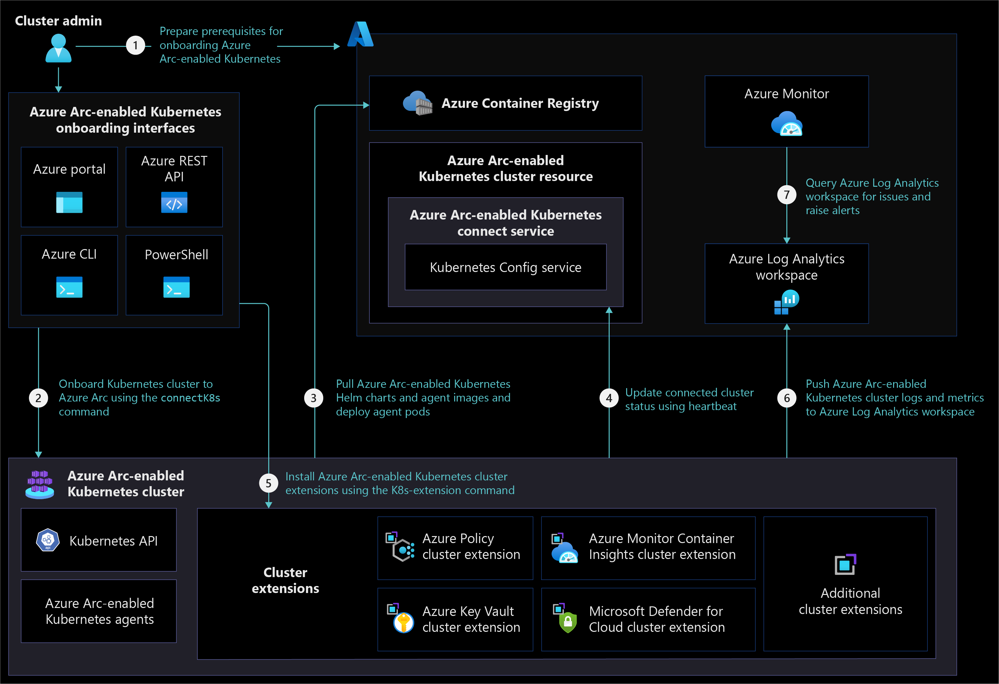
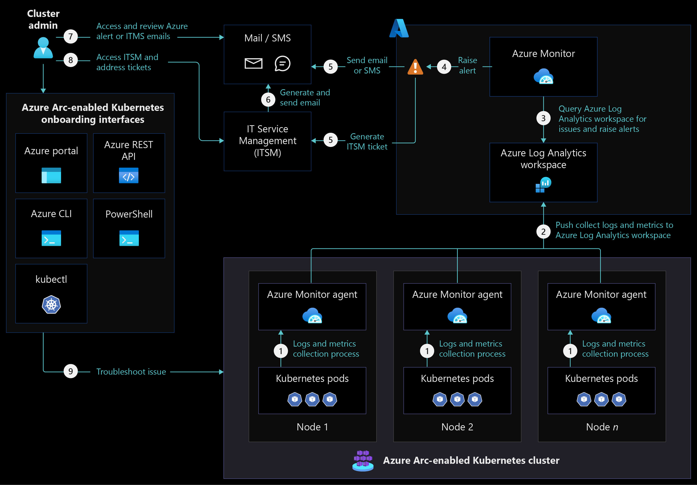
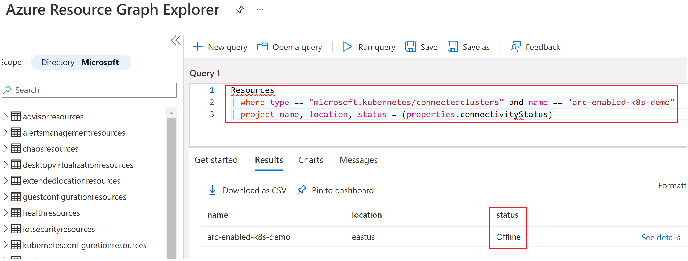

# Management and monitoring for Azure Arc-enabled Kubernetes

This document provides key design considerations and recommendations to manage and monitor Azure Ar-enabled Kubernetes to help you understand and design solutions for well architected operational excellence.

Before continuing with this document, review [Identity and Access Management](./identity-access-management.md), [Networking](./network-connectivity.md), [Resource Organization](./resource-organization.md), and [Governance](./governance-disciplines.md) critical design areas (CDA) to better understand related design considerations and recommendations to focus on management and monitoring aspects of the Azure Arc-enabled Kubernetes.

## Architecture

It is important to understand Azure Arc-enabled Kubernetes architecture and [network connectivity modes](/azure/azure-arc/kubernetes/conceptual-connectivity-modes#understand-connectivity-modes) to make the right architectural decision to onboard on-premises or multi-cloud Kubernetes clusters to Azure Arc, manage, and monitor and meet organization enterprise architecture standards and operational desired state.

### Cluster management

The following architecture diagram shows different Azure Arc-enabled Kubernetes components and how they interact when onboarding and managing the on-premises or multi-cloud Kubernetes cluster in a fully connected network connectivity mode.

The following diagram shows [Azure Arc-enabled Kubernetes cluster access from anywhere](/azure/azure-arc/kubernetes/conceptual-cluster-connect) and how the components interact with each other to manage cluster using Azure RBAC.

### Cluster monitoring

The following architecture diagram shows Azure Arc-enabled Kubernetes cluster monitoring in a fully connected network connectivity mode.

## Design considerations

**Cluster onboarding:**

- Consider designing [enterprise scale landing zone subscriptions](/azure/cloud-adoption-framework/ready/landing-zone/#azure-landing-zone-conceptual-architecture) for Azure Arc-enabled Kubernetes cluster and the [extensions](/azure/azure-arc/kubernetes/extensions) deployment and management based on the [resource organization](./resource-organization.md) and [governance principles](./governance-disciplines.md) defined by the organization.
- Decide between [auto-upgrade versus manual upgrade Azure Arc-enabled Kubernetes agents](/azure/azure-arc/kubernetes/agent-upgrade#toggle-auto-upgrade-on-or-off-when-connecting-cluster-to-azure-arc) depending on the organization change management process and onboard on-premises or multi-cloud Kubernetes clusters to Azure Arc. If the decision re-considered later, Azure Arc-enabled Kubernetes agents auto-upgrade management behavior can be changed any time after cluster is onboarded.
- Consider designing source and destination groups to manage [Azure Arc-enabled Kubernetes network firewall rules](/azure/azure-arc/kubernetes/quickstart-connect-cluster?tabs=azure-cli#meet-network-requirements) to simplify and minimize firewall or proxy management effort. Refer to your on-premises or multi-cloud firewall or proxy management guidelines for more details.

**Cluster management:**

- Azure [Arc-enabled Kubernetes extensions](/azure/azure-arc/kubernetes/extensions) require additional URL whitelisting on firewalls or proxy. Depending on the extensions being installed, consider planning to accommodate additional URLs whitelisting to minimize change management timelines.
- If decide to onboard on-premises or multi-cloud Kubernetes cluster with [auto-upgrade toggle off](/azure/azure-arc/kubernetes/agent-upgrade#toggle-auto-upgrade-on-or-off-when-connecting-cluster-to-azure-arc) to control agent upgrades, consider upgrading Arc-enabled Kubernetes agents on a regular basis to stay up to date with latest product releases and avoid expensive upgrade process in the future.
- Consider using [GitOps](/azure/azure-arc/kubernetes/tutorial-use-gitops-flux2) to manage Arc-enabled Kubernetes agent and cluster extension updates to maintain consistent deployments across all clusters and environments. Review [platform automation CDA](./platform-automation.md) for detailed guidance.

**Cluster monitoring:**

- Considering the [supported configuration for Azure Monitor for containers](/azure/azure-monitor/containers/container-insights-enable-arc-enabled-clusters?toc=/azure/azure-arc/kubernetes/toc.json#supported-configurations) with Azure Arc-enabled Kubernetes, decide if Azure Monitor for Container is the right monitoring solution to monitor Arc-enabled Kubernetes cluster.
- Consider using dedicated Log Analytics workspace per region to collect logs and metrics from Azure Arc-enabled Kubernetes cluster to monitoring and reporting across multiple cluster in a specific environment. Review [resource organization](./resource-organization.md) CDA for additional details.
- Consider Azure Monitor [ITSM connector integration](/azure/azure-monitor/alerts/itsmc-overview) with your organization [IT service management] tools to raise incidents for Azure Monitor alerts and track issue resolution.

## Design recommendations

**Cluster onboarding:**

- Use shared administration terminal server(s) to [install required tools](/azure/azure-arc/kubernetes/quickstart-connect-cluster?tabs=azure-cli#prerequisites) to maintain consistent tools and versions across all users to prevent issues deploying and managing Azure Arc-enabled Kubernetes cluster.
- Make sure administration terminal servers and on-premises or multi-cloud Kubernetes clusters are whitelisted to access [Azure Arc-enabled Kubernetes required URLs](/azure/azure-arc/kubernetes/quickstart-connect-cluster?tabs=azure-cli#meet-network-requirements) to onboard and manage using Azure Arc control plane.
- Create a script to verify connectivity to the [Azure Arc-enabled Kubernetes required URLs](/azure/azure-arc/kubernetes/quickstart-connect-cluster?tabs=azure-cli#meet-network-requirements) from on the on-premises or multi-cloud Kubernetes cluster nodes to minimize effort troubleshooting and resolving connectivity issues.
- Create onboarding deployment script using [PowerShell](/azure/azure-resource-manager/templates/deploy-powershell) or [Bash](/azure/azure-resource-manager/templates/deploy-cloud-shell?tabs=azure-cli) to onboard Arc-enabled Kubernetes cluster and install cluster extensions to prevent issues and consistent deployment across all environments and clusters.

**Cluster management:**

- Certain Azure [Arc-enabled Kubernetes extensions](/azure/azure-arc/kubernetes/conceptual-extensions) requires [custom location](/azure/azure-arc/kubernetes/conceptual-custom-locations) to deploy extension pods and configuration. Only one custom location is supported per Kubernetes namespace. It is recommended to create each custom location in its own Kubernetes namespace and deploy Azure Arc-enabled Kubernetes extension that relies on the custom location, and in the same namespace.
- When using [the semi-connected network connectivity mode](/azure/azure-arc/kubernetes/conceptual-connectivity-modes#understand-connectivity-modes), it is recommended to connect the cluster to Azure Arc at least once in 30 days to export billing data and once in 90 days to renew managed identity certificates, update Azure Arc-enabled Kubernetes resource and agents.
- Recommended to deploy [Open Service Mesh (OSM)](/azure/azure-arc/kubernetes/tutorial-arc-enabled-open-service-mesh) to encrypt and authenticate (using mTLS) service to service network traffic across cluster nodes.

**Cluster monitoring:**

- Enable [Azure Monitor Container Insights for Azure Arc-enabled Kubernetes clusters](/azure/azure-monitor/containers/container-insights-enable-arc-enabled-clusters) to collect logs and metrics to create dashboards and generate alerts for cluster related issues.
- Use [Azure Resource Graph](/azure/azure-arc/kubernetes/resource-graph-samples?tabs=azure-cli) or [Log Analytics queries](/azure/azure-monitor/logs/queries) to monitor cluster health and raise alerts.

## Next steps

- Review [Azure Arc-enabled Kubernetes network connectivity requirements](/azure/azure-arc/kubernetes/quickstart-connect-cluster?tabs=azure-cli#meet-network-requirements).
- Review [Connect an existing Kubernetes cluster to Azure Arc](/azure/azure-arc/kubernetes/quickstart-connect-cluster).
- Review [Azure Arc Jumpstart - Azure Arc-enabled Kubernetes](https://azurearcjumpstart.io/azure_arc_jumpstart/azure_arc_k8s/).
- Review [Upgrading Azure Arc-enabled Kubernetes agents](/azure/azure-arc/kubernetes/agent-upgrade).
- Review [Use Cluster Connect to connect to Azure Arc-enabled Kubernetes clusters](/azure/azure-arc/kubernetes/cluster-connect) to manage clusters.
- Review [Frequently Asked Questions - Azure Arc-enabled](/azure/azure-arc/kubernetes/faq) to get answers to most common questions.
