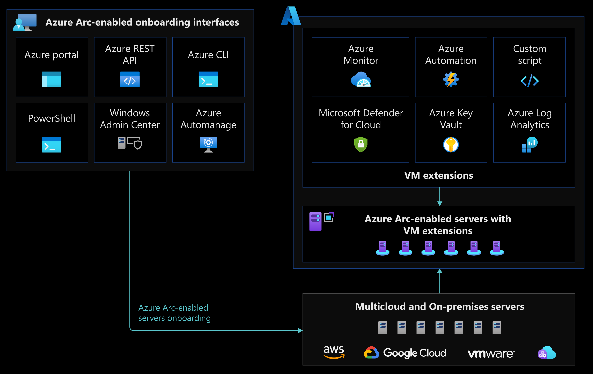

# Automation disciplines for Azure Arc-enabled servers

Azure Arc-enabled servers allow you to manage your Windows and Linux servers and virtual machines that are hosted outside of Azure, on your corporate network, or on another cloud provider. This document is written to help plan for the automation of onboarding, Update Management, and expansion of the capabilities of Azure Arc-enabled servers through VM extensions. The article presents key recommendations for operations teams to onboard and automate Azure Arc-enabled servers throughout their lifecycle.

## Architecture

The following image shows a conceptual reference architecture that highlights the onboarding and automation design areas for Azure Arc-enabled servers:

## Design considerations

The following are some design considerations before onboarding Azure Arc-enabled servers to Azure:

### Review requirements

- Your machines run a [supported operating system](/azure/azure-arc/servers/agent-overview#supported-operating-systems) for the Azure connected machine agent.
- Your machines have the [required software](/azure/azure-arc/servers/agent-overview#software-requirements) installed before deploying the Azure connected machine agent.
- You've reviewed the [Azure subscription and service limits](/azure/azure-arc/servers/agent-overview#azure-subscription-and-service-limits) for Azure Arc-enabled servers.

### Network connectivity

Your machines have [connectivity](/azure/azure-arc/servers/agent-overview#networking-configuration) from your on-premises network or each of the other third-party cloud providers to Azure - either directly connected, via a proxy server or private endpoint. See the [Network connectivity for Azure Arc-enabled servers](./eslz-arc-servers-connectivity.md) section of this guide for design considerations and recommendations.

### Environment preparation

- To deploy and configure the Azure Arc-enabled servers connected machine agent, an account with administrator or root privileges is required.
- To onboard machines, you have the [required Azure permissions](/azure/azure-arc/servers/agent-overview#required-permissions). See the [Identity and access management for Azure Arc-enabled servers](./eslz-identity-and-access-management.md) section of this guide for more identity and access related content.

### Onboard Azure Arc-enabled servers

- Before onboarding machines, you've [registered the Azure resource providers](/azure/azure-arc/servers/agent-overview#register-azure-resource-providers) for Azure Arc-enabled servers.
- Decide how you'll install and configure the Azure connected machine agent across your fleet of servers. Typically, you'll deploy the agent using your organization's standard automation tools.

### Virtual machine extensions

Determine which Azure capabilities you want to enable on your Azure Arc-enabled servers. Some capabilities require a VM extension to be installed on your server, which can be automated with Azure Policy.

### Lifecycle automation

Create an operating system patch management strategy for Azure Arc-enabled servers.

## Design recommendations

The following are general design recommendations for Azure Arc-enabled servers:

### Environment preparation

- Create a [dedicated resource group](/azure/azure-resource-manager/management/manage-resource-groups-portal#create-resource-groups) to include only Azure Arc-enabled servers and centralize management and monitoring of these resources.
- Evaluate and develop an IT-aligned [tagging strategy](/azure/cloud-adoption-framework/decision-guides/resource-tagging/) that can help reduce the complexity of managing your Azure Arc-enabled servers and simplifies the process of making management decisions.
- Create a [service principal](/azure/azure-arc/servers/onboard-service-principal#create-a-service-principal-for-onboarding-at-scale) to connect machines non-interactively using Azure PowerShell or from the Azure portal.

### Onboard Azure Arc-enabled servers

One of your first tasks will be to onboard your fleet of servers and virtual machines to Azure. After [generating an installation script](/azure/azure-arc/servers/onboard-portal#generate-the-installation-script-from-the-azure-portal), if you only have a few servers, you can opt to run the script directly from your [Windows](/azure/azure-arc/servers/onboard-portal#install-and-validate-the-agent-on-windows) or [Linux](/azure/azure-arc/servers/onboard-portal#install-and-validate-the-agent-on-linux) machines. For larger fleets of servers, there are several options available in Azure to automate the onboarding process. We recommended creating a [service principal](/azure/azure-arc/servers/onboard-service-principal#create-a-service-principal-for-onboarding-at-scale) and apply one of the following methods:

- Review and customize the [predefined installation script](/azure/azure-arc/servers/onboard-service-principal) for at-scale deployment of the connected machine agent to support your automated deployment requirements.
- Generate a [PowerShell script](/azure/azure-arc/servers/onboard-service-principal) using a service principal, and deploy via your organizations existing automation platform
  - Connect machines using [automation Update Management](/azure/azure-arc/servers/onboard-update-management-machines)
  - Connect machines using [PowerShell remoting](/azure/azure-arc/servers/onboard-powershell#install-and-connect-by-using-powershell-remoting) or [PowerShell DSC](/azure/azure-arc/servers/onboard-dsc)
  - Connect machines from [Windows Admin Center](/azure/azure-arc/servers/onboard-windows-admin-center)

Afterwards, be sure to [verify your connection](/azure/azure-arc/servers/onboard-portal#verify-the-connection-with-azure-arc) to Azure Arc.

### Virtual machine extensions

To simplify the management of hybrid servers throughout their lifecycle, [VM extensions](/azure/azure-arc/servers/manage-vm-extensions) can be deployed to Azure Arc-enabled servers from the Azure portal. Virtual machine (VM) extensions are small applications that provide post-deployment configuration and automation tasks on Azure VMs. For example, if a virtual machine requires software installation, anti-virus protection, or to run a script in it, a VM extension can be used. Many VM extensions are supported for both [Windows](/azure/azure-arc/servers/manage-vm-extensions#windows-extensions) and [Linux](/azure/azure-arc/servers/manage-vm-extensions#linux-extensions) Azure Arc-enabled servers.

We recommended automating the deployment of VM extensions at scale via [Azure Policy](/azure/governance/policy/overview) to automatically deploy extensions to your Azure Arc-enabled servers and regularly check the policy compliance data to identify and remediate servers that don't have the agent installed.

Overview of steps:

- Create an [initiative](/azure/security-center/security-policy-concept#what-is-a-security-initiative) to deploy VM extensions at scale.
- Use a "[DeployIfNotExists](/azure/governance/policy/concepts/effects#deployifnotexists)" policy effect to ensure the VM extensions get deployed automatically, as more servers are onboarded, and remediate any servers where the VM extensions have been removed.
- More details on using policy with Azure Arc-enabled servers can be found in the [Security, governance and compliance for Azure Arc-enabled servers](./eslz-security-governance-and-compliance.md) section of this guide.

### Lifecycle automation

Once your servers are onboarded to Azure, it's recommended to [enable patch and Update Management](/azure/cloud-adoption-framework/manage/hybrid/server/best-practices/arc-update-management) to ease OS lifecycle management on your Azure Arc-enabled servers. Update Management in Azure Automation allows you to view and schedule operating system updates and patches for your Azure Arc-enabled servers at scale. More information about Update Management for Azure Automation can be found in [Update Management overview](/azure/automation/update-management/overview).

We recommend enabling OS lifecycle management automation by configuring the [Update Management](/azure/automation/update-management/enable-from-automation-account) solution in Azure Automation, to manage operating system updates for your Windows and Linux virtual machines registered with Azure Arc-enabled servers.

## Next steps

For more guidance for your hybrid cloud adoption journey,  review the following:

- Review [Azure Arc Jumpstart](https://azurearcjumpstart.io/azure_arc_jumpstart/azure_arc_servers/day2/) scenarios
- Review the [prerequisites](/azure/azure-arc/servers/agent-overview#prerequisites) for Azure Arc-enabled servers
- Plan an [at-scale deployment](/azure/azure-arc/servers/plan-at-scale-deployment) of Azure Arc-enable servers
- To learn more about Azure Arc, check out the [Azure Arc learning path on Microsoft Learn](/learn/paths/manage-hybrid-infrastructure-with-azure-arc/)
