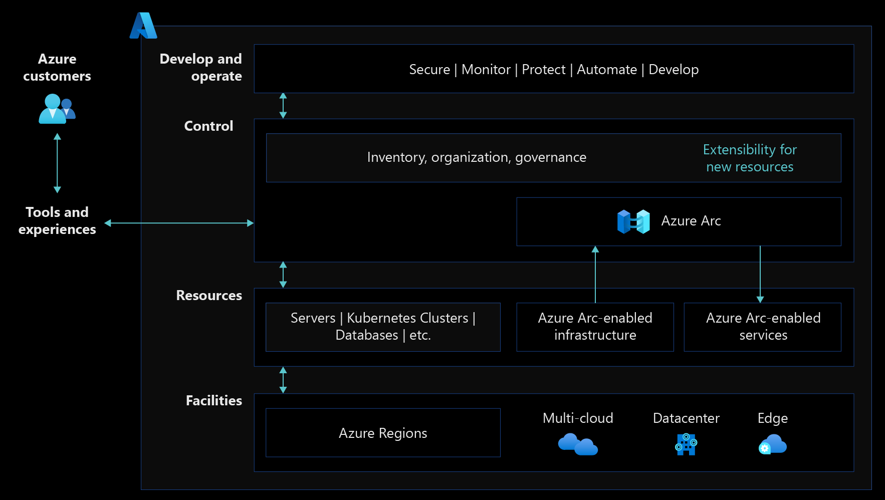

# Azure Arc-enabled servers landing zone accelerator for hybrid and multicloud

Enterprises are currently building and running applications across various ecosystems on-premises, in multiple public clouds, and on the edge. When you're working in these distributed environments, it's critical that you find a way to ensure compliance and manage servers, applications, and data at scale while you still maintain agility.

[Enterprise-scale landing zone](/azure/cloud-adoption-framework/ready/landing-zone/) provides a specific architectural approach, reference architecture, and set of reference implementations that help you prepare your landing zones for mission-critical technology platforms and supported workloads.

Enterprise-scale was designed with hybrid and multicloud in mind. To support hybrid and multicloud, the reference architecture requires two simple additions:

- **Hybrid and multicloud connectivity:** Understand key network design considerations and recommendations for working with Azure Arc.
- **Unified operations:** Include Azure Arc-enabled resources to extend your governance and operations support with consistent tooling.

## Why hybrid?

As organizations adopt modern cloud services and their associated benefits, periods of parallel-running alongside the legacy on-premises infrastructure are inevitable. As your organization further evaluates cloud services, or as business requirements dictate, your organization might choose to run more than one public cloud service. Operating a distributed heterogeneous estate requires simplified, consolidated management and governance in order to reduce operational impact.

You can use landing zone concepts introduced as part of the Cloud Adoption Framework guidance to establish patterns for building out hybrid architectures and introducing standards for connectivity, governance, and monitoring. This helps when your strategic intent is to simplify and combine the infrastructure and services following migration projects. Setting standards for management processes and tools removes the need to retrofit workloads after you move them into Azure.

## Prerequisites

It's beneficial to have familiarity with the enterprise-scale landing zone. For more information, see the enterprise-scale [overview](../../ready/enterprise-scale/index.md) and enterprise-scale [implementation guidance](../../ready/enterprise-scale/implementation.md).

## Azure Arc

Azure provides various management tools to help you monitor and govern infrastructure and applications at scale. When you implement a hybrid landing zone, you should also extend these Azure tools to control infrastructure and applications running outside of Azure. This creates a single management plane and single view of your entire hybrid estate, which makes monitoring and management at scale as straightforward as possible.

[Azure Arc](/azure/azure-arc/) simplifies governance and management by providing a consistent multicloud and on-premises management platform. Azure Arc lets you to manage your entire environment with a single pane of glass by projecting your existing resources into [Azure Resource Manager](/azure/azure-resource-manager/management/overview).

You can now manage virtual machines, Kubernetes clusters, and databases as if they are running in Azure. Regardless of where they live, you can use familiar Azure services and management capabilities. Azure Arc enables you to continue using traditional ITOps, while introducing DevOps practices to support new cloud native patterns in your environment.

## Azure Arc-enabled server design guidelines

The design guidelines provide recommendations for the critical decisions that drive the design of the Cloud Adoption Framework for Azure enterprise-scale landing zone in a hybrid multicloud environment. There are seven critical design areas you have to consider when working with Azure Arc:

| CDA | Description |
|--|--|
| [Identity and access management](./arc-enabled-servers/eslz-identity-and-access-management.md) | Best practices for access control design to secure your hybrid resources as you use Azure Arc to centrally manage them. |
| [Network topology and connectivity](./arc-enabled-servers/eslz-arc-servers-connectivity.md) | Design considerations for working with Azure Arc-enabled servers, and information explaining how you can securely connect them to your enterprise-scale landing zone. |
| [Resource organization](./arc-enabled-servers/eslz-resource-organization.md) | Best practices for resource consistency and tagging strategy, including for your hybrid and multicloud resources. |
| [Governance and security disciplines](./arc-enabled-servers/eslz-security-governance-and-compliance.md) | The [Cloud Adoption Framework's enterprise-scale landing zone architecture](/azure/cloud-adoption-framework/ready/landing-zone/) includes patterns for standardizing your deployment of [Azure Policy](/azure/governance/policy/overview) and [role-based access control (RBAC)](../../ready/azure-setup-guide/manage-access.md) through structured use of management groups that segment resources into logical groupings. You can extend these patterns with technologies like Azure Arc. |
| [Management disciplines](./arc-enabled-servers/eslz-management-and-monitoring-arc-server.md) |You can use Azure Arc to extend Azure management services out to other environments like on-premises and other cloud platforms. Enterprise-scale provides guidance for operationally maintaining Azure Arc-enabled servers on Azure enterprise estate with centralized management and monitoring at the platform level. |
| [Cost governance](./arc-enabled-servers/eslz-cost-governance.md) | You can use budgets, cost allocation, and chargebacks to keep track of ungoverned and unmonitored resources preventing you from increasing financial accountability. |
| [Automation disciplines](./arc-enabled-servers/eslz-automation-arc-server.md) | Azure Arc helps you manage your digital state hosted outside of Azure using the same level of experience and automation you'd have for a native Azure resource.  Plan for using automation as much as possible for agent onboarding, lifecycle management, and expansion of your Azure control plane capabilities through Azure Arc. |

