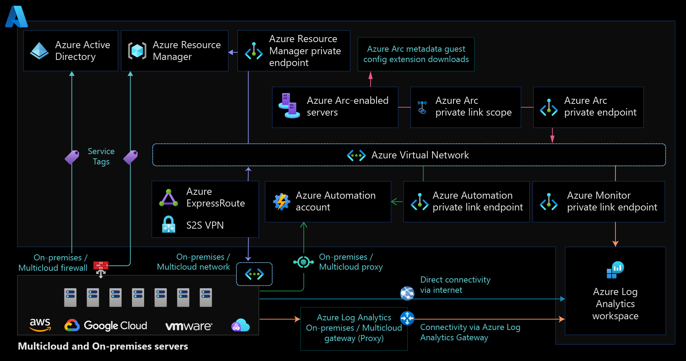

# Enterprise-scale Azure Arc-enabled servers Network Connectivity

Azure Arc-enabled servers allows you to manage your Windows and Linux physical servers and virtual machines, on your corporate network, or other cloud provider using the Azure control plane. This document walks through the key design considerations and best practices for Azure Arc-enabled servers connectivity as part of a CAF enterprise-scale landing zone implementation.

This article assumes that enterprise-scale landing zone has been successfully implemented, therefore hybrid and multicloud network connections have been established and will focus on the Azure Arc-enabled servers Connected Machine agent connectivity. For more information on this prerequisite, review the enterprise-scale [overview](../../ready/enterprise-scale/index.md) and [implementation guidance](../../ready/enterprise-scale/implementation.md).

## Design considerations

The following are some network design considerations for Azure Arc-enabled servers:

- **Define the agent's connectivity method:** The Connected Machine agent [communicates to Azure](/azure/azure-arc/servers/agent-overview#networking-configuration) from your on-premises network or other cloud environment over TCP port 443. This connection can be over the internet, through a proxy server or you can implement [Private Link Scope](/azure/azure-arc/servers/private-link-security) for a private connection.
- **Use TLS 1.2 protocol:** configure the machine to use Transport secuirty (TLS) 1.2 older versions are not recomended as data in transit might be vulnerable.
- **Manage Access to Azure Service Tags:** Consider creating an automated process to keep the firewall and proxy network rules updated according to the [Azure Arc network service Tags and IP addresses range](https://www.microsoft.com/en-us/download/details.aspx?id=56519).

## Design recommendations

### Define the agent's connectivity method

Azure Arc-enabled servers allows you to connect hybrid machines using the following methods:

#### Direct Connection

Azure Arc-enabled servers offers [direct connectivity to Azure public endpoints]((/azure/azure-arc/servers/agent-overview#networking-configuration)). In this connectivity method, all the machine agents will open a connection via the internet using public endpoint.

In this connectivity method you need to review your internet access for the Connected Machine Agent and it is best practice to configure the [required network rules](/azure/azure-arc/servers/agent-overview#networking-configuration).

#### Proxy server connection

The Connected Machine agent for Linux and Windows communicates outbound securely to Azure Arc over TCP port 443. If the machine needs to connect through a firewall or proxy server to communicate over the internet, the agent communicates outbound instead of using the HTTP protocol. Proxy servers don't make the Connected Machine agent more secure because the traffic is already encrypted. For this connectivity method make sure the [Azure Arc network service Tags and IP addresses range](/azure/azure-arc/servers/agent-overview#networking-configuration) are not blocked. When you only allow the IP ranges or domain names required for the agent to communicate with the service, you need to allow access to the Service Tags and URLs listed.

Be aware that if you deploy extensions on your Azure Arc-enabled servers they also support Proxy connection and should be configured as such. However, every extension has its own endpoint, and all corresponding URLs must also be allowed in the firewall or proxy. It is recommended to have an automated process to keep all required endpoints updated for any firewall or proxy rules.

#### Private Link, using Site-to-Site VPN or ExpressRoute to a private endpoint

Azure Arc-enabled servers allow you to deploy VM extensions to centrally manage your servers from Azure, these extensions connect to other resources such as Log Analytics workspaces, Automation Accounts, Key Vault or Azure Storage. You can use Azure Private Link to make this connection private without opening any public network access, all of the data is kept private preventing data exfiltration. The traffic between you Azure Arc-enabled servers and Azure Services will go through your VPN connection or Express Route and will be kept inside the Microsoft Azure backbone network.

Be ware that this method has some [restrictions and limitations](/azure/azure-arc/servers/private-link-security#restrictions-and-limitations) and consider that when you enable any one of the Azure Arc-enabled servers supported VM extensions, those extensions connect other Azure resources which require configuring Private Link for each service. Review [Azure Private Link security](/azure/azure-arc/servers/private-link-security#how-it-works) for more information.

### Use TLS 1.2 protocol

It is recommended to use [Transport Layer Security 1.2 protocol](/azure/azure-arc/servers/agent-overview#transport-layer-security-12-protocol) to ensure the security of data in transit to Azure as older versions of TLS/Secure Sockets Layer (SSL) have been found to be vulnerable and they are not recommended.

### Manage Access to Azure Service Tags

It is a best practice to implement an automated process to keep the firewall and proxy network rules updated according to the [Azure Arc network service Tags and IP addresses range.](https://www.microsoft.com/en-us/download/details.aspx?id=56519)
