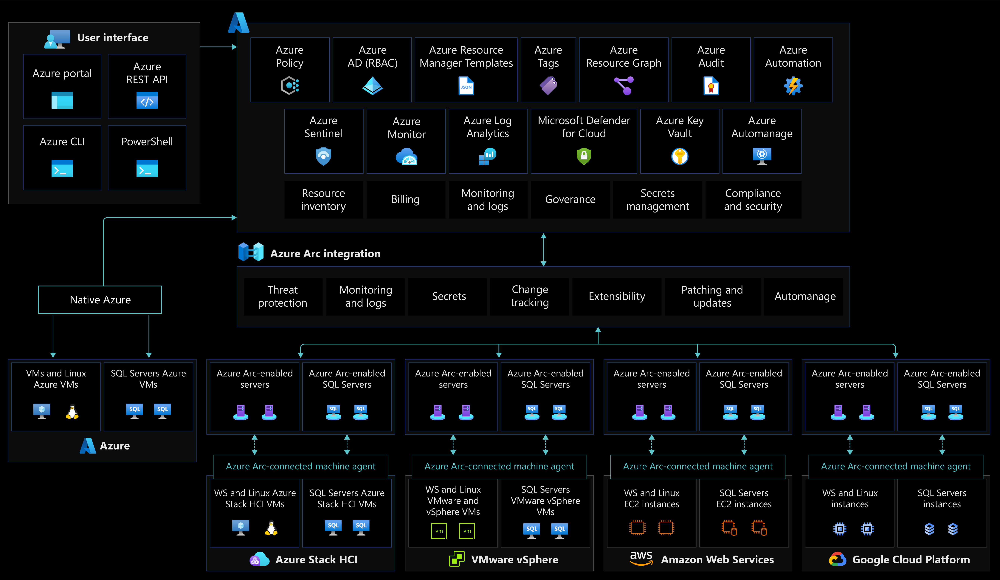

# Cost governance with Azure Arc-enabled servers
Cost governance is the continuous process of implementing policies to control costs of services you are using on Azure. This document will walk you through the various cost governance considerations and recommendations when using Azure Arc-enabled servers.

## How much does Azure Arc-enabled servers cost?
Azure Arc-enabled servers provides two types of services:
1. **Azure Arc control plane functionality**, which is provided at no extra cost including:
   - Resource organization through Azure management groups and tags.
   - Searching and indexing through Azure Resource Graph.
   - Access and security through Azure RBAC and subscriptions.
   - Environments and automation through templates and extensions.
   - Update management

2. **Azure services used on the Azure Arc-enabled servers**, which has some cost to it according to it's usage including:
   - Azure Monitor
   - Azure Security Center
   - Azure Sentinel
   - Azure Policy Guest Configuration (includes Azure Automation change tracking, inventory, state configuration)
   - Azure Key Vault
   - Azure Private Links

## Design considerations
### Azure Monitor
[Azure Monitor](https://docs.microsoft.com/en-us/azure/azure-monitor/overview) includes functionality for the collection and analysis of log data of your Azure Arc-enabled servers (billed by data ingestion, retention, and export), collection of metrics, health monitoring, alerts, and notifications.

Features of Azure Monitor that are automatically enabled such as collection of standard metrics, activity logs and Insights are provided at no cost.

Understand your monitoring requirements and review [Azure Monitor pricing](https://azure.microsoft.com/pricing/details/monitor/).

### Azure Security Center
Azure Security Center is offered in [two modes](https://docs.microsoft.com/en-us/azure/security-center/security-center-pricing):
- **Azure Defender OFF (Free)** - [Security Center without Azure Defender](https://docs.microsoft.com/en-us/azure/security-center/security-center-introduction) once enabled, provides security policy, continuous security assessment, and actionable security recommendations to help you protect your Azure Arc-enabled servers and Azure resources.

- **Azure Defender ON (Charged)** - Enabling [Azure Defender](https://docs.microsoft.com/en-us/azure/security-center/azure-defender) extends the capabilities of the free mode to your Azure Arc-enabled servers and Azure resources, providing unified security management and threat protection.

Review [Azure Defender for Servers pricing](https://azure.microsoft.com/en-us/pricing/details/azure-defender/).

### Azure Sentinel
Azure Sentinel provides intelligent security analytics across your enterprise. The data for this analysis is stored in an Azure Monitor Log Analytics workspace. Azure Sentinel is billed based on the volume of data ingested for analysis in Azure Sentinel and stored in the Azure Monitor Log Analytics workspace for your Azure Arc-enabled servers.

Review [Azure Sentinel pricing](https://azure.microsoft.com/en-us/pricing/details/azure-sentinel/).

