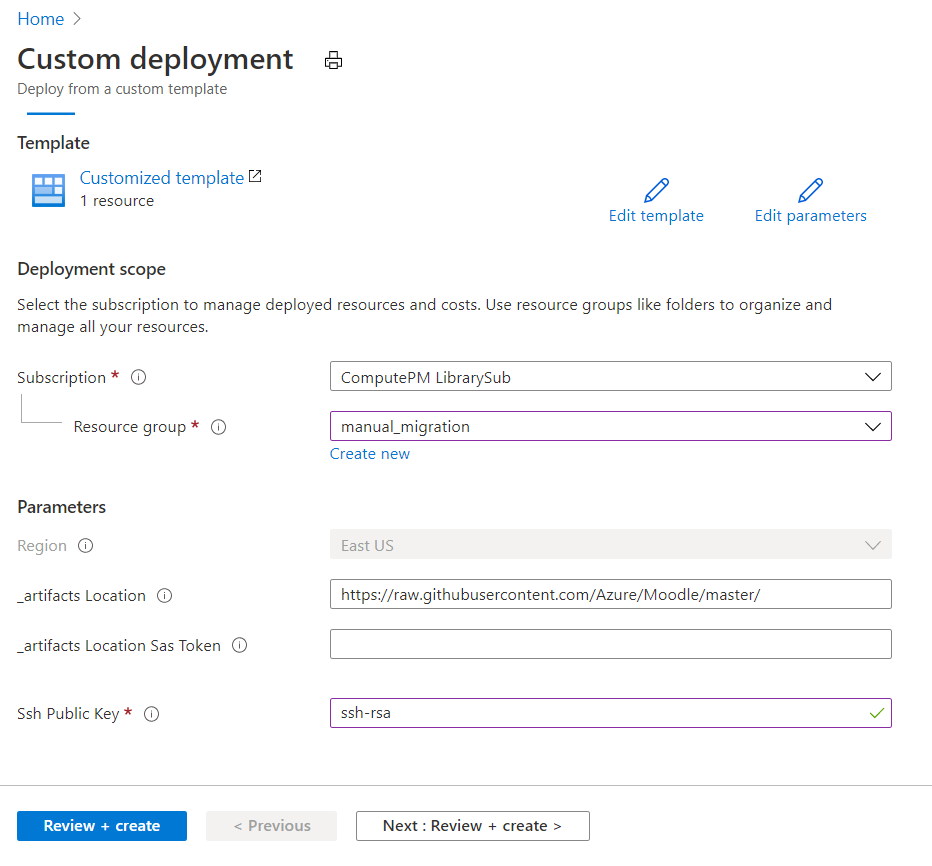

# Moodle migration tasks

## Moodle migration outline

- Moodle migrations include the following tasks:
    -   Deploy Azure Infrastructure with Azure ARM Templates.
    -   Download and install AzCopy.
    -   Copy over the backup archive to the Controller Virtual Machine instance from the ARM deployment.
    -   Migration of Moodle application and configuration.
    -   Setup Moodle controller instance and worker nodes. 
    -   Configuring PHP & webserver.

## Deploy Azure Infrastructure with Azure ARM emplates
- Deploying Azure infrastructure using ARM template.
- When using an ARM template to deploy infrastructure on Azure, you have a couple of available options.
- The following diagram will give an idea about Infrastructure Resources.
    
- A pre-defined deployment size using one of the four pre-defined Moodle sizes.
- A fully configurable deployment that gives more flexibility and choice around deployments.
- The 4 predefined templates options such as Minimal, Short-to-Mid, Large, Maximal are available on [GitHub repository](https://github.com/Azure/Moodle).
    - [Minimal](https://portal.azure.com/#create/Microsoft.Template/uri/https%3A%2F%2Fraw.githubusercontent.com%2FAzure%2FMoodle%2Fmaster%2Fazuredeploy-minimal.json): This deployment will use NFS, MySQL, and smaller auto scale web frontend VM sku (1 vCore) that will give faster deployment time (less than 30 minutes) and requires only 2 VM cores currently that will fit even in a free trial Azure subscription.  
    - [Small to Mid](https://portal.azure.com/#create/Microsoft.Template/uri/https%3A%2F%2Fraw.githubusercontent.com%2FAzure%2FMoodle%2Fmaster%2Fazuredeploy-small2mid-noha.json): Supporting up to 1000 concurrent users. This deployment will use NFS (no high availability) and MySQL (8 vCores), without other options like elastic search or Redis cache.  
    - [Large (high availability)](https://portal.azure.com/#create/Microsoft.Template/uri/https%3A%2F%2Fraw.githubusercontent.com%2FAzure%2FMoodle%2Fmaster%2Fazuredeploy-large-ha.json): Supporting more than 2000 concurrent users. This deployment will use Azure Files, MySQL (16 vCores) and Redis cache, without other options like elastic search.  
    - [Maximum](https://portal.azure.com/#create/Microsoft.Template/uri/https%3A%2F%2Fraw.githubusercontent.com%2FAzure%2FMoodle%2Fmaster%2Fazuredeploy-maximal.json): This maximal deployment will use Azure Files, MySQL with highest SKU, Redis cache, elastic search (3 VMs), and pretty large storage sizes (both data disks and DB).
- To deploy any of the predefined size template click on the launch option.  
- It will redirect to Azure Portal where user need to fill mandatory fields such as Subscription, Resource Group, [SSH key](https://docs.github.com/en/github/authenticating-to-github/generating-a-new-ssh-key-and-adding-it-to-the-ssh-agent), Region. 

- Above pre-defined templates will deploy the default versions.
    ```
    Ubuntu: 18.04-LTS
    PHP: 7.4
    Moodle: 3.8
    ```
- If the PHP and Moodle versions are lagging with the on-premises, then update the versions by following steps.
    - Click on Edit Template in Custom deployment page.
    
    
    - In the Resources section, add the moodle and php versions in the parameters block.
        ```json
        "phpVersion":       { "value": "7.2" },
        "moodleVersion":    { "value": "MOODLE_38_STABLE"}

        # for moodle 3.9, value should be "MOODLE_39_STABLE"
        ```
    - To save the changes, click on Save button.