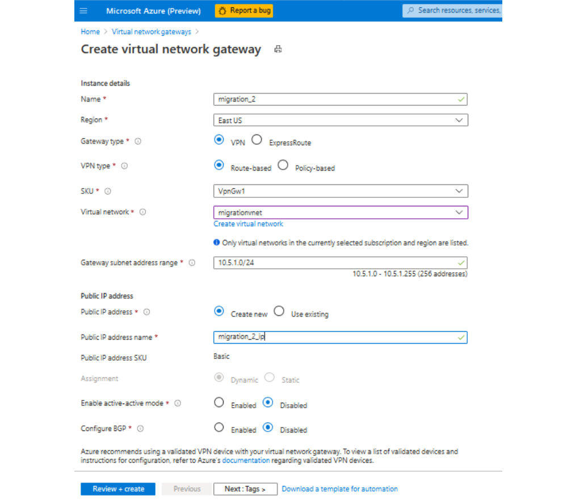

# How to create a virtual network gateWay and connect through a private IP

This document explains how to set up a virtual network gateway in Azure.

## Getting started

Create a virtual network gate in Azure Portal with the following steps:

- Search for and select **Virtual network gateway**.
- Select **Create** to open a window.
- Fill in all fields like **Name, Region, Gateway type, SKU,** and **VNet**. Keep the rest of the default values.
- Select the virtual network associated with virtual machines created under the same resource group.
- Select **Create** to start deploying.


		
- Create a virtual network gateway with this Azure CLI command:

	```bash
	az network vnet-gateway create -g MyResourceGroup -n MyVnetGateway --public-ip-address MyGatewayIp --vnet MyVnet --gateway-type Vpn --sku VpnGw1 --vpn-type RouteBased --no-wait
	```

## Generate certificates

- Open Windows PowerShell ISE to the root and child certificates.

- The command to generate root certificates:

  ```bash
  $cert = New-SelfSignedCertificate -Type Custom -KeySpec Signature `
  -Subject "CN=P2SRootCert" -KeyExportPolicy Exportable `
  -HashAlgorithm sha256 -KeyLength 2048 `
   -CertStoreLocation "Cert:\CurrentUser\My" -KeyUsageProperty Sign -KeyUsage CertSign
  ```

- The command to generate the child certificate:

  ```bash
  New-SelfSignedCertificate -Type Custom -DnsName P2SChildCert -KeySpec Signature `
  -Subject "CN=P2SChildCert" -KeyExportPolicy Exportable `
  -HashAlgorithm sha256 -KeyLength 2048 `
  -CertStoreLocation "Cert:\CurrentUser\My" `
  -Signer $cert -TextExtension @("2.5.29.37={text}1.3.6.1.5.5.7.3.2")
  ```

## Export certificates

Following these steps should allow you to successfully install certificates on your local systems.

- Open the Microsoft Management Console to export the certificates.
- Go to **Run** and enter "MMC" to open certificates.
- Select the **Certificates** under the **Personal** folder to open a page.
- Refresh the page and find **Root and child certificates**.

Certificate types:

**Exporting root certificates:**

- Select the root certificate, right-click on the certificate, and then go to **All Tasks**.
- Select **Export** for a new window and then **Next**.
- Select **No, do not export private key** and then **Next**.
- Select **Base-64 encoded X.509(.cer)** and then **Next**.
- Select the **Browse and select the path**, enter a name, and select **Next**. 
- This message will appear: **Exported successfully**.
    
**Exporting child certificates:**

- Select the client certificate, right-click on the certificate, and then go to **All Tasks**.
- Select **Export** for a new window and then **Next**.
- Select **Yes**, **Export private key**, and then **Next**.
- Select the **Personal information exchange**, **PKCS**, and then **Next**.
- Select the password checkbox and provide the password.
- Set the encryption to TripleDES-SHA1, and select **Next**.
- Select the **Browse and select the path**, enter a name, and select **Next**. 
- This message will appear: **Exported successfully**.
- Open the root certificate file in your choice editor, and copy the code.

## Configure the virtual network gateway

- Go to the resource group where the virtual network gateway is created.
- Go to Point-to-Site-configuration on the left panel.
- Click on Configure now in the center panel.
- Add the address pool (ex: 192.168.xx.0/24).
- Select the tunnel type, IKEv2.
- Set the authentication type to Azure certification.
- Paste the copied root certificate code in the portal, name it as "root", and select **Save**.

## Download and Connect to the VPN Client

- Download the VPN Client after saving the configuration from portal.
- Open the downloaded VPN Client zip file and open “WindowsAMD64” folder and install the “VPNClinetsetupAMD64” file.
- Go to **Control Panel\Network and Internet\Network Connections** to see your installed VPN.
- Right-click the VPN, and select **Connect**.
- A new window will appear. Select the **Connect** button to get connected.

The VPN Gateway connection is established.

## Log in to the virtual machine

- Log in to virtual machine with private IP through the SSH key.

- Run this command to set the password authentication:

  ```bash
  sudo vi /etc/ssh/sshd_config
  ```

- Update these parameters: Change the password authentication type from **no** to **yes**, find the commented UserLogin, remove the **#** comment, and change to **yes**.
  
- Press the ESC key and type “:wq!” to save the changes.

- Restart the SSHD:

  ```bash
  sudo systemctl restart sshd
  ```

- Set the password with this command:

  ```bash
  sudo passwd <username>

  For example: sudo passwd azureadmin

![Note:] The password must be 14 characters long. 

Password authentication has been completed.

## Log in to virtual machine instance from a controller virtual machine

- Log in to your client virtual machine.

- Run these commands to connect to private virtual machine:

  ```bash
  sudo ssh <username>@<private_IP>

  For example, sudo ssh azureadmin@102.xx.xx.xx

- Follow the prompt to enter the password.

## Next steps
