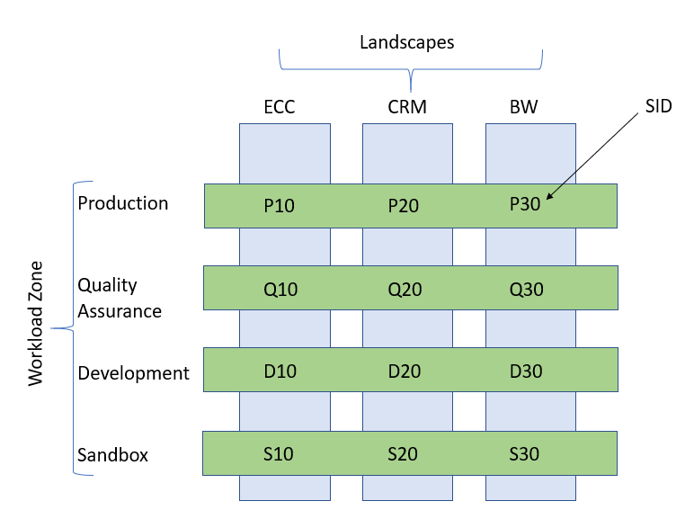
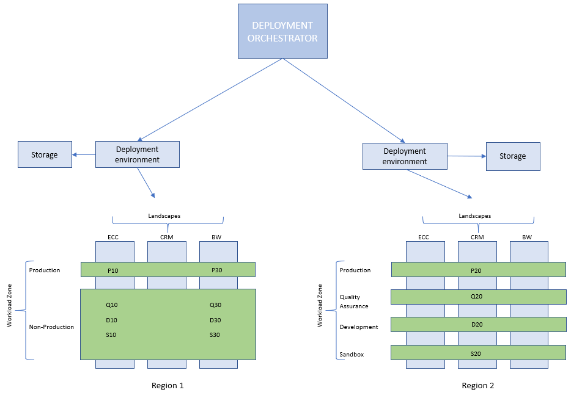

<!-- docutune:casing Snow -->

# SAP enterprise-scale platform automation and DevOps

All of the principles laid out in the Cloud Adoption Framework are applicable to SAP Automation, this section will explain how to start addressing SAP Automation.
When deciding on an automation approach it is important to look at an SAP Application landscape to identify the key components and based on those define the automation strategy.

SAP applications are mission-critical and form the technology backbone for enterprises around the world. Due to SAP systems' significance to an enterprise, guidelines are provided by SAP and Microsoft Azure to ensure the solutions are certified, supported, and successfully implemented. SAP deployments and system configurations are complex tasks. By harnessing Azure cloud's agility, organizations seek to automate SAP deployment activities for operational efficiency, controlled, and malleable-by-code infrastructure deployments.

Microsoft's SAP automation repo is designed such that Azure-SAP customers have the freedom to incorporate the scripts in existing DevOps practices or utilize the code as-is, directly from a repo clone.

## SAP Architecture

An SAP application estate consists of systems, workload zones, and landscapes.

### System

An SAP system is an instance of an SAP application that has the resources the application needs to run, like virtual machines (VMs), disks, load balancers, proximity placement groups, availability sets, subnets, and network security groups. The application is identified by a unique 3 letter identifier SID.

For lifecycle purposes, each system should deploys into a separate Azure resource group.

### Workload zone

A workload zone is also called a deployment environment, and partitions the SAP application into environments like non-prod and prod or can further segment a landscape into tiers like development, quality assurance, and production. A deployment environment provides shared resources like virtual networks and key vaults to all the systems in the Workload Zone.

### Landscape

A landscape is a collection of systems in different environments in an SAP application. The example diagram shows three SAP landscapes: SAP ERP Central Component (ECC), SAP customer relationship management (CRM), and SAP Business Warehouse (BW).

The following diagram illustrates the dependencies between SAP systems, workload zones, and landscapes. In the illustration below the customer has three landscapes: SAP ERP Central Component (ECC), SAP customer relationship management (CRM), and SAP Business Warehouse (BW). Each landscape has four workload zones: sandbox, development, quality assurance, and production. Each workload zone may contain one or more systems.

*Figure 1. SAP application estate.*

### Additional components

In addition to the SAP components the automation solution will need:

- An execution environment from where the deployment activities can be performed.
- Persistent storage for installation media and if Terraform is used storage for the Terraform state files.

**Design recommendations:**

- Use a Virtual Machine that has network connectivity to the target Virtual Networks in order to enable application configuration and installation
- Use Azure storage accounts for state file management and as installation source for SAP installation media

## Preparation activities

### Deciding on a DevOps strategy

The SAP Deployment Automation is implemented as a workflow starting with infrastructure deployment and followed by operating system configuration and application installation.

**Design considerations:**

- Define the scope of automation
  - infrastructure
  - operating system configuration
  - application installation
  - On going operations (run-state operations)
- Define strategy for storage of parameter files

**Design recommendations:**

- Store all parameter files in a source control repository
- Back up state and parameter files to safeguard against file corruption. For example, you can store Terraform state files on read-access geo-redundant storage (RA-GRS) based hot storage accounts.

### Region planning

The SAP Deployment Automation Framework supports deployments in multiple Azure Regions. Each region will host:

- Deployment infrastructure
- SAP Library for state and SAP installation media
- 1-n Workload zones
- 1-n SAP systems deployed in the Workload Zones.

The illustration below shows the deployment strategy for two Azure regions.

*Figure 2. SAP Automation across regions.*

**Design considerations:**

- Which Azure regions are in scope?
- Disaster recovery considerations

### Workload zone planning

A workload zone combines the workload Virtual Network and the set of credentials to be used in the systems in that workload as well as the Service Principal that is used for deploying systems. The Workload Zones are regional because they depend on the Azure Virtual Network. The naming convention of the automation supports having workload zones in multiple Azure regions each with their own virtual network.

A workload zone is also called a deployment environment, and partitions the SAP application into environments like non-prod and prod or can further segment a landscape into tiers like development, quality assurance, and production. A deployment environment provides shared resources like virtual networks and key vaults to all the systems in the Workload Zone.

Some common patterns for workload zones are:

#### Production and non-production

In this model the SAP environments are partitioned into two zones, production and non production.

#### Sandbox, Development, Quality Assurance, Production

In this model the SAP environments are partitioned into four zones: sandbox, development, quality assurance, production

**Design considerations:**

- How many workload zones are required?
- Subscription design
  - Does a subscription contain multiple workload zones
- Which regions are the workloads deployed to?
- Outbound Internet connectivity
- Network connectivity to On-Premises network
- Is the deployment a Greenfield deployment (no Azure Infrastructure for the Workload exists) or a Brownfield deployment (some or all of the artifacts supporting the workload zone already exists)?
- Deployment credentials, does each workload zone need unique deployment credentials?

**Design recommendations:**

- Outbound internet connectivity should be provided by the Networking team
- Network connectivity to On-Premises network should be provided by the Networking team
- Use unique deployment credentials per workload zone. **Note** If a workload zone exists in multiple regions they should use the same deployment credentials.
- Try to minimize the number of workload zones to simplify network planning

### SAP application planning

The SAP System is the actual SAP Application, it contains all the Azure artifacts required to host the SAP Application. Refer to [SAP on Azure](/azure/virtual-machines/workloads/sap/get-started) to get started, plan, and consider deployment factors in detail.

**Design considerations:**

- Which database backend to use?
- The number of database servers?
- Is high availability required?
- The number of Application Servers?
- The number of Web Dispatchers (if any)?
- The number of Central Services instances?
- The sizes of the virtual machines?
- Decide whether to use an Azure Marketplace image or a custom-built image. Custom-built images have several advantages, like customer-specific OS configuration, security hardening, and compliance tooling. Custom-built images can also potentially streamline image lifecycle management.
- Is the deployment a Greenfield deployment (no Azure Infrastructure for the subnets created) or a Brownfield deployment (some or all of the artifacts for the subnets already exists)?
- IP Allocation strategy (Azure or customer provided)
- Naming convention for Azure resources
- Define credentials management requirements, can all the systems in a workload zone use the same credentials to access the virtual machines?

**Design recommendations:**

- Use default SAP Automation standard naming conventions. SAP Automation publishes a set of naming convention guideline [Naming convention](https://github.com/Azure/sap-hana/blob/master/documentation/SAP_Automation_on_Azure/Software_Documentation/standards-naming.md).
- Use the same set of credentials for each system deployed into a workload zone. Azure Key Vault is the recommended solution for key management and key storage.

## The SAP Deployment Automation Framework

The SAP Deployment Automation Framework provides both Terraform templates and Ansible playbooks which can be used to build and configure the environments to run SAP on Azure. The artifacts are hosted in the [sap-hana](https://github.com/Azure/sap-hana) repository. The SAP on Azure deployment scripts are open-source and supported by Azure (non-customized code).

### Automation capabilities

#### Supported platforms

The SAP Deployment automation supports deployment on both Linux and Windows

#### Supported topologies

The default deployment model using the SAP Deployment Automation is the distributed model with a database tier and an application tier. The application tier can be further split into three tiers: the application servers, the central services servers and the web dispatchers.

The automation can also be deployed to a standalone server by specifying an configuration without an application tier.

#### Included capabilities

The SAP Deployment Automation Framework capabilities matrix

| Feature | Included | Notes |
|:-|:-|:-|
| Accelerated Networking | Y | Accelerated Networking is enabled on VMs |
| Application Security Groups | N | In roadmap |
| Anchor VM | Y | A Virtual Machine which is uses to anchor the proximity placement group in the Availability Zone |
| Application configuration | N | Ansible based configuration to be released shortly |
| Application installation | N | Ansible based installation to be released shortly |
| Authentication | Y | The authentication supports both ssh based authentication as well as username/password based authentication |
| Availability Zones | Y | The automation can deploy Virtual machines zonal or across Availability Zones |
| Azure Files for NFS | N | In roadmap |
| Azure Firewall | Y | The automation can deploy an Azure Firewall in the deployer network |
| Azure Load Balancer | Y | The automation uses Standard Azure Load Balancers |
| Azure NetApp Files | N | In roadmap |
| Boot diagnostics Storage Account | Y | The boot diagnostics storage account is shared across all systems in a Workload Zone |
| Azure Key Vaults | Y | New Azure key vaults or existing |
| Customer images | Y | The custom images need to be replicated to the region |
| Customer managed disk encryption keys | Y | The keys need to be pre-created and stored in an Azure key vault |
| Deployment environment | Y | A Virtual machine in a network peered to the SAP network(s) |
| Disk sizing | Y | Default disk sizing specified, can be configured |
| IP Addressing | Y | Both customer specified IP addresses and Azure provided |
| Naming convention | Y | Default naming convention, can be customized |
| Network Security Groups | Y | New Network Security Groups or existing |
| Operating system configuration | N | Ansible based configuration to be released shortly |
| Proximity Placement Groups | Y | New Proximity Placement groups or existing |
| Resource Group | Y | New Resource Group or existing |
| Subnets | Y | New subnets or existing |
| Storage for SAP Installation Media | Y | New storage account or existing |
| Storage for Terraform state | Y | New storage account or existing |
| Virtual Machine SKU | Y | All Virtual Machine SKUs are configurable |
| Virtual Networks | Y | New Virtual Network or existing |
| Witness Storage Account | Y | The Witness storage account is shared across all systems in a Workload Zone. Used for Windows High Availability Scenarios |

### Planning for the parameter files

The SAP Deployment Automation leverages json parameter files to configure the Azure environment with different parameter files for the different artifacts.

The development environment should clone both the `sap-hana` repository and the customer repository into the same root folder.

Having the parameter files in a predefined folder structure will simplify automated deployment operations.

**Design recommendations:**

All parameter files should be stored in a source control environment.
