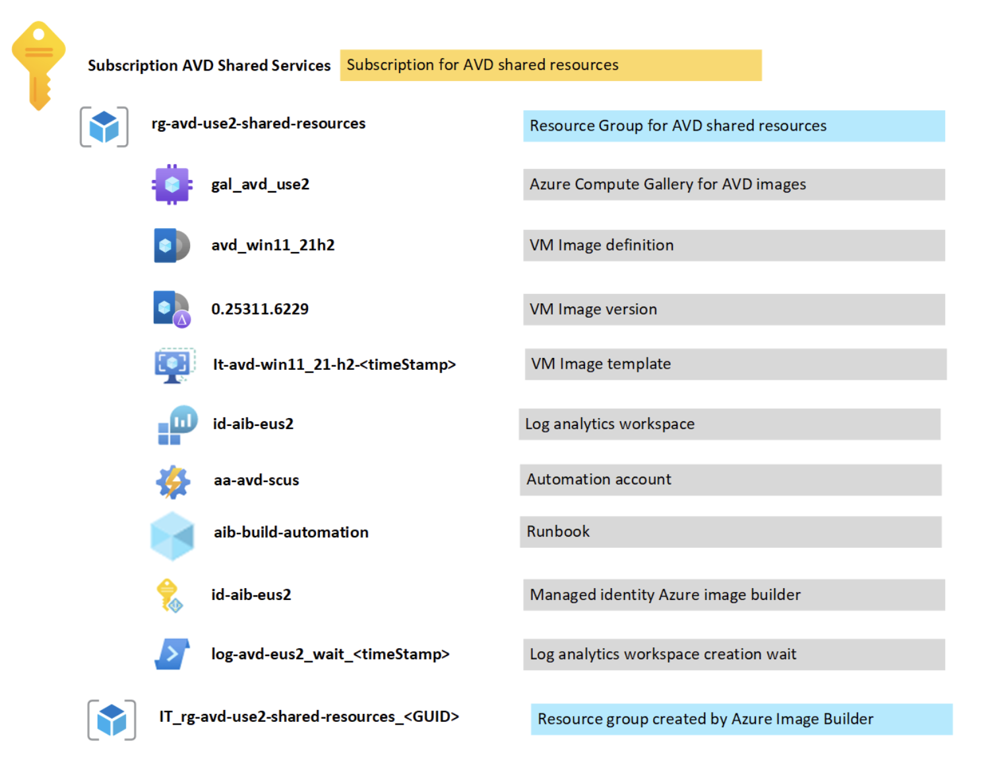
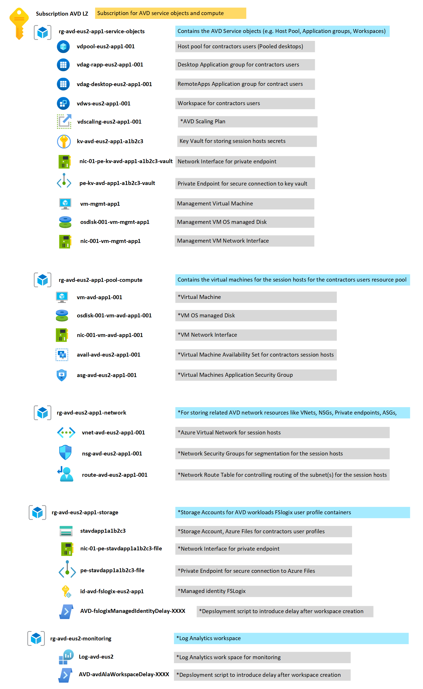

# Resource organization considerations for Azure Virtual Desktop

As with all cloud environments, the structure within which resources are deployed will have a direct bearing on how they are managed and governed.

The following considerations and recommendations will help establish proper resource organization and segmentation across management group hierarchies, subscriptions, landing zones, and resource groups. It will also help establish proper tagging strategies to keep resources organized.

## Design considerations

### How many Azure Virtual Desktop virtual machines will you require?

You shouldn't deploy more than 5,000 virtual machines per region (for both personal and host pools based on Windows 10 Enterprise single and multi-session). Increasing the resources of an individual session host virtual machine can help to accommodate more user sessions.

To manage enterprise environments with more than 5,000 VMs per Azure subscription in the same region, you can create multiple Azure subscriptions in a hub-spoke architecture and connect them via virtual network peering, as in the preceding example architecture. You could also deploy VMs in a different region in the same subscription to increase the number of VMs.

### Which regions will the hosts be deployed in?

There are a few considerations for the Azure Regions for AVD related resources, but generally is recommended storing all the resources in the same Azure Region where AVD will be deployed. Below are the main resources involved.

- Metadata (Services Objects), like the Host Pools, Application Groups, Workspaces.
- Session Hosts (Virtual Desktops) compute, like Virtual Machines, Disks, Network Interfaces.
- VNets. The VNet where the Session Hosts will be directly connected
- Storage. For storing the FSLogix user profiles.
- Other resources like Azure Compute Galleries, Key Vaults, Images.

### Other considerations

- Deploy session hosts to Azure regions that are closest to the users in order to help with performance related to network connectivity and latency. Also consider compliance and data residency requirements when choosing a specific region.
- If applications running in the session hosts in an Azure Region (e.g. Central India) need to reach services in another Azure Region, (e.g., Central US) it could introduce more latency to the application than placing the session hosts closer to the Azure Region where the services are hosted (e.g., Central US). Therefore, consider placing the session hosts closer to such services instead. In this way the end user experience won’t be affected as much, because there could be less latency involved with the remote session than the latency between the application and the services between those in different Azure Regions.
- Multi-region AVD deployments. Mixing session hosts located in different Azure Regions (e.g., Central India and Central US) in the same host pool of type pooled, should not be done as there's no way to specify users to a session host in the specific Azure Region. Instead, create session hosts for each Azure Region.

## Design recommendations

### Naming and tagging

Use naming and tagging standards to organize resources and help simplify resource management, cost tracking and governance.

Maintaining consistency across resources helps identify deviation from agreed-upon policies. [Prescriptive guidance for resource tagging](../../govern/guides/complex/prescriptive-guidance.md#resource-tagging) demonstrates how one of the following patterns can help when deploying governance practices. Similar patterns are available to evaluate regulatory compliance using tags.

A standardized naming convention is the starting point for organizing your cloud-hosted resources. A properly structured naming system allows you to quickly identify resources for both management and accounting purposes. If you have existing IT naming conventions in other parts of your organization, consider whether your cloud naming conventions should align with them or if you should establish separate cloud-based standards.

### Management groups and subscriptions

As part of the Azure landing zone best practices, resources should be grouped logically in management groups in order to target policy and initiative assignments using Azure Policy.

Create management groups under your root-level management group to represent the types of workloads (archetypes) that you'll host and ones based on their security, compliance, connectivity, and feature needs. This grouping structure allows you to have a set of Azure policies applied at the management group level for all workloads that require the same security, compliance, connectivity, and feature settings.

Subscriptions serve as a scale unit so that component workloads can scale within the platform [subscription limits](/azure/azure-resource-manager/management/azure-subscription-service-limits). Make sure to consider subscription resource limits during your workload design sessions.

Subscriptions provide a management boundary for governance and isolation, which clearly separates concerns.

Below is the recommended structure and Resource Groups to be created and use as administrative domains and lifecycle purposes for each Azure Region deployed.

## Next steps

[Further reading on recommendations for Azure Virtual Desktop resource organization](/azure/architecture/example-scenario/wvd/windows-virtual-desktop#azure-limitations)

[Further reading on recommendations for naming and tagging in Azure](../../decision-guides/resource-tagging/index.md)
