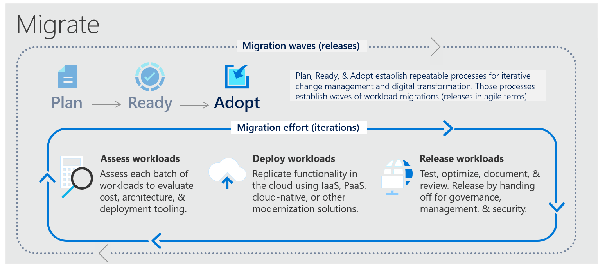

# Windows Virtual Desktop planning

Windows Virtual Desktop deployment scenarios follow the same Migrate methodology as other migration efforts.

This consistent approach allows migration factories or existing migration teams to adopt the process with little change to non-technical requirements.

## Plan your migration

As with other migrations, your team will assess workloads, deploy them, and then release them to end users. However, Windows Virtual Desktop includes specific requirements that will necessitate a review of the Azure landing zones during the assessment of the workloads. The process will also require a proof of concept prior to the first deployment.

To build your plan, see the [cloud adoption plan DevOps template](../../plan/template.md) for an existing migration backlog in Azure DevOps. Use the template to create a detailed plan of activities.

## Business justification

Part of your planning will require being able to articulate the business benefits of moving to Windows Virtual Desktop.

The following list includes items to be used in a business case.
  
- The Windows Virtual Desktop control plane or management plane is provided as a service to customers. The control plane manages the end user’s seamless global connectivity into their desktop, as well as the centralized deployment and orchestration that IT require. This is a PaaS service in that you do not have to procure hardware, deploy that hardware, patch it, or support it. It is an evergreen service that you just consume. It has no cost, it is a service that you are entitled to through a license that you already own, hence you can achieve cost savings by using this PaaS service. It also means that after migration you do not need to do the management, feeding and watering, troubleshooting, break fix, patching etc. of your own on-prem Virtual Desktop management service. This allows IT to concentrate on what is far more important to the business, which would be concentrating on delivering more value to the business, typically ensuring customers have the best user experience when they are consuming their applications and data.

- No upfront costs. Doing virtual desktop's on premises requires you to either pay up front or enter into a length leasing agreement for all of the hardware required to meet the peak load, even if that hardware is not used as the project progresses, and even if the hardware is not used 100% of the time when the project is complete. Windows Virtual Desktop and Azure is charged based upon consumption, hence you only pay for what you use. In addition, this can scale both up and down based upon business requirements, allowing you to meet business requirements whilst also reducing your costs when scaling down.

- Windows Virtual Desktop and Azure have a far quicker cadence in terms of new features and capabilities. On-premises hardware and off the shelf software has a shelf life and does not receive large new feature sets or new capabilities very often, and it typically requires a costly project to implement. Windows Virtual Desktop and Azure receive regular new capabilities and that deployment is managed by Microsoft. To you this is an evergreen service you just consume. You do not need a project to roll out new services to your business users, for them to be able to make use of the new services. These new features may well provide competitive advantage, or even in at the least it prevents you becoming weighed down with technical debt.

- Azure is a hyperscale cloud, providing massive scale. On-premises services will never be able to compete with Azure as a computing platform. This provides substantial agility to your organization. If they have a new opportunity to expand into global locations for which they do not have a local data center, Microsoft can host this service in an ever-increasing number of Azure regions, that will enable Microsoft to place the infrastructure or services closer to your end users than you can.

- Windows 10 rich user experience that end users expect, at multi session cost. Windows Virtual Desktop enables the scale of Windows Server with Remote Desktop Services combined with the user experience of Windows 10, without the compromise of application compatibility. Windows Virtual Desktop is the only place where Windows 10 multi-session can be run.

- There is no requirement for client access licenses with Windows 10 Multi session, as Windows 10 multi session does not require a Client Access Licence (CAL)

- In Windows Virtual Desktop if you deploy Windows Server (Windows Server 2012 R2, 2016 or 2019), there is no requirement to purchase a Windows Server license

- All Windows Virtual Desktop virtual machines are charged at the Base compute rate. Windows Virtual Desktop is entitled through another license that you probably already own (M365 E3+), that includes a Windows license

- All Windows 7 virtual machines in Windows Virtual Desktop receive free extended security updates until Jan 14, 2023

## Next steps

For guidance on specific elements of the cloud adoption journey, see:

- [Review your environment or Azure landing zones](./ready.md)
- [Complete a Windows Virtual Desktop proof of concept](./proof-of-concept.md)
- [Assess Windows Virtual Desktop migration or deployment](./migrate-assess.md)
- [Deploy or migrate Windows Virtual Desktop instances](./migrate-deploy.md)
- [Release your Windows Virtual Desktop deployment to production](./migrate-release.md)
