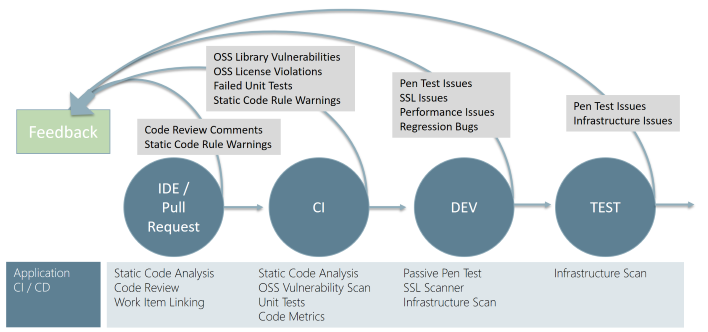

# Innovation Security

Cloud technologies enable organizations to envision new ideas and products that were not possible before. Put simply, cloud can enable innovation.
However, that innovation can often introduce new ways of working that test or break existing security or operational processes and controls.
As part of the journey to cloud environment - and the realization of the benefits - organizations will need to consider and implement new ways of working to ensure secure is at the core of everything that is built.

This article explores how to integrate modern security practices (such as DevSecOps) into processes in order to align security, development, and operational practices.

## Secure by design

As development teams adopt cloud technologies as part of their development environment there is an opportunity to integrate tools and techniques to make security a default part of the development lifecycle.
Modern software development is typically orientated around code repositories and build pipelines, which created an effective method of collaboration between teams and enables high volume, repeatable build and release of code into a variety of environments.

This streamlined process removes a number of manual steps from the development process which can result in the reduced need for manual review and approval during the development cycle. This is a huge benefit, but can also introduce a risk of unintentional security issues if not approached correctly.
By building security checks into development cycles can reduce the risk of tokens or credentials being checked into a code repository or left in a software release. Scanning for vulnerabilities in third-party libraries can also help to reduce the risk of vulnerabilities in code and in environments.

Setting these techniques as default behavior within the development process - and, crucially automating it - helps organizations move closer to the principle of secure by design, as opposed to security being a waterfall activity after development finishes.

## What is DevSecOps?

In the same way that DevOps is the combination of people, process and technology the same is true of DevSecOps - the difference being the expansion of the core teams to include the organization's security functions.

Development, Security, Operations. Three key functions within an organization working together in a common model to help build secure, resilient applications.
Developing applications requires a number of teams to work harmoniously in order to ensure that - from concept to live environment - the code and services that are developed have been regularly checked for vulnerabilities and issues addressed.

## Security in repositories

Typically, developers create, manage and share their code in repositories such as GitHub or Azure DevOps Repos. This provides a central, version controlled library of code that can be collaborate on easily.
However, enabling a number of collaborators on a single codebase can also introduce the risk of changes being introduced that lead to vulnerabilities or the unintentional inclusion of credentials or tokens in commits.
To address this, development teams should evaluate and implement a repository scanning capability. Repository scanning tools are intended to perform static code analysis on source code within repositories and look for vulnerabilities or credentials and flag items found for remediation.
This capability acts as a backstop to protect against human error and is a useful safeguard in distributed teams where a number of people are collaborating in the same repository.
The security validation of code can happen both within the Integrated Development Environment (IDE), such as Visual Studio Code, or at the point of creating a pull request to merge code into a branch or repository.

## Security in pipelines

Many organizations use build and release pipelines (often referred to as Continuos Integration and Continuous Delivery or CI/CD) to automate and standardize the processes for building and deploying code into various environments.
This use of pipelines allows development teams to make iterative changes to sections of code quickly and at scale, without the need to spend large amounts of time re-deploying or upgrading existing environments.
Using pipelines also enables teams to promote code from development environments, through testing environments and ultimately into production.
As part of this automation, development teams should include security tools that run scripted automated tests when code is deployed into testing environments. This can include tests such as unit testing the applications features to check for vulnerabilities or checking for public endpoints to ensure they are intentionally accessible. 

## Security in environments

## Actionable intelligence

## Feedback loops

All of these techniques and tools should enable teams to find and flag risks and vulnerabilities that require investigation and potential resolution.
Operations teams who receive an alert, or discover a potential issue when investigating a support ticket, need a route back to the development team in order to flag items for review.
This feedback loop being a smooth collaboration is vital to issues being addressed quickly and the risk of a vulnerability being minimized as much as possible.
