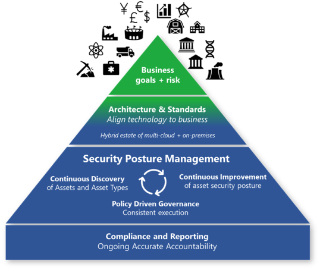

# Governance in Security

Security governance provides the bridge from business priorities to technical implementation with architecture, standards, and policy. Governance teams also provides oversight and monitoring to sustain and improve security posture over time, and also report compliance as required by regulating bodies. 

**Business goals and risk** provide the true north star for security, ensuring that security is focusing efforts on what matters to the organization and is informing the risk owners using familiar language and processes in the risk management framework

### Compliance and reporting

Compliance and reporting on external security requirements (and sometimes internal policy) are often basic required elements of operating in a given industry. The mandatory requirements are like feeding the bear in the zoo, if you don’t feed the bear every day, it may eat you. 

### Architecture and Standards

Architecture, Standards, and Policy provide the critical translation from business requirements and risk into the technical environment. We strongly recommend a unified view across your enterprise estate rather than splitting up cloud vs. on premises. Attackers don’t care about your internal processes and follow the path of least resistance to their objective, including moving laterally between cloud and on-premises environments. Most enterprises today are a hybrid environment that spans 
 - **On-premises** – including multiple generations of technology, often significant numbers of legacy software and hardware (and sometimes operational technology controlling physical systems with a potential life/safety impact).
 - **Clouds** – typically including multiple providers for
   - Software as a Service (SaaS) applications
   - Infrastructure and Platform as a Service (IaaS/PaaS) 

### Security Posture Management

Hope (and reporting problems) is not a plan. Governance in the cloud age must have an active component that engages continuously with other teams. Security posture management is a new/emerging function that represents a step forward in the long term convergence of security functions that answer the question “How secure is the environment?” (including vulnerability management and security compliance reporting)

In the on-premises world, security governance often followed the cadence of the data it could get about the environment, which may take a long time and be constantly out of date. Cloud technology now provides on demand visibility into the current security posture and asset coverage. This drives a major transformation of governance into a more dynamic organization with closer relationships to other security teams to monitor security standards, provide guidance, and improve processes.

In it's ideal state, governance is the beating heart of continuous improvement, dynamically engaging across the organization to constantly improve security posture.

The key tenets of success for this are
 - **Continuous discovery of assets and asset types** - The cloud is a dynamic environment where new types of services are added regularly and workload owners dynamically spin up and down instances of applications and services as needed. Governance teams need to perform continuously discover assets types and instances to keep up with this pace of change. 
 - **Continuous improvement of asset security posture** - Governance teams should focus on continuously improving standards and enforcement of those standards to keep up with cloud and the attackers. IT organizations must be able to react quickly to new threats and adapt accordingly because attackers are continuously evolving their techniques, defenses are continuously improving and sometimes need to be enabled, and you can’t always get all the security you need into the initial configuration. 
 - **Policy Driven Governance** provides consistent execution by fixing something once in policy that is automatically applied at scale across resources. This limits wasted time/effort on repeated manual tasks and is often implemented using Azure Policy or 3rd party policy automation frameworks

In order to maintain agility, best practices guidance is often iterative - digesting small pieces of information from multiple sources in order to create a complete picture and continuously make small adjustments.

## Governance and Protection Disciplines

For the protection disciplines (Access Control, Asset Protection, and Innovation Security), the Security governance team provides standards and guidance to drive consistent execution of security best practices and controls. 

In the ideal state, these protection teams then apply these and provide feedback on what is working, what challenges they have applying them, and the teams work together to identify the best solutions for them.  

## Governance and Security Operations

Security Governance and security operations work together to provide complete visibility and to ensure that lessons learned from real world incidents are integrated into architecture, standards, and policy

Governance and security operations provide complementary types of visiblity:
 - *Security operations* provides insight into the immediate risk of active attacks
 - *Security governance* provides the big picture/long view of risk from potential future attacks and attack vectors. 

The security architects within the governance function to help identify lessons learned from incidents (root cause of major incidents, trends, etc.) and capturing those into the organization's standards to ensure they are applied consistently across the enterprise (rather than as a one off correction or not at all).

See the Complete Risk Mitigation section in security integration for more information on this. 

> [!Note] While some organizations may choose to put monitoring of security posture in security operations, we generally recommend having this in governance to foster deeper empathy and relationships with the IT engineering and operations teams that have to apply the standards. This often results in higher quality communications and better security outcomes than a governance team that is completely abstracted away from the real world impact of their standards. 
