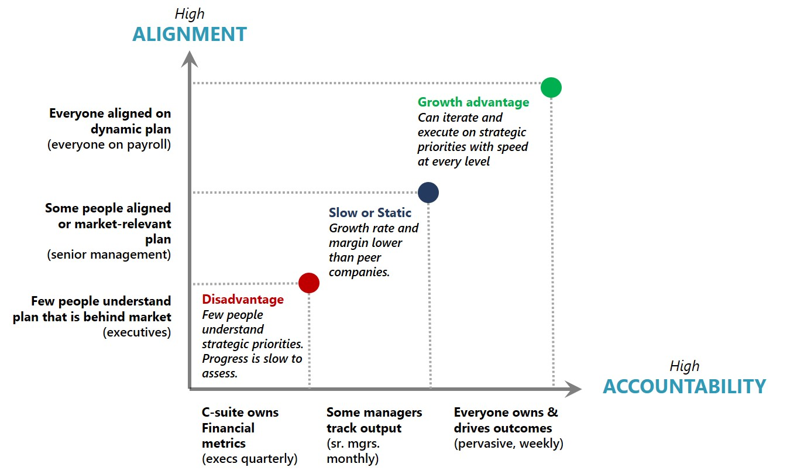

# Measuring outcomes with Objectives and Key Results (OKRs)
So now that we have walked through examples of different outcomes, lets see how we can measure impact. 
Modern operations require modern ways to measure outcomes. The cloud world is intended to help drive increased velocity within the business, our measurement platform needs to support that. We need to think about how we provide insights to team members and groups, we need to build the capability to pivot quickly when measures or outcomes are not what we expect and lastly we need to have a cadence which aligns to the philosophy of increased velocity. 

## What are OKRs?  
Many organizations have begun adoptiong OKRs, they have proven to help drive alignment in complex work environments, foster innovation and get individuals to focus on what matters. OKRs are combined 2 elements, an **objective** and **key results**. Objectives are the statement of intent - what is the team trying to accomplish and why is it important? whilst the key results are the specific outcomes to track impact on the objective. The important thing to remember about OKRs is that they are intended to measure outcomes as a team, not individual performance. In addition, key results are a set on a quarterly cadence - nothing is more motivating than a deadline. The intent is to help drive focus on what is important vs the amount of work that we do.  
To do this we focus on shorter term measurements such as in month or quarter. This does not mean that you cannot have OKRs that are longer term in nature, it just means that you want to have good KRs that help track shorter term impact. 

&nbsp;&nbsp;**Objective** = Clarity & Intent  
&nbsp;&nbsp;**Key Results** = measurement of success within the quarter

[Workboard](http://www.workboard.com) is a company that focuses solely on OKRs and have a software solution to enable customers to adopt OKRs. [Workboard](http://www.workboard.com) talk about first principles:

- **Aspire & Inspire**: Teams establish their best possible results in a given quarter, focus efforts on great outcomes, and use retros to learn and iterate.

- **Outcome Focus**: Quarterly key results provide radical clarity on where value is created. This helps teams and the organization drive business impacts faster.

- **Global + Local**: Teams localize OKRs into their nouns, verbs and numbers and enrich them with the team’s expertise and insight.

- **Transparent**: OKRs, alignment and progress are transparent to everyone with OKR software, so it’s easier collaborate and we make good decisions faster.

## Why are OKRs important?  
OKRs help keep us aligned and accountable. Here is a great article on how to drive alignment between Strategy & Execution (https://www.workboard.com/blog/execution-vs-strategy.php)

## Examples of OKRs
So what do great OKRs look like? As mentioned in the principles our objectives need to inspire, you want your organization and teams to sit and take notice, something that teams can look to and fully understand their mission. Key results need to be specific and measurable wihtin the quarter.

Here are some example of OKRs:

**Objective #1**: To be the #1 organization in the US providing learning platforms to schools   
&nbsp;&nbsp;Key Results  
&nbsp;&nbsp;&nbsp;&nbsp;1. 45% of K12 schools using our platform.  
&nbsp;&nbsp;&nbsp;&nbsp;2. 12% increase in student engagement as measured through internal systems.  
&nbsp;&nbsp;&nbsp;&nbsp;3. 95% satisfaction rate from quarterly parent surveys.  

**Objective #2**: Building a technology platform that enables every person in our business to innovate and create.  
&nbsp;&nbsp;Key Results  
&nbsp;&nbsp;&nbsp;&nbsp;1. 5 new applications developed and adopted across the organization.  
&nbsp;&nbsp;&nbsp;&nbsp;2. Every team with atleast 2 members using the Microsoft PowerPlatform.   
&nbsp;&nbsp;&nbsp;&nbsp;3. Inclusion of new cloud technologies such data analytics and machine learning in all customer facing applications.  

**Objective #3**: Transform our approach to sales to be data driven  
&nbsp;&nbsp;Key Results  
&nbsp;&nbsp;&nbsp;&nbsp;1. Increase in pipeline coverage from 2x to 4x.    
&nbsp;&nbsp;&nbsp;&nbsp;2. Close rates for sales engagements to increase by 5%.  
&nbsp;&nbsp;&nbsp;&nbsp;3. Reduction in time to close deals by 8%.  

## Next steps

To move forward with OKRs and measuring your there are x simple steps to take:

**Step 1: Learn**: Start exploring what OKRs can do for your business, listen to some of your industry peers and leaders.

**Step 2:Plan**: As you begin to draft your OKRs ensure that you have all your sponsors contributing and involved in the process. Work with an OKR coach to refine your OKRs.

**Step 3:Launch**: Each organization launches initiatives differently, ensure that you have a strong communication plan and build the OKR calibration and celebration process into your operating model

**Step 4:Drive**: It is important to keep the rigor and focus, make sure that you are sharing the outcomes and results across the organization. You need to build the muscle and make OKRs a habit.

**Step 5:Improve**: Continue to improve, revisit and rethink how you can further connect across the organization. OKRs in spreadsheets work to a degree, what you really want is for the rest of the organization to participate and harness the intelligence from the aligned 

 Link to Workboard: https://appsource.microsoft.com/en-us/marketplace/co-sell/SOL-31525-NGJ?debug=true%2F%3FignoreAutoSignIn%3Dtrue&tab=Overview 

> [!div class="nextstepaction"]
> [Align Efforts to Learning Metrics](docs\strategy\learning-metrics.md)
